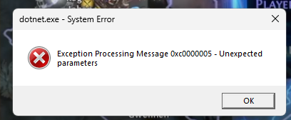
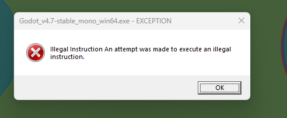

# LastBreath — контекст для продолжения работы

Godot 4.7 C# (.NET 9, LangVersion preview: primary constructors, `field`). Пошаговая RPG, соло-разработчик Todd, общение на русском.
Проекты: **Main** (LastBreath), **Battle**, **Crafting**, **LootGeneration** — отдельные Godot-приложения; **Core** — общая библиотека (ссылается на Godot SDK и MS DI); **Testing**. Общий код шарится симлинками (`*/Source`, Core); `*/Internal` — приватное для проекта.

## Правила работы и формулы
Перенесены в `CLAUDE.md` (авто-подгружается всегда). Там: код-стайл, работа с файлами, формулы урона/крита, описание систем.

## Roadmap
Этапы до играбельного демо — `src/Docs/ROADMAP.md` (создан 2026-07-24; этап-уровень там, отдельные пункты — issues на доске #3).

## Навигация
⚔️ Боевая система · 🧠 AI и симуляция мира · 💬 Нарратив · 🤝 Репутация · 🎒 Лут и предметы · 🖥️ Интерфейс · 🌐 Локализация · 💾 Сохранения · ☠️ Смерть игрока · 🛠️ Инструменты · 🔊 Аудио · 🧭 Гейм-луп: что дальше · 📋 Сквозные трекеры

# ═══════════  📌 СЕССИЯ 2026-08-20: ХВОСТЫ РЕШЕНИЙ 26, АУДИТ ЧИСЕЛ, UID-ИНЦИДЕНТ, ЧИСТКА ДОКОВ  ═══════════

**Тесты 1565 → 1613, ноль красных. ~18 коммитов `60f3cb6f`…`be63ade1`.** Конвейер исполнитель+ревьюер (Opus 5); два окна лимитов, бюджет второго (~4M) израсходован по плану владельца.

**РЕШЕНИЯ Todd:** DoT-тики Банки/Близнеца — под канон 0.35/0.45, «фиксим, балансим потом» · А-1b целиком: код-онли числа в данные (крит-шанс КР + эффект в канон с потолком 5=3+2; стадии Int-стойки в CombatRules; девять мелочей; порог обрыва серии остаётся кодом) · `.uid` коммитим (снят из .gitignore, 572 сайдкара в git) · песочница Crafting как есть · export.ps1 — относительная ссылка · чистка src/Docs заказана (Д-1).

- **Хвосты реш. 26**: снос EquipItemResources `60f3cb6f`; защиты уникальных наград `f1ad6c31` (`IUniqueItemQuery`, аудит ВСЕХ дверей выдачи вкл. GiveItem-хуки, факт-реестр в сейве quests v2, статус ДО выплаты; попутно `[assembly: DoNotParallelize]` — вскрыта настоящая гонка тест-статиков RNG, честная починка «сиденье ролла в контексте боя» в бэклоге); десять «Сильных» в каноне `6c29f029` (двусторонний пин сил парами id=power).
- **Аудит А-1 «числа мимо json»** (`Audit-A1-NumbersOffJson.md`, свод + механизм «json побеждает тихий RegisterDefault») и его фиксы: А-1a `406f11de` (`DamageOverTurnEffect.FromCanon` — потенция+потолок+сила из канона, длительность за способностью), А-1b-1 `02ac3a8a`, А-1b-2 `7a07bdb6` (`MulticastRules` + тестовый шов `Roll(owner, rules)`), А-1b-3 `be63ade1`. Открыт А-1c (лгущие дефолты, ноль-дефолты).
- **uid-инцидент**: robocopy 19.08 унёс 372 гитигнорированных `.uid` (git их не знал) → Godot перегенерировал случайные → закоммиченные сцены поехали. Ремонт: 36 сайдкаров восстановлены значениями ИЗ СЦЕН (битых ссылок 51→15; остаток — предшествующая гниль, список в бэклоге). `.uid` теперь в git `29db64a0`; export.ps1 — относительная ссылка с гардами `f64b457a`. Задача-кандидат: скрипта-восстановителя девяти симлинков репозитория нет.
- **Д-1 чистка доков, первый проход** `360bbe40`/`c528d904`: HANDOFF 423→342KB — июльские сессии сжаты в сводки, дубли CLAUDE.md заменены указателями «канон — CLAUDE.md», устаревшее (снесённая система улучшений, дорепутационные фракции, планы-референсы) срезано/помечено. Второй проход: список «Доработать», архив багов (решение владельца), секция Локализации, plan↔PLAN-дубли.
- **Инцидент-урок**: «null-тип урона пойзона» чуть не был «починен» владельцем — null был решением «яд кормится всей суммой удара» (реш. 2026-08-18 п.6); спасла сверка с журналом. Док-строка `s_pools` — в бэклоге на явную пометку. Мораль: неочевидное решение в коде обязано называть себя решением.

**Очередь следующего окна** (plan.md): А-1c → Б-4 → дерево-задачи PLAN-TreeUx (Т-17 раньше Т-15/Т-16) → Д-1 второй проход; лок-проход Т-9 пополнился (тултип Печати забвения — чужой текст; 5 «сильных» без русского имени; `{damageMultiplier}` и «1 turn» КР). Незакоммичено владельцем: реордеры `Ability.cs`/`Skill.cs`, 8 .tscn сокет-панелей, иконки аугментов + ATTRIBUTION, global.json — его правки, не трогать.

# ═══════════  📌 СЕССИЯ 2026-08-08/09: ФУНДАМЕНТ МИРНЫХ ЖИТЕЛЕЙ + РОНАЛД  ═══════════

**Тесты 1184 → 1245, ноль красных. 13 коммитов `4be12b00`…`eb8d58d6`.** Оркестрация субагентами (исполнитель+ревьюер на задачу); планы/решения/бэклог — `docs/plan.md`, `docs/decisions.md`, `docs/backlog.md` (пять ревью accept-with-minors, хвосты там).

**РЕШЕНИЯ Todd:** тренер линейки испытаний — **Роналд** (кузнец+торговец) · мирные ключевые жители: **отдельный lifecycle-класс**; смертны, но встают ЖИВЫМИ; безопасной зоны как механики НЕТ (leash+wander хватает) · постановка в мир — **авторский именованный спавн** (стойка/уровень/редкость из данных, без роллов) · роллы NPC-модификаторов остаются, но нужен опт-аут per-запись (`modifierCount: 0`) · легаси-сейв, где житель записан «восставшим», — принять как есть (сейвы ломаем) · центральный узел `Start` в (0,0) — осознанная втулка колеса.

- **Перевес тестов дерева**: 5 красных после авторской правки разметки перевешены на ФОРМЫ вместо id (`FindChain` ищет нужную цепочку динамически — 15 кандидатов, следующая правка разметки тесты не уронит); валидация признала втулку (`NodeKindRules.IsWheelHub`, одно место) и авторская разметка впервые целиком под `Validate()`-тестом — падал до правки ровно тремя претензиями.
- **Мирный цикл**: `VillagerLifecycle` + суб-интерфейсы исходов подъёма (подписка на чужой исход не компилируется — ревью поймало немую заглушку `add {} remove {}` до того, как она стала багом проводки); `NpcLifecycleFactory` — switch в одном тестируемом месте; сейв-дефект «легаси-запись `risen` поднимала жителя нежитью необратимо» найден расследованием и закрыт guard'ом по суб-интерфейсу.
- **Данные**: `lifecycle.kind`, секция `authored` (+`modifierCount`), активность `Work` (канал `point` в расписании существовал насквозь — код не понадобился, только член enum + ветка фабрики + тег Forge).
- **Роналд в данных**: `Npc_Ronald` (Сила/8/Uncommon/без модификаторов, полный день кузня→прилавок→костёр→сон), диалог с торговлей (`Trader_Ronald`: 4 существующие руды + случайный экип), локализация en+ru. Тренерская ветка = будущее entry-правило с бо́льшим приоритетом, узлы не трогаются. Сцена: Todd поставил спавн (radius 1/max 1) + Forge + TradeStall; **Tent/Campfire для Роналда НЕ стоят** (Sleep/Rest мягко деградируют в «стоять дома»), арт в `NpcVisuals.tres` не назначен.
- **Стартовые узлы дерева теперь 4** (втулка + 3 сида) — старые записи «один Start / два узла без рёбер» в блоках ниже устарели.

**Из рантайм-лога после прогона Todd (2026-08-08 17:47):** [ERR] каталог `PassiveTreeRules` не грузится в Main (цены респека; расследуется) · 56×WRN нет иконки `Augment_Reduce_Cooldown.png` (арт-долг) · WRN окно колеса не находит top bar / close guard (части сцены).

**Процессное:** очередь сборки — ОДИН исполнитель за раз (MSB3027 душит параллельные `dotnet build`); дешёвые minor'ы ревью закрывались возвратом ДО коммита (мутационные доказательства окупались — трижды ловили тесты, зелёные на подменённом поведении); `git checkout --` для `LootSimulationReport.md` после прогонов — штатная процедура (файл переписывает сам прогон).

---

# ═══════════  📌 СЕССИЯ 2026-08-01: ВОЛНА F, ШАГИ 7–8, СЕЙВЫ  ═══════════

**Тесты 787 → 927, ноль падений. Четыре сборки чистые** (решение, `Main`, `Battle`, редактор — три последние собираются отдельно, решение их не покрывает).

**РЕШЕНИЯ Todd:** сохраняемся **только в основном проекте**, побочные — песочницы, сейвы там не нужны → система сохранения **удалена из Battle** · линейка «Испытание сильных» переедет на тренера (он и даватель, и принимающий), у остальных квестов список принимающих расширится · «`AttackReceived` только попавшие атаки» и формулировка окна узла «Уклонение» — в бэклоге (W-72, W-75).

- **Волна F.** Провайдер NPC — одна копия в `Core` (две расходились только неймспейсом и формой конструктора; до переезда у него **не было ни одного теста**). Игрок видит стаки Изнеможения — **событием**, не чтением живого: бой резолвит ход мгновенно, а показывает по битам, поэтому опрос состояния показал бы надбавку раньше времени. Квест умеет объявить, что не проваливается: гард стоит **в самом провале**, все пять путей идут через него.
- **Шаг 7 — прогрессии способностей не было вовсе.** Сервис синхронизировал книгу с каталогом: игрок держал весь каталог с первой секунды. Теперь книга — **зеркало взятых узлов**; секция сейва перестала хранить список выученного, поэтому файл больше не спорит с деревом. Биекция 21 узел ↔ 21 видимая способность, четыре скрытых — боссовые.
- **Шаг 8 — сокеты.** Слот опознаётся **узлом**, а не тиром: два аугмента одного тира выразимы, потому что различаются узлом. Запись несёт слот, для которого выбрана, — перенацеленный узел аугмент не наследует. Нечитаемое дерево не стоит аугментов: записи держатся до **первой** читаемой аллокации, она их сажает или отбрасывает.
- **Сейвы.** Битая секция больше не ведёт себя как отсутствующая (мир без NPC при повреждённом файле). `Capture` перестал переносить чужие секции — контракт «четыре проекта пишут один файл» был ложью: хранилище коренится в `user://` своего проекта.
- **Два окна каста** больше не переживают исключение: упавший каст оставлял на бойце +50% навсегда.

**Процессное, оплаченное этой сессией:**
- **Лимит сессии выбил пять агентов разом, на середине — и ничего не пропало.** Дерево осталось собираемым, потому что каждый писал в свою зону. Работу подняли и довели, а не переписали.
- **Реестр находок отстаёт от кода.** Дважды запись, переданная исполнителю как факт, оказалась неверной (мёртвая точка входа сервиса; поле `canFail` и число мест провала). Правило: запись реестра — гипотеза, проверять грепом до реализации.
- **Тест, проверяющий отсутствие, обязан утверждать и предусловие.** Четыре теста сокетов были зелёными на вырезанной фиче: «слотов ноль» верно и там, где слот не открывался. Ловится вырезанием того, что тест якобы охраняет.
- **Зонд не должен ссылаться на сборку движка.** Так был убит вспомогательный процесс (`0xC0000005`): он создавал объект Godot в обход конструктора вне рантайма. Правильный путь — собственные интерфейсы проекта.

---

# ═══════════  📌 СЕССИЯ 2026-07-31: КОНТЕКСТНЫЙ КАНАЛ ДЕРЕВА И УСЛОВИЯ  (сжато 2026-08-20)  ═══════════

9 коммитов `8c5b93d6`…`90fc3aa4`, тесты 687→775. Загрузка сейва начинается со сброшенной сессии (`SaveManager.Restore` — единственная воронка; 13 участников с парным `ISessionResettable`; исключение — спавн-поинты, узлы сцены). Узел дерева несёт контекстную строку отдельным каналом; каталог условий `SharedData/Conditions` (адресация по `id`, гистерезис одной полосой на семейство); условие вошло в идентичность строки предмета («ключ + условие»), предикат едет на строке, надевание наводит его на бойца. Условие умеет спрашивать про цель удара (цель удерживается между событиями атаки; урон-не-атака не накрыт — у DamageContext нет Target). Род ручки сверяется с типом значения (`Flag` — только там, где биндинг не читает значение; признак выводится из таблицы биндингов). W-60: «Уклонение» читается как `Health_Full`; «до первой атаки» — ходовой предикат, ждёт T-10b3. Правила, оплаченные волной: поле на общем типе проверяется грепом по всем читателям типа; обоснование, ссылающееся на соседний файл, проверяется грепом до написания.

---

# ═══════════  📌 СЕССИЯ 2026-07-30: РЕВОРК БИ — ВОЛНЫ 1–5 + ПОЧИНОЧНАЯ  (сжато 2026-08-20)  ═══════════

План — `PLAN-MartialArts.md` (реестр 90 находок), справочник слоёв — `CombatLayers.md`. Волна 1 (11 коммитов, тесты 596→624): атрибуты → один параметр каждый (источник модификаторов `Attribute_<Parameter>`); контракт `IsStronger` «true = сильнее Я, выброси аргумент» (пин всех 40 пассивок рефлексией); владение пассивкой по инстансу (сильнейшая прикреплена); подавление — ролл раз на удар после митигации, гейт «происхождение от способности» (`Cause == Ability` ИЛИ непустой `SourceAbilityId`). Волны 2–5 (9 коммитов, тесты →679, Godot-подтверждено): дерево пассивок в игре (модель в Core, `IPassiveTreeService`, вклад через `IParameterModifierSource` — `RemoveModifierBySource` до источников не достаёт; сейв-секция `passiveTree`, очки НЕ персистятся — тотал у мастерства); мастерство с нуля (50 левелапов = 50 очков, кривая в SharedData); гейт способностей от уровня мастерства снят (изучение узлами дерева). Починочная волна: `Set(this)` аксессору — в конце `_Ready` («боец готов», не «объект создан»); `ISaveParticipant.RestoreMissingSection` (дефолт no-op). Живые квирки: `GameServiceProvider.GetService<T>` = GetRequiredService, кидает — мягкий резолв только `GetServices<T>().FirstOrDefault()`. **Классовая дыра W-25 закрыта точечно, не архитектурно: загрузка сейва не проходит через сброс сессии — участник без секции в файле может унести состояние прошлого прохождения; при находке такого бага смотреть сюда.** Балансные долги волны (подавление без источников в данных; базовые `ManaRecovery`/`HealthRecovery` нули; Ловкость против скейла точности; `BaseNpc.Kill()` через стейдж-гард) — в реестре находок PLAN-MartialArts.

---

# ═══════════  📌 СЕССИЯ 2026-07-27: СТАРТ РЕВОРКА БИ (ЭТАПЫ 0–1)  (сжато 2026-08-20)  ═══════════

Решения Todd: демо отложено до «Боевых искусств», ROADMAP на паузе; сейвы можно ломать. Этап 0 — гигиена: id декораторов чеканятся от id апгрейда (коллизии не затирают друг друга); превью активации (`IAbilityActivationContext.IsPreview` — настоящий пайплайн мутаторов каста, шансовые не роллят, one-shot не сжигается); `s_castRnd` ленивый — нативный Godot-RNG в статик-инициализаторе ронял тест-хост 0xC0000005 (диалоги «Exception Processing Message» у Todd — это оно, починено); честный `Copy()` апгрейдов; пол параметров `EntityParametersComponent.ApplyBounds`. Этап 1: Изнеможение (`ExhaustionGrant.Attach` из обеих копий Player/BaseNpc, числа `CombatRules.json → exhaustion`, действует на всех) + словарь `AbilityTags` и разметка всех способностей.

---

# ═══════════  📌 СЕССИЯ 2026-07-26: СТИХИЙНЫЙ УРОН В АТАКАХ + РАЗВОД МИТИГАЦИИ DoT  (сжато 2026-08-20)  ═══════════

Итог канонизирован в CLAUDE.md (разделы «Урон атаки — словарь компонентов» и «Митигация»). Осознанные поведенческие сдвиги миграции: `PrimalFuryEffect` множит урон ВСЕЙ атаки ×1.5 (раньше только AdditionalDamage — на базовых атаках был no-op); «Право первого» = `ScaleDamage(1.45)` (буст и стихии); Резонанс маны кладёт сожжённую ману как Physical-компонент. Пенетрация резистов и пер-статусные ручки в пулы предметов НЕ добавлялись — данные за Todd.

---

# ═══════════  📌 СЕССИЯ 2026-07-25 (вечер): UI-РЕВИЗИЯ + ЧИСТКА  (сжато 2026-08-20)  ═══════════

Коммит `ec972975`, Godot-подтверждено. Снесён мёртвый UI-код (41 файл + ~20 членов); отписки боевой шины в 4 местах (правило «подписался — отпишись»; отписка из хендлера безопасна — EventDispatch снапшотит); блокировка движения: `IWindow.BlocksMovement` + `IUiElementsManager.HasMovementBlockingWindow` — новый блокирующий сценарий = один флаг на окне; диспетчеризация `PopupLifetime` (Timed-цикл запускает сервис после ShowOverlay); тосты сумки `UI_Inventory_Full`/`UI_Inventory_Missing_Items`; хелперы `QueueFreeChildren`, `ParameterValueText.Format`, `DragPayload.*`, `LayerBehavior`, `Localization.TryLocalizeDescription`. System-фид едет в BottomRight. Осознанно не тронуто: живое чтение `IAbility`/`IAbilityBook` в AbilityButton/BattleHud (решение Todd), Crafting-копии Slot/Inventory («Main первым»).

---

# ═══════════  📌 СЕССИЯ 2026-07-25: UI CRAFTING ПАКЕТ (№97–107)  (сжато 2026-08-20)  ═══════════

Подтверждено Todd и закоммичено. Верстак (CraftingWindow): три колонки; живой пул «Возможные модификаторы» (Create — ровно то, из чего роллит хендлер: family∪база∪дескрипторы выбранного, ForCategory, ×качество; Ascend — гифт-пул клейма ЦЕЛИКОМ полными строками с тинтом Mythic); вход в item-режимы с пустого верстака и смена предмета — пикер кликом по шапке (реюз `ResourcePickerPopup`); реролл-тоггл переезжает на новую строку после успеха; «до→после» инлайн в каждой скейлящейся части строки (единая точка `ILocalizationService.FormatUpgradePreview`, скейл `IEquipItem.NextUpgradeValueScale`); блок базовых статов оружия с влитыми ЛОКАЛЬНЫМИ строками и Ctrl-reveal «база + вклад» (`IWeaponItem.GetStatBreakdown`; корзина сведена в `EquipItem.LocalBucket`/`ResolvedLocalFlat`) — и в тултипе, и на верстаке во всех item-режимах; «до→после» для статов оружия НЕ делалось (заточка двигает Damage нелинейно). Трейд: мердж buyback-строк (тот же id и цена), sell-quote в сабтайтле попапа при открытом трейде (`TradeWindow.Active` static — единственный оставленный; `QuoteSellPrice`), движение глушится тем же гейтом, ряд крафт-кнопок пина переезжает над панель у края вьюпорта.

---

# ═══════════  📌 СЕССИЯ 2026-07-24: РОАДМАП → ЭТАПЫ 0–3  (сжато 2026-08-20)  ═══════════

Создан `ROADMAP.md` (этапы 0–7 до демо). Закрыты этапы 0–2 и весь этап 3 «Торговля» (кошелёк, оценщик инстанции, трейдеры + buyback + рестока, TradeWindow, торговец-NPC со StartTrade, золото кучкой из остатка лут-бюджета — Godot-подтверждено, `79a6dec0`). Рейл мастерства крафта над табами + блок «Прогноз крафта» (вариант 2a Umbral; все шесть каналов лерпятся одним прогресс-фактором `(уровень+бонус)/макс`; `GetBaseUpgradeChance` — кривая без мастерства для зачёркнутого «было»). Модульная дисциплина DI: AddSaveSystem/AddSessionReset в Core, торговля регистрируется только в Main. Попутно: гейт боя по касанию с нейтралами (`ConsidersPlayerAnEnemy`).

---

# ═══════════  ✅ GODOT-ПРОГОН БЛОКА 0 (2026-07-18)  (сжато 2026-08-20)  ═══════════

Полный прогон накопленного «awaiting» — всё зелёное, метки сняты. Фиксы прогона: лут (снапшот-и-очистка кэша ДО async-цикла раскладки + гарды `IsInstanceValid` — отравленный кэш ронял все последующие раскладки); Main-копия `BattleSummonSpawner` (призыв работал только в Battle); батчинг серий атак — итоговая механика (реворк №73, 2026-07-23): серии СПОСОБНОСТЕЙ играют cast-chord'ом (`GetCastId` распознаёт закрывающий `AbilityExecutedEvent`, окно охватывает атаки без CastId и всех райдеров), melee-обмены — упорядоченным rider-agnostic окном, оба пути слиты в `PlayApproachedMelee`; `AbilityStageActivatedEvent` виден в battle log (стадии 2–4).

# ═══════════  ⚔️ БОЕВАЯ СИСТЕМА  ═══════════

## Боевая архитектура: replay-модель (канон — CLAUDE.md «Воспроизведение боя»; сжато 2026-08-20)
Детали сверх канона: `SubscribeAll` catch-all подписывается ДО типизированных (причинный порядок); незнакомые типы событий директор молча пропускает — новые combat-события безопасны; гейт хода — `WaitForPresentationAsync` после каждого хода + финальный; упавший бит не стопорит очередь.

## Добивка контента: стойка Интеллекта + каталог эффектов/пассивок (2026-07-18; сжато 2026-08-20)
Заполнены все недостающие способности/эффекты/пассивки из Obsidian-доков («Бдительный» пропущен — мировая механика, решение Todd). Перегрузка ПЕРЕПИСАНА под док: селф-баф — поглощает СВОЮ ману, `OverloadChargeEffect` множит урон следующей способности за поглощённое. Пассивка стойки Int «Резонанс» — стак за каждую использованную в ходу способность. ВНИМАНИЕ: описанные тогда апгрейды (Т2/Т3/L3) УСТАРЕЛИ — старая система улучшений снесена реворком аугментов (2026-08); эффекты с тех пор канонизированы через `EffectsData.json`/реестр. Живое знание: ru.po однажды был двойнокодирован (350 строк кракозябр на диске) — чинился round-trip'ом UTF8↔CP1252.

## Боссы: решения Todd по механике (2026-07-17) + фаза 4, шаг 1 — сопротивление контролю (сделано)
**Решения (источник — чат, Todd дозаполняет «Боссы.md»):**
1. **Контроль на боссах**: классический diminishing — каждый следующий hard-CC короче, дальше иммунитет; числа в данных для баланса.
2. **Близнецы — один энкаунтер, лут с одного**: второй брат НЕ материализуется (не ходит, урон не получает) — «помощь» = способность с условием; если брат уже убит (мировой факт) — способность не активируется (вместо неё фраза/анимация).
3. **Переход стадии Rat King**: при пересечении 35% босс получает иммунитет до конца хода (сигнал игроку «заканчивай ход») → трансформация: эффекты снимаются, фулл-restore, стадия 2. Одноразово. Восстал нежитью → сразу стадия 2. Слабая стадия 1 — так задумано.
4. **Призыв**: способность с кулдауном и стоимостью; саммоны не дают ничего (ни лута, ни опыта, ни трупа). **Арена — отдельный шаг**: развести группы по арене (сейчас смешаны, NPC бьют «союзников» в спину), динамические слоты для саммонов рядом с призывателем, общий лимит слотов (трупы считаются, саммон-слоты — нет, при смерти саммона слот уничтожается и чистится). После бегства игрока саммоны развеиваются как спелы; боссы остаются трупами; спавн мировых боссов (кости) — отдельная идея Todd, позже.

**Дозаполнение «Боссы.md» (2026-07-17, все числа теперь в файле):** Ядовитые когти = 75% урона атаки/3 хода/999 стаков; Увядание от атак ст.2 = макс 3 стака/3 хода; Ярость — до конца боя. Помощь близнеца: кап 3 срабатывания за ход, атаки Зигри = ПРЯМЫЕ ХИТЫ (не атаки — во избежание циклов реакций). **Щит — НОВАЯ механика**: отдельный слой защиты (не барьер!), принимает весь урон до разрушения + семейство бафов «пока щит цел» (реген/статы/снижение урона). CC боссов: −50% за каждое наложение вплоть до нуля, сопротивление СПАДАЕТ (100%→0 за ~7 ходов). Респавн: две категории — Респавнящиеся (таймер/условия) и Единственные. Боссы не бегут, AiIntellect Mastermind. Подача перехода стадии: пока просто анимация — свой эвент + бит (заменим на клип позже). Интро: пока молча агрятся, реплики у будущих боссов.

**Сделано (шаг 7, 2026-07-17): анти-ваншот стадийных боссов + DamageResolutionChain.** Godot-тест показал: стадия 1 Rat King (750 HP) ваншотится до срабатывания перехода. Решение Todd: урон не может опустить HP ниже порога перехода — избыток предотвращается, ход принудительно завершается, переход штатный.
- **`DamageResolutionChain`** (Core/Battle/DamageResolution, чистая, тесты): упорядоченные слои поглощения ПОСЛЕ митигации — `Shield → Barrier → StageGuard` → HP. `TakeDamage` обеих Battle-копий (BaseNpc/Player) схлопнут до вызова цепочки — захардкоженная копипаста слоёв убрана (щит/барьер переехали в слои), новая защитная механика = новый слой, а не правка сущностей.
- **`StageGuardEffect`/`IStageGuardEffect`**: пол на пороге перехода (threshold × MaxHealth текущей стадии); вешает/перевешивает `BossStagesController` (attach + после трансформации, у финальной стадии пола нет), снимает Dispose (выживший босс не уносит его в мир). Предотвращённый избыток пишется в `IDamageContext.PreventedByStageGuard` (честные цифры лога — презентация покажет «N предотвращено» позже).
- **Казни конвертируются в переход**: `BaseNpc.Kill()` при наличии гарда роутит летальный Pure-урон через TakeDamage (пол клампит к порогу; Source=self — репутационная семантика Kill сохранена). Апгрейд «казнит боссов» остаётся полезным на финальной стадии.
- **Форс-энд хода**: контроллер публикует `BossStageTransitionStartedEvent` и в боевую шину; арена на нём резолвит ввод игрока в null («конец хода») — после текущего действия, мид-резолв не рвётся (хвост серии гасит иммунитет). Ход NPC завершается сам (иммунитет защищает) — осознанное упрощение.
- Loc-ключи Effect_Stage_Guard; Main-копия DamageContext дополнена полем (интерфейсная необходимость).

**Сделано (шаг 6, 2026-07-17): BossSpawnPoint — обе категории респавна.** Решения Todd: респавнящийся босс возвращается каждые N ЛЮБЫХ боевых смертей членов его фракции (включая скирмиши NPC-vs-NPC); живой босс ЗАМОРАЖИВАЕТ счётчик (смерти при живом не копятся); факт финальной смерти режим FactionDeaths игнорирует (гейт «брат жив» близнецов корректен, только пока они Single).
- **`BossRespawnTracker`** (Core/Ai/World/Spawn, чистый, тесты): счётчик в WorldFacts (`Boss_Respawn_Deaths:<id>` — сейвится с нарративом бесплатно), саммоны не кормят счётчик (волки не фармят вожака обратно), своя смерть босса не кормит его же возвращение.
- **`BossSpawnPoint`** (Battle/Internal/Npc, [GlobalClass], по образцу NpcSpawnPoint): экспорты bossId/respawnMode(Single|FactionDeaths)/factionDeathsPerRespawn(200)/pointId. Single: спавн при входе в мир, если нет факта `Npc_Final_Death`; после — никогда. FactionDeaths: первый спавн сразу, дальше по счётчику; спавн из обработчика смерти отложен в _Process (смерти резолвятся в боевых колбэках — дерево не трогаем). Босс резервируется ВНЕ глобального лимита популяции (паттерн рейдов). `IPersistentSpawnPoint`: сейвится Alive 0/1 (труп/тела — за существующей системой сейва тел); восстание нежитью = тот же инстанс снова жив → счётчик замерзает опять.
- **Руками (Todd)**: поставить BossSpawnPoint-ноды в сцену мира для Rat King (Single или FactionDeaths — реши), близнецов (Single ×2) и Вожака (FactionDeaths, undead-смерти). — СДЕЛАНО 2026-07-18, точки работают.

**Сделано (шаг 1): сопротивление контролю.**
- **Target-side пайплайн эффектов**: `IIncomingEffectContext`/`IIncomingEffectModifier` (Core/Context) + пайплайн в `ModifierHandlerComponent`; `Effect.Apply` после caster-пайплайна гоняет инстанцию через пайплайн ЦЕЛИ — резисты укорачивают (`Effect.Duration`) или отвергают (`Rejected` → эффект не применяется вовсе). Общий канал — не только для боссов (ауры-резисты и т.п.).
- **`ControlResistanceModifier`** (Core/Modifiers/Context, чистый, тесты): применение N hard-CC = длительность × multipliers[N] (ceil — укороченный стан живёт минимум ход), за концом списка — полный резист. **Сопротивление спадает**: float-счётчик, `DecayTick()` на конце СВОЕГО хода носителя (подписка в гранте) снимает multipliers.Count/decayTurns за ход — полный резист сходит на нет за `resistanceDecayTurns`; новое наложение снапит к следующему полному тиру.
- **Данные**: `SharedData/CombatRules/CombatRules.json` → `ICombatRulesProvider`/`CombatRulesProvider` (каталог `CombatRules`). Дефолты: hard-CC = Stun/Freeze/Paralysis; множители [1, 0.5, 0.25] (полный → половина → четверть → иммун); appliesTo = Boss, Archon; resistanceDecayTurns = 7. Все числа крутятся в json.
- **Грант**: `BaseNpc.ApplyDefinition` (сделано в Battle-копии при старой политике «сначала Battle»; с 2026-07-24 Main — основной проект и обновляется первым, Main-копию проверить/догнать) — EntityType из appliesTo получает модификатор + подписку декея на TurnEndEvent.
- **`EffectResistedEvent`** (ICombatEvent+IBattleEvent) публикуется целью при полном резисте — логика готова; бит «Immune!» в директоре + строка лога — вместе с битом перехода стадии (одна презентационная итерация).
**Сделано (шаг 2, 2026-07-17): Щит.** `IShieldEffect` (Core) + `ShieldEffect` (Battle/Source/Effects): отдельный слой защиты, ест ПОСТ-митигационный урон ДО барьера (врезка в `TakeDamage` BaseNpc/Player, Battle-копии; порядок слоёв: щит → барьер → HP), при нуле прочности снимает себя; перк «пока щит цел» v1 — реген % maxHP на конце хода носителя (внутри эффекта; семейство расширяется по мере надобности); `IDamageContext.AbsorbedByShield` (зеркало барьерного поля; Main-копия DamageContext дополнена — интерфейсная необходимость). Duration 999 = «до разрушения». UI-подача щита (полоса поверх барьера, лог) — не сделана.
**Сделано (шаг 4, 2026-07-17): стадии босса (Rat King).**
- **Данные**: секция `stages` в Npc.json → DTO в `Core/Data/NpcData` + строгий `NpcStageParser` (all-or-nothing: битая стадия роняет ВСЮ секцию с репортом — скип сдвинул бы индексы переходов). Стадия: `parameterMultiplier`, `abilities` (полный набор стадии), `attackEffects` ({`effect` Poison|WitheringCurse (enum `StageAttackEffectKind`), `chance`, `damagePercent` = магнитуда эффекта (ОБЯЗАТЕЛЕН для обоих видов), `duration`, `maxStacks`}), `nextStageAtHealthPercent`, `rageAtHealthPercent`+`rageBonus`. `NpcDefinition.Stages`; у staged-NPC `Abilities` пуст — набором владеет стадия.
- **Применение стадии**: `BaseNpc.ApplyStage(index)` (интерфейсный член `IFightableNpc` с дефолт no-op — Main не трогали): base-параметры ВСЕГДА от оригиналов definition (`_definitionParameters` × множитель, база не теряется) + пересборка AbilityBook (Forget всех → Learn набора стадии через IAbilityProvider). `ApplyDefinition` со stages применяет стадию 0; **восстание нежитью** (`BecomeRisenUndead`) — сразу последнюю стадию (без иммунитета/эвентов).
- **`BossStagesController`** (Battle/Source, чистый C#, зеркало NpcReactionsDriver): арена создаёт в `SetupBossStagesController` рядом с reactions-драйвером, TryAttach в TryJoinBattle, Dispose в _ExitTree. Порог по DamageTakenEvent владельца → НЕМЕДЛЕННО `DamageImmunityEffect` + `BossStageTransitionStartedEvent`; трансформация на СЛЕДУЮЩЕМ TurnStartEvent боевой шины: RemoveAllEffects (иммунитет и дебаффы игрока — осознанно) → ApplyStage → фулл-restore HP/маны/барьера → `BossStageChangedEvent`. Оба события ICombatEvent+IBattleEvent — биты директора отдельной итерацией. Ярость: одноразовые Increase-модификаторы (Damage/CritChance/AdditionalHitChance, источник `BossRage`), снимаются в Dispose («до конца боя»).
- **Атак-эффекты стадии**: entity-level IAttackModifier для базовых атак НЕ исполняется (пайплайн только у серий способностей) — контроллер слушает `AfterAttackEvent` владельца (паттерн PoisonCoatingEffect), ролл шанса на каждый УСПЕШНЫЙ хит (доп. атаки/контратаки включены — «каждая атака» by design), перевешивается при смене стадии. Poison → DamageOverTurnEffect, WitheringCurse → WitheringCurseEffect.
- **`DamageImmunityEffect`** (Battle/Source/Effects): на Apply вешает target-side IDamageModifier (Absolute) — зануляет все компоненты урона; снимается с Remove. Duration 999 — живёт до трансформации.
- **Запись `Npc_Boss_Rat_King`**: Animal/Archon/Mythic/Mastermind, lvl 15, Dex, статы из «Боссы.md»; ст.1 ×0.15 (без способностей, яд 35%/75%/3х/999), переход 35%; ст.2 ×1.0 (Increasing Pressure + Poison Explosion, Ядовитые когти 100%, Увядание 15% (0.15/3 хода/3 стака), Ярость 30%/+25%). Локализация en+ru (Rat King, Effect_Damage_Immunity).
- Тесты: `BossStagesTests` (парс из json-строки и реального Npc.json, иммунитет+событие, трансформация на TurnStart, одноразовость перехода/Ярости, снятие Ярости в Dispose, атак-эффекты по шансу/мимо не вешаются).

**Сделано (шаг 5, 2026-07-17): арена (разводка групп + динамические слоты) + призыв (Вожак костяной стаи).**
- **Формация**: `ArenaFormation` (Battle/Source, чистая математика, тесты `ArenaFormationTests`) — позиции слотов от СОСТАВА боя: кластеры по группам вокруг центра арены (группа игрока со своей стороны, 2 группы — напротив, 3+ — секторами; ряды 1/2/2 внутрь кластера). Опоздавший известной группы — вглубь её кластера, НОВАЯ группа — в середину самого широкого углового зазора. Константы расстояний — `ArenaFormationSettings`; центр формации — константа арены `s_formationCenter` (подобрана так, что классический бой 1-группы совпадает с прежней сценой: спот игрока остаётся на своём месте).
- **Слоты**: статичные споты сцены остались как СТАРТОВЫЙ пул, но ПЕРЕПОЗИЦИОНИРУЮТСЯ формацией при подготовке; сверх пула споты создаются программно (`EntitySpot.Initialize()`), включая всех новичков входа-на-лету. `_allSpots` — живой список всех слотов; селекшн-контроллер держит его же (динамический слот подсвечивается без перепроводки), FindSpotFor/FreeSpotOf/трупы работают поверх него. **Лимит**: `CombatRules.json → arena.maxBattleSlots` (10, включая игрока; `ArenaRules`, Main без провайдера падает на дефолт) — считается по РОСТЕРУ (трупы и сбежавшие держат слот до конца боя), саммоны в лимит НЕ входят; нет бюджета → отказ TryJoinBattle/Prepare как раньше.
- **Призыв**: способность публикует `SummonRequestedEvent` в CombatEvents кастера (канал выбран вместо расширения IBattleField — наименее инвазивно, реплей скипает событие молча); исполняет **`SummonService`** (Battle/Source, чистый, зеркало reactions-драйвера, тесты `SummonServiceTests`) через `ISummonHandler` (реализует арена): `IBattleNpcSpawner`/`BattleSummonSpawner` (Internal, регистрируется бутстрапом Battle; Main-копия `Main/Npc/BattleSummonSpawner` + регистрация добавлены 2026-07-18 — призыв работает в обоих проектах) спавнит BaseNpc ПРЯМО в арену, definition из NpcProvider, затем ВСЕ EntityParameter = текущие значения призывателя × statShare (виталы фулл), `MarkAsSummon()`. Слот — динамический РЯДОМ с призывателем (`ReserveSummonSlot`, монотонный счётчик — замена не встаёт на живого), группа = группа призывателя через новый `IEntityGroup.ForceAddToGroup` (капасити мировой группы не рвёт сторону боя). Кап живых = wolvesPerCast, повторный каст ДОЗАПОЛНЯЕТ (каст при полной стае жжёт КД/ману — хвост балансу).
- **Смерть саммона**: двухфазно — арена сообщает сервису на резолве (`OnSummonDied`, идемпотентно к двойной публикации resolve+replay), слот+нода уничтожаются `CleanupDead()` ПОСЛЕ презентационного гейта хода (добивающий бит играет на живом якоре); труп не остаётся, спот QueueFree. Конец боя ЛЮБЫМ исходом (включая бегство игрока): `DespawnAll()` после финального гейта — саммоны развеиваются, в `_entities` контекста не попадают, в мир не возвращаются; страховка в `_ExitTree`. Перед QueueFree — `IFightable.RemoveBattleEventBus()` (новый дефолт-член; BaseNpc реализует) — освобождённая нода не слышит поздний BattleEndEvent.
- **«Саммон не даёт НИЧЕГО»** — гейты по `IFightableNpc.IsSummon` (дефолт-свойство false): `LootGenerationService` (даже таблицу не запрашивает), `BattleExperienceProcessor` (ни смерть, ни бегство), `ReputationDeedProcessor` (убийство саммона — не деяние), цикл нежити не стартует по построению (BecomeBody недостижим). Тесты `SummonRewardGatesTests`. HUD-бары: `SummonSpawnedEvent` (battle bus) → BattleContext создаёт бары по пути опоздавшего.
- **Данные**: `Npc_Boss_Bone_Pack_Leader` (Undead/Boss/Unique/Mastermind, lvl 10, Dex, статы из «Боссы.md», fleeHealthThreshold 0, abilities: Critical_Calculation + Summon_Bone_Wolves; пассивка «Глубокие раны» — ~~в коде НЕ существует, хвост~~ ЗАКРЫТО 2026-07-24: новый generic-канал `passives` в Npc.json (`[{id, properties}]` → `NpcPassiveData` → `NpcDefinition.Passives` → `BaseNpc.AttachAuthoredPassives` через `ISkillProvider`, обе копии BaseNpc/NpcProvider; кривой id/недостающее свойство — Tracker+скип, песочница без реестра вешает ничего) — Вожак несёт `Passive_Skill_Bleeding` 120%/3 хода/999 стаков (решение Todd: без лимита стаков, как яд RatKing); канал открыт любому NPC; тест `Parse_RealNpcJson_BonePackLeaderCarriesDeepWoundsPassive`, ПРОТЕСТИРОВАНО Todd 2026-07-24) и `Npc_Bone_Wolf` (Undead/Regular/Simple, Dex, статы-заглушки — перезаписываются долей вожака; без world-мозга и без canTalk; lifecycle не авторится — саммону не нужен). `Ability_Summon_Bone_Wolves` в BaseAbilityData.json (hidden, Self, cooldown 4, cost 200 маны, wolvesPerCast 3, statShare 0.25; id волка — константа класса `SummonBoneWolves`: в abilityProperties только float'ы, хардкод уровня контента). Локализация en + ru-ключи.
- **AI**: новая секция `abilityBehaviors` в Npc.json (DTO переиспользует NpcAbilityBehaviorData) мерджится ПОВЕРХ архетипа в NpcProvider.BuildProfile — авторские способности вне пула стойки (призыв: weight 1.2, role Utility) скорятся планировщиком, не протекая в роллы обычных NPC. Волки ходят штатно: RefillIfEmpty подхватывает, профиль Dex-архетипа от стойки.

- **Следующие шаги фазы 4**: бит-анимация перехода стадии (директор: BossStageTransitionStarted/Changed + «Immune!» из шага 1); мелкие хвосты арены/призыва — визуальный бит появления саммона (сейчас волк просто возникает на слоте в resolve-time), скоринг «не кастуй призыв при полной стае».

## Композиция способностей: фазы 1–3 (2026-07-16/17; сжато 2026-08-20)
Итог канонизирован в CLAUDE.md (AbilityParameterSet, доставки, апгрейды-рычаги). Живое сверх канона: единый набор параметров со строковыми ключами — `RegisterBaseParameters` по цепочке Ability→DamagingAbility→Multicast→конкретика, `RegisterDefault` = тихий TryAdd (json, зарегистрированный базой раньше, побеждает), декоратор на незарегистрированный ключ = громкий Tracker, каждый ключ автоматически плейсхолдер описания; способность строится из данных (`Ability(AbilityBaseData)` — единственный ctor, все `abilityProperties` авторегистрируются camelCase→PascalCase, `Copy()` = `CopyUpgradesTo(new X(Data))` — класс багов «перепутанные позиции» закрыт по построению); модели активации отделены от урона (`MulticastActivation`/`ChargedActivation`; `MulticastAbility<TPlan>` урон не носит — урон-мультикасты регистрируют его сами); райдер-унификация: все четыре урон-мультикаста диспатчат `ApplyImpactRiders` на каждый импакт, общий `DealPlanDamage` роллит крит и штампует `CastId` (хиты группируются в аккорд).

## Райдер-архитектура (канон — CLAUDE.md «Riders»/«Delivery»; сжато 2026-08-20)
Сверх канона: generic-обёртки `AbilityUpgradeImpactRider`/`AbilityUpgradeCastEffect`/`DelegateUpgrade`; enablers: `AbilityExecutedEvent` (окно Activated→Executed для «следующая способность…»), `CompositeParameterChangeEffect`, `RawAccuracy` в `IAttackContext`, `IgnoreResistances` в `IDamageContext`. В сериях атак райдеры бьют по КАЖДОЙ owner-атаке окна (доп. атаки от реакций тоже). `IChargedAbility` (`MaxStage/MaxAffordableStage/PendingStage`) — канал стадии UI→Execute.

## Scheduler атак: реакции и предохранители (2026-07-10, сделано)
`AttackContextScheduler` — FIFO-очередь + итеративный дрейн (рекурсии/call stack нет по построению: реакции кладут контексты в очередь, разгребает тот же цикл). Введено:
- **`IAttackContext.ReactionDepth`** (0 = запланированная атака) и **единственный путь создания реакции** — `context.CreateReaction(attacker, target, damage)`: наследует шедулер/rnd триггера, глубина +1, крит от параметра реактора. Обе реакции-пассивки (CounterAttack, ChainAttack) переведены на него; `new AttackContext` остаётся только для запланированных атак (арена + серии способностей, глубина 0).
- **Два предохранителя** (не игровые лимиты — шансы уклонения/доп.атаки заклэмплены ниже 100%, легитимные цепи короткие): `Schedule` отказывает при глубине > 24 (взаимные контратаки не могут повесить бой), дрейн обрывается после 256 атак (страховка от обхода депт-логики). Отказ — громкий, через репортер.
- **Репортер предохранителя инжектится** (ctor, дефолт = Tracker): статический ctor `Tracker` зовёт Godot-натив (`ProjectSettings.GlobalizePath`) и роняет чистый тест-хост — паттерн для всего Battle-кода, который должен тестироваться без Godot.
- **`finally`-очистка очереди** в `RunQueue`: отменённый/оборванный дрейн не протаскивает атаки в следующий ход (арена переиспользует один шедулер).
- **Багфикс:** бросок контратаки был инвертирован (`Randf() <= Chance → return`) — срабатывала с вероятностью 1−Chance.
- Тесты: `AttackContextSchedulerTests` (FIFO, реакция мид-дрейн, отказ по глубине, пинг-понг двух контратакеров обрывается, отмена не оставляет хвостов) — чистый C#, фейковый контекст + Moq.
- **Серии консолидированы (2026-07-10):** общий **`AttackSeriesWindow`** (Battle/Source/Abilities) — окно атак одной цели: владеет шедулером/отменой, считает атаки владельца (`OwnerAttacks`, вкл. доп. атаки от реакций), диспатчит impact-райдеры за каждую; `ResolveAsync(context, onProcessed?)` — хук на каждый обработанный контекст, `false` = аборт окна (SoA-обрыв по уклонению). Числа/пер-хит логика/решения о продолжении остались в способностях. Переведены все шесть: SoA, IP default/single, HeadButt, DoubleStrike, BerserkFury. Нюанс HeadButt: стан теперь ПОСЛЕ райдеров того же хита (было до) — эффекты независимы.

## Таргетинг и цикл выбора цели (сделано, работает)
- `AbilityTargetType { Enemy, FewEnemies, Self, Ally, FewAllies }` (JSON `targetType`+`maxTargets`) → `ITargetingStrategy` (Core) + стратегии `SingleTarget/FewTargets/Self/RandomTargets` + `TargetingStrategyFactory`; `Ability.Targeting` (сеттер — апгрейды могут подменять).
- **`TargetSelectionController`** (Battle): фаза выбора бесплатна/отменяема, подсвечивает валидные споты; одиночная цель коммитит по клику, `Few*` — тоггл до N + подтверждение, Self/random — авто. **Единый commit = `AbilityActivationEvent`** (публикует контроллер, исполняет BattleArena через `TakeCommittedTargets`). События: `PlayerSelectingTargetForAbilityEvent` (старт), `AbilityTargetPickedEvent`, `ConfirmSelectionEvent`, `CancelSelectionEvent`, `TargetSelectionResolvedEvent` (сброс кнопки).
- `EntitySpot`: подсветка — плейсхолдер-кольцо в `_Draw` (красный=атака, голубой=цель способности, зелёный=выбран).
- **Модель хода:** способности свободны внутри хода; ход завершает базовая атака (клик по врагу) или конец хода. Кнопки «конец хода без атаки» в турн-лупе пока НЕТ.
- `AbilityButton`: стейты Ready/Charging/SelectingTargets/NotAvailable; кулдаун-число + затемнение, отдельный тинт нехватки ресурса; **Charging** = удержание (0.5с/стадия, стадия на кнопке) для `IChargedAbility`, отпускание → выбор цели.

## Способности: все три стойки в игре (сжато 2026-08-20)
Ловкость 7 / Сила 7 / Интеллект 8 (ChainLightning `hidden` — код жив, в игре нет). Упоминания L2/L3/Т2/Т3-апгрейдов в старых заметках УСТАРЕЛИ — старая система улучшений снесена, улучшения теперь аугменты в сокетах (2026-08). Живой нюанс: разрушение барьера Эгиды отслеживает сам `IceAegisEffect` (ст.4 Freeze всех, остаток сгорает).

## Эффекты в UI (сделано)
`EffectsComponent.GetEffectViews()` + событие `EffectsChanged` → сущности публикуют `EffectsChangedEvent(target, views)` → HUD диффит по Id: одна иконка на эффект, счётчик стаков, длительность (макс среди стаков). **Id — это и есть единица группировки** (слот в HUD, суммирование в описании, ведро `MaxStacks` с вытеснением старейшего), поэтому разные по смыслу эффекты обязаны иметь разные Id. **Разведение DoT (2026-07-20)**: `DamageOverTurnEffect` больше не хардкодит один Id — он выводится из статуса (`Effect_Damage_Over_Turn_Bleed/_Poison/_Burning`, безтиповой DoT сохраняет базовый `Effect_Damage_Over_Turn`). До этого кровь, яд и горение сливались в ОДИН слот: счётчик складывал стаки всех трёх, длительность бралась максимальная, описание суммировало `DamagePerTick` по всем трём («Deal N damage per Turn» врало), общий кап 999 позволял свежему горению вытеснить стак яда, а `IsApplied` в `Effect.Apply` считал эффект применённым из-за чужого статуса. Код UI не менялся — три Id сами дают три слота. Ключи `.po` под три вида уже были написаны и до этого лежали мёртвыми; **иконки** `Assets/Effects/Effect_Damage_Over_Turn_<Статус>.png` — за Todd'ом (без файла `Effect.Icon` вернёт null, слот будет пустым и Godot будет ругаться на каждое чтение). `IEffect` из UI убран. Старые `EffectAddedEvent/EffectRemovedEvent` больше не публикуются.

## Battle Log (сделано)
Лента в реплей-времени (battle bus): урон с разбивкой по типам/цветам + крит, смерть, уклонение/блок, лечение, активации, наложенные эффекты (**новое combat-событие `EffectAppliedEvent`** из `Effect.Apply`, только принятые стаки), пропуск хода, маркеры ходов. `BattleLogPresenter` (весь текст/BBCode) + `BattleLog` контрол (буфер 150, фильтры по категориям, сворачивание). Директор дополнен republish-битами `AttackEvaded/AttackBlocked/EffectApplied` (готовые точки для будущих анимаций уклонения/блока). Пассивки в логе — только через их урон; полноценно = ввести `PassiveTriggeredEvent`.

## Анимации подхода в ближний бой (2026-07-10, сделано; ПРОТЕСТИРОВАНО 2026-07-18 — батчинг обмена чинился, см. «Godot-прогон блока 0»)
Чисто презентационная механика (логика не знает о движении) в `BattleDirector`:
- **Melee-обмен (реворк фразы 2026-07-11, пункт 17)**: `TryCollectMeleeExchange` собирает ПОДРЯД идущие базовые атаки одной пары бойцов (плановая + доп. атаки + контратаки, направление любое; мгновенные райдер-события EntityHealed/EffectApplied между ударами входят в окно, если за ними следует атака той же пары) → ОДИН подход инициатора (`MeleeGap` 120px, изинг Quad/Out — рывок с торможением) → удары обеих сторон в упор: `PlayExchangeBlow` — резолюция (hurt/уклон/блок) играет на `SwingImpactFraction` 0.6 длительности замаха (`IAnimationsComponent.GetClipSeconds` — новый метод), следующий удар после полного проигрыша замаха → ОДИН возврат инициатора (Quad/InOut; пропускается, если инициатор погиб от контратаки в обмене). Это закрыло и «возврат в середине анимации атаки»: раньше каждая реакция была своей фразой с выпадом к чужому пустому споту, возврат одного накладывался на замах другого. Базовые атаки подходят ВСЕГДА (все текущие оружия ближние; дальнобойным понадобится признак у оружия).
- **Серии способностей**: `AbilityVisualConfig.MeleeApproach` (новый Export, дефолт false — существующие .tres не затронуты): кастер бежит к каждой цели по очереди, группа хитов играет в упор, один возврат в конце каста. Галки проставлены (2026-07-18). NB: для серий атак ветка аккорда MeleeApproach не срабатывает (урон серий без CastId) — подход серий обеспечивает melee-обмен, см. «Godot-прогон блока 0» фикс №3.
- Якоря — споты через `FindSpotFor` арены (прокинут в `Director.Setup`); без лукапа/спота — деградация в атаку с места. Константы (гэп/тайминги) — крутить по ощущению.
- Рефактор попутно: `PlayEvent` (диспатч бита без очереди) выделен из `PlayBeat` — фразы переиспользуют хендлеры/посмертную фильтрацию.
- НЕ сделано (следующая итерация визуалов): разворот спрайта по направлению движения (клипы одной стороны), парабола твина. ~~Тайминги фразы / подход раз на окно серии / изинг~~ — закрыты melee-обменом (см. выше, 2026-07-11).

## VFX способностей (канон — CLAUDE.md «VFX способностей»; сжато 2026-08-20)

**План расширения системы проигрывания (следующая итерация визуалов):**
- **Пер-стадийные клипы мультикаста**: уровень активации 4 должен быть существенно «сочнее» уровня 1 — конфиг получает клипы по стадиям (напр. `StageClips`/суффикс `<клип>_Stage3`); стадия уже известна презентации (`AbilityStageActivatedEvent` с 2026-07-18 несёт кастера, IBattleEvent, репаблишится битом/ReplayInstant + строка Log_AbilityStage — пер-стадийные клипы вешать на этот бит).
- **Разные анимации от апгрейдов**: выбранный апгрейд меняет вид (глобальный Poison_Explosion, прыгающая банка) — ключ конфига id+вариант либо способность публикует «визуальный вариант» в `AbilityActivatedEvent`.
- **Разные анимации от кастующего**: тот же id способности у разных существ выглядит по-разному — выбор конфига с учётом кастера (переопределения per-entity поверх дефолтного).
- Мелочи: дуга полёта (банка — парабола), смещение точки спавна, звук каста/импакта в конфиге (стык с аудио-планом).

## Боевой UI: серые кнопки и логика (2026-07-10, сделано; сцена — руками, см. ниже)
Визуала нет — всё серое, кодом в существующие контейнеры:
- **Конец хода**: кнопка в `_buttonsContainer` → `PlayerEndTurnRequestedEvent` → арена резолвит выбор цели null (ход завершается штатно, эффекты/кулдауны тикают). Гард `CanResolvePlayerAction` = окно ввода атаки (ход игрока + ничего не проигрывается).
- **Побег**: кнопка → `PlayerFleeAttemptEvent` → арена бросает шанс из **`EscapeChanceCalculator`** (чистый, тесты): решает СИЛЬНЕЙШИЙ живой враг — база 95%, штрафы за EntityType (Regular 0 … Archon 0.5) и Rarity (Common 0 … Mythic 0.45), кламп 5–95% (мифический архонт ≈ не отпускает; числа — придуманные дефолты). Успех → исход **`BattleResults.PlayerFled`** (опыт 0 — решение Todd), неудача → ход потрачен. Обе ветки публикуют `PlayerFleeResolvedEvent` → строка в battle log (`Log_Flee_Success/Failed`).
- **Очередь ходов достроена**: HUD подписан на `BattleQueueDefinedEvent` (арена публикует старт + каждый раунд) → серые Label'ы с `DisplayName` в `_queueContainer` (новый Export), текущий боец подсвечен по `TurnStartEvent`. `QueueSlot` стал не нужен (TODO на удаление).
- **Барьер поверх HP (PoE-like)**: `CharacterBar.UpdateBarrier` — полупрозрачный оверлей-бар над HealthBar (создаётся кодом), скейл от своего максимума, скрыт при нуле; данные из `VitalsSnapshot` (реплей-корректно). **Мёртвые бары приглушаются** (`SetDead`, по `Vitals.IsDead` — тоже реплей-корректно).
- Мёртвый экспорт `_returnButton` удалён из BattleHud.
- **Руками в редакторе (BattleHud.tscn):** очередь ходов привязана, `_returnButton` убран — СДЕЛАНО 2026-07-18.
- Локализация: `UI_End_Turn`, `UI_Flee`, `Log_Flee_Success`, `Log_Flee_Failed` (en + ru-ключи).

## Модель сторон: вход в бой на лету (2026-07-10, сделано, ПРОТЕСТИРОВАНО 2026-07-18)
Решения Todd: маркер боя + периодический пульс шума; многосторонний бой (новичок сохраняет свою группу); сторона — параметр (союзники будущих компаньонов готовы); спот освобождается смертью.
- **Мир-сторона**: нода игрока на время боя изъята из мира — физический контакт невозможен. `BattleSiteMarker` (Battle/Internal, создаёт Main на месте старта боя): каждые 5с публикует шум (`WorldStimulusEvent` — агрессивные мозги расследуют и приходят), контакт тела с маркером (радиус 120) + `ConsidersPlayerAnEnemy()` (стал public) → `npc.StopMoving()` (фиксирует позицию возврата) + **`BattleJoinRequestEvent(fighter, alliedWithPlayer)`** (game bus). Main держит `_activeContext` и роутит запрос; отказ (нет спота/бой кончился/уже в бою) просто оставляет NPC в мире.
- **Вход**: `BattleContext.TryJoinBattle` — арена `TryJoinBattle` (свободный спот, ростер, `timeline.Attach`, шина спота; союзник → группа игрока, враг сохраняет свою), затем шина боя/IsFighting/изъятие из мира/бар в HUD/добавление в `_entities` (список возврата). Очередь подхватывает новичка со следующего раунда (`RefillIfEmpty` от present-состава). Опыт событийный — новичок-враг считается сам; **гард союзников**: `BattleExperienceProcessor` получил игрока — смерть/бегство союзника игрока опыта НЕ даёт.
- **Спот освобождается смертью** (`FreeSpotOf` в `OnEntityDead`): труп репарентится на арену с сохранением позиции (лежит на поле до конца боя, контекст вернёт в мир — `ReturnToWorld` снимает с текущего родителя), спот свободен для новичка. `FindSpotFor` фолбэчит на припаркованный труп (якорь для цифр/подхода посмертных битов); `EntitySpot.SetEntity` сбрасывает состояние выбора (спот после смерти оставался Unavailable — новичок был бы неселектируемым).
- **Многосторонность**: работает из коробки — таргетинг NPC (`GetEnemies` по группам) и победа игрока (`CheckPlayerVictory` — нет ЕГО врагов) уже групповые; восставшая нежить может бить и игрока, и бандитов. Бой кончается, когда кончились враги игрока, даже если NPC-NPC вражда осталась (доиграют скирмишем в мире).
- **Урок физики (фикс 2026-07-10 после Godot-теста):** весь вход в бой стартует из физических колбэков (`BodyEntered`) — менять физику в этой фазе нельзя: `AddChild` области маркера падал («can't change state while flushing queries»), а `RemoveChild` тела новичка из мира тихо фейлился → нода оставалась стоять в мире, подсвеченный спот пустовал (новичок «неселектируем»). Фикс: маркер добавляет Area2D через `CallDeferred`, Main диспатчит `TryJoinBattle` через `Callable.From(...).CallDeferred()`. Правило: всё, что рождается из BodyEntered и трогает дерево/физику — только deferred (стартовый путь боя уже так и делал).
- НЕ сделано: визуальное «разведение» трупа и вставшего на его спот новичка (лежат вплотную); сбежавший NPC спот НЕ освобождает (стоит до конца боя — решить визуал бегства); ally-таргетинг игрока в UI (подсветка/коммит по союзникам — есть стратегии, нет потребителей); лут при союзниках (когда появится лут в Battle).
- **Из Godot-теста (2026-07-10), решить:**
  1. **Мировые NPC агрятся на игрока во время боя** — зрение поллит позицию игрока, а нода игрока на арене (арена «выше» мира): NPC видят его перемещения в анимациях боя (подход/выпады) и реагируют. Варианты: оставить как есть (стягиваются к бою — синергирует с маркером) ИЛИ отключить обнаружение сущностей не на своём «слое» (зрение игнорирует цели вне мира / за пределами мирового слоя).
  2. ~~**Визуально развести враждующие группы на арене**~~ СДЕЛАНО (2026-07-17, шаг 5 фазы 4): `ArenaFormation` — кластеры по группам от состава боя, статичные споты сцены перепозиционируются как стартовый пул, недостающие создаются программно; лимит слотов в CombatRules.arena. Детали — секция «Боссы», «Сделано (шаг 5)».

## Ревизия цикла боя (2026-07-10, сделано, ПРОТЕСТИРОВАНО 2026-07-18)
- **Деалиасинг списков — два бага одним корнем.** Арена работала на ТОМ ЖЕ списке, что контекст (`_fighters = fighters`): игрок возвращался в мир только потому, что арена случайно добавляла его в список контекста, а `RemoveEnemyFromFight` удалял мёртвых/сбежавших — их ноды снимались со спота и оставались сиротами вне дерева (тело не ложилось в мир → цикл нежити после боя не работал, сбежавшие исчезали, утечка нод). Теперь: арена копирует список (`[.. fighters]` + игрок), контекст возвращает ВСЕХ (игрока — явно) через `ReturnToWorld`.
- **Победа по группам (готовность к союзникам):** счётчик `_playersEnemiesCount` выпилен; `CheckPlayerVictory` = «нет живых не-сбежавших врагов группы игрока» (`AreAllies`) — смерть будущего союзника не сдвинет исход. Все выборки арены (GetEnemies/GetAllies/GetAll/GetRandomEntity) фильтруют `IsPresent` (жив и не сбежал): мёртвые остаются в ростере ради возврата тел, но невидимы для таргетинга.
- **Порядок ходов починен:** ловкачи ходят первыми (был `OrderBy` — медленные первыми); мёртвые не попадают ни в очередь, ни в `BattleQueueDefinedEvent`; мёртвое событие `QueueContainLessThenTwoFighters` удалено. Тесты: `QueueSchedulerTests`.
- **AccuracyBuff починен:** `DsUpgradeAdditionalAccuracy` передаёт `1 + amount` (Multiply хочет полный множитель — сырые 0.25 РЕЗАЛИ точность в 4 раза).
- Пометка в коде арены: без назначенного `BattleDirector` бой не завершается (смерти доезжают до арены републишем битов) — headless-тестам нужен фейковый директор.
- Подтверждено дизайном (не баги): Fury жжёт HP на всех атаках (стойка силы — баф от потерянного здоровья, ярость улучшаема). Открытым остаётся: MaxBarrier клампит грант Эгиды; Porcupine self-attribution (Source = attacker) + пинг-понг двух дикобразов (возврат урона идёт мимо шедулера — предохранитель реакций его не ловит).

# ═══════════  🧠 AI И СИМУЛЯЦИЯ МИРА  ═══════════

## NPC AI (сделано, фазы 1–3)
Архитектура: **HFSM (Stateless, добавлен в Core) + Utility AI**, ядро — чистый C# в `Core/Ai`, Godot — тонкие адаптеры. Данные: `Battle/Data/Npc/Npc.json` (NPC: статы, стойки, world, lifecycle) + `Battle/Data/NpcBehaviors/NpcBehavior.json` (архетипы по стойкам: Dex=агрессивный, Str=защитный, Int=смешанный) → `NpcProvider` (Battle DI) роллит `NpcDefinition` (стойка/уровень/редкость/способности) → `BaseNpc.ApplyDefinition`. Маппинг `EntityType` (enum — источник правды): Regular=Обычный(15), Special=Редкий(25), Elit=Элитный(35), Unique=Специальный(50), Boss(80), Archon(150) — Boss/Archon только вручную.

- **Боевой планировщик** (`Core/Ai`): `UtilityTurnPlanner` — цикл «скоринг→каст→переоценка» до `maxCastsPerTurn`, затем базовая атака (модель хода: способности бесплатны). `CastAbilityAction` берёт цели через `ITargetingStrategy` способности (мимо TargetSelectionController — тот UI игрока), исполняет через `ICombatEnvironment` (реализует BattleArena; ветка не-игрока в `RunBattleAsync`). Considerations: добивание/самосохранение/бюджет маны; `AiIntellect` (Simple/Tactical/Mastermind — явное поле), temperature-шум, charged-стадии = MaxAffordable×Greed. NPC без профиля — старый fallback (атака игрока).
- **Мозг мира** (`Core/Ai/World`): `WorldBrain` — FSM Calm/Suspicious/Alert/Search: активности (Idle/Wander/Patrol — маршрут = Node2D-дети в `NpcSpawnTool._patrolRoute`), шум (`WorldStimulusEvent` в GameEventBus, старт боя публикует), погоня с leash от дома, поиск, grace после боя. `BaseNpc` = `IWorldAgent`: движение прямой линией c MoveAndSlide (шов под NavigationAgent2D), зрение поллингом `IPlayerAccessor` (LoS-рейкаста нет), бой стартует физическим контактом (мозг доводит).
- **Цикл нежити** (`NpcLifecycle`): HP=0 → тело в мире (BattleContext возвращает всех); не-нежить → таймер 1–10 мин (JSON `lifecycle`) → восстаёт нежитью (Fraction→Undead, Increase-модификаторы ∝ таймеру, source `UndeadRising`, зелёный Modulate-плейсхолдер, `NpcFactionChangedEvent`); нежить → анабиоз (Dormant). Клик ЛКМ по телу рядом с игроком (150px) = сжигание → `NpcFinalDeathEvent` → QueueFree. Легаси-NPC без данных при смерти QueueFree (раньше утекали сиротами).
- **Спавн**: `NpcSpawnPoint` (нода: npcIds/maxCount/радиус/группа/respawnDelay; слушает FinalDeath/FactionChanged — сожгли → замена, восстал → восставший дикий, точка спавнит замену) + `NpcPopulationService` (глобальный лимит, дефолт 20; Release по FinalDeath — дикие тоже освобождают слот).
- **Живые правила из фиксов «Fight из Fight»** (история сжата 2026-08-20): `BattleEndEvent` — в ОБЕ шины (канон CLAUDE.md). **`BattleContext` — единственный владелец боевого статуса**: ctor ставит `IsFighting=true` игроку и всем NPC, `RunBattleAsync` в try/finally — `BattleEndEvent` публикуется ВСЕГДА + сброс `IsFighting` всем; `BaseNpc.OnBodyEnter` проверяет `player.IsFighting` (второй контакт в том же кадре не стартует второй бой); FSM игрока `Fight.Ignore(Trigger.Fight)`; нехватка спотов → Tracker + чистый abort; Main зовёт `context.Dispose()` в finally — упавший бой всё равно возвращает бойцов в мир.
- **Тесты**: `Testing/BattleSystemTests` (планировщик, мозг, lifecycle) — чистый C#, Moq/фейки, без Godot-рантайма.

### AI: фракции и NPC vs NPC (сжато 2026-08-20)
- **Фракционные отношения**: первичная реализация этого блока УСТАРЕЛА — вытеснена системой репутации (`Core/Reputation`, канон в CLAUDE.md: очки, пороги, личный слой, свидетели, рейды); направленная матрица и `hostileToPlayer` живут там же.
- **NPC vs NPC авторезолв (скирмиши)**: `Core/Ai/World/Skirmish` — `SquadStrength` (уровень/редкость/тип/численность только добавляют шансы), `NpcSkirmish` (3 броска d20+Сила, раунд каждые 30–120с, ничья → сила → монетка), `NpcSkirmishService` + `NpcWorldRegistry` (NPC-зрение без физики) + нода `NpcWorldDirector` — ОДНА в сцене мира, тикает сервис (будущий дом A-Life). Проигравшие умирают по своим lifecycle; живые победители сжигают нежить с шансом 0.6. `NpcSkirmishRoundResolvedEvent` — готовый хук под анимации при игроке рядом (не реализовано).
- **NPC-модификаторы**: реализации в `Core/Components/NpcModifiers`, weighted-ролл на спавне по типу/редкости (`NpcTypeDefaults.ModifierCount`); данные едины в `SharedData/NpcModifiers` (старое предупреждение о двойном хранении снято симлинками). Парам-бафы `NpcBuffId` работают (секция ниже); на лут влияют difficulty/budget.
### AI: время суток + расписания (сделано)
- **`WorldClock`** (`Core/Ai/World/Time`, чистый): игровые сутки = `realMinutesPerGameDay` реальных минут (дефолт 24 → 1 мин = 1 час), `Day/Hour/Minute/MinuteOfDay/NormalizedTimeOfDay`, фазы `DayPhase` (Night 22–06/Morning 06–10/Day 10–18/Evening 18–22, границы в `Battle/Data/World/WorldClock.json`), события `HourPassed`/`PhaseChanged`. Рантайм — `GameWorldClock` (Battle/Source/World, грузит JSON), DI `IWorldClock`. Тикает `NpcWorldDirector` (он же публикует `WorldHourChangedEvent`/`WorldPhaseChangedEvent` в GameEventBus). Время идёт в бою, останавливается с паузой игры. Сейвов нет — время сессионное.
- **Расписания NPC**: секция `schedule` в world (`[{from:"22:00", to:"06:00", activity, wanderRadius?}]`, слоты через полночь ок, дыры → fallback на базовую `activity`) → `ScheduledActivity` — обычная `IWorldActivity`, переключающая под-активности по `MinuteOfDay` (мозг не изменён; тревога/погоня прерывают расписание как любую активность). Фабрика `WorldActivityFactory` (общая для мозга и слотов). Данные: скелет ночной (день Idle / ночь Wander 400), бандит дневной. Локации слотов («к кузнице») — ждут smart-точек из бэклога, формат расширяем полем `location`.
- **Визуал**: `DayNightTint` (CanvasModulate, лерп к цвету фазы) — добавить ОДНУ ноду в сцену мира рядом с `NpcWorldDirector`.

### AI: бафы модификаторов, союзники, бегство (сделано)
- **`NpcBuffId` работает**: `Battle/Data/NpcBuffs/NpcBuffs.json` (id → парам-модификаторы; заполнены 4 scale-бафа Double_Health/Damage/Defence/Health_Recovery, лутовые id без парам-части = пусто) → `INpcBuffProvider`/`NpcBuffProvider` (DI). BaseNpc: `NpcModifiers.ModifierAdded` → бафы в `ParameterModifiers` (source = InstanceId модификатора), до заполнения витал — максимумы стартуют полными. Скейл от ScaleModifier на бафы НЕ влияет (только на difficulty) — осознанно.
- **Боевой AI углублён**: `SelfPreservationConsideration` — срочность хила по самой раненой ПЛАНИРУЕМОЙ цели (self или союзник; fallback на себя при авто-таргете); НОВЫЙ `AlreadyAffectedConsideration` — повтор Buff/Debuff/Control по целям, уже несущим эффекты этой способности (конвенция: `Effect.Source` = InstanceId способности) давится ×0.2. Полноценные хилы/бафы союзников появятся, когда будут ally-таргет способности (дизайн) — инфраструктура готова.
- **Бегство мирных (мир)**: `AlertnessState.Flee` — неагрессивный NPC при виде врага или ЛЮБОМ шуме бежит от угрозы (`FleeDistance` 400, chase-скорость), паника обновляется пока угроза видна, `FleeSeconds` 5 без контакта → Calm (активность ведёт домой). Агрессивные шум по-прежнему расследуют.
- **Бегство из боя + исходы + опыт**: `BehaviorProfile.FleeHealthThreshold` (JSON: Dex 0.15, Str 0.1, Int/нежить 0 = бесстрашна) — планировщик в начале хода бежит вместо действий; `ICombatEnvironment.FleeBattleAsync` → арена: `EntityFledBattleEvent` (таймлайн + battle bus), боец выбывает живым, состояние восстановит BattleEndEvent. ВАЖНЫЙ ФИКС: исходы боя раньше НЕ выставлялись (`_fightEnds` был мёртвым флагом, всегда BattleAbandoned → опыт всегда 0!) — теперь `PlayerWon` (враги мертвы/сбежали), `PlayerLost` (PlayerDiedEvent); `EndBattle` больше не рвёт таймлайн мид-каст (detach после финального гейта). Опыт: сбежавший враг даёт 50% опыта (повторно не считается), смерть игрока = 30% как было.

## AI: активности и иерархия + отдых/лагеря (план 2026-07-11; СДЕЛАНО и ПРОТЕСТИРОВАНО 2026-07-19)
Закрыла два пункта AI-бэклога («Расширение списка активностей», «Иерархия»), оба TODO в коде (сняты) И первый пункт блока 1 альфы — восстановление вне боя. Решения Todd: отдых восстанавливает HP+ману+барьер; зона лечит ВСЕХ не-сражающихся в радиусе; NPC уходит домой лечиться при HP<50% (порог в json). ПОЛИТИКА РАЗМЕЩЕНИЯ (2026-07-19): всё мировое живёт ТОЛЬКО в Core+Main (Todd снёс Battle-копии SmartPoint/CampfireNode); в Battle — только непосредственно боевое.

**Реализация (компилируются все 4 проекта, 439 быстрых тестов зелёные):**
- **Контракт резюмируемости** зафиксирован в `IWorldActivity` (поля = прогресс, Enter пересчитывает только позиционное); `IWorldTask {IsCompleted, Restart}` + `TimedTask` (бюджет ИГРОВЫХ минут; гэп прерывания не считается работой) + `CycleActivity` (routine-композит: продвижение по завершении, зацикливание, индекс = прогресс, не-задача терминальна).
- **Smart-точки**: `ISmartPoint`/`ISmartPointRegistry`/`SmartPointRegistry` (Core/Ai/World/SmartPoints): ближайшая свободная по тегу, Capacity, идемпотентный ре-клейм держателя, Unregister чистит зависшие клеймы; страховка смерти (Exit мёртвому не зовётся) — `Release(claimantId)` по `EntityDiedEvent`/`NpcFinalDeathEvent`, подписка в DI-фабрике `BattleSystemModuleDependencies`. Нода `SmartPoint` (Tag/Capacity; Main/World + Battle/Internal/World).
- **Зоны восстановления (отдых/лагерь, блок 1)**: `IRestRecoveryService`/`RestRecoveryService` (Core/Ai/World/Recovery) — реестр зон+участников, тикается `NpcWorldDirector` (обе копии) по игровым минутам (без часов 1 реальная секунда ≈ 1 минута — конвенция спавн-точек), лечит HP/ману/барьер всем живым не-сражающимся в радиусе любой зоны; полные каналы не трогаются (без спама событий), HUD игрока обновляется сам от сеттеров. Зоны регистрируют: **`CampfireNode`** (новая нода, обе копии; радиус 0 = дефолт конфига) и **`NpcSpawnPoint`** (экспорт `_recoveryZone`, дефолт ON; радиус = `_spawnRadius`+100 — дом лечит своих раненых). Участники: Player (обе копии; пара `_EnterTree`/`_ExitTree` — репарент мир↔арена не теряет регистрацию, freed-нода не течёт в синглтон) и BaseNpc (InjectServices/Dispose). Конфиг `SharedData/Recovery/Recovery.json` (10%/15%/15% в игровую минуту, радиус 150, порог 0.5, give-up 3 мин — придуманные дефолты) → `RecoveryConfigProvider` (Battle/Source/World, shared-DI, каталог Recovery).
- **Активности**: `PointPoseActivity` — Rest и Sleep одной активностью (клейм точки по тегу, фолбэк — дом; поза; Sleep режет чувства множителями world-конфига 0.3/0.6 через новые `Vision/HearingMultiplier` мозга — только Calm-восприятие, погоня/бегство в полную силу); `HuntActivity` (ближайший враждебный NPC по матрице в leash от дома → контакт → штатный скирмиш; нет добычи → стоит дома); `HarvestActivity` (клейм OreVein, поза Work, 10с = 1 ед. в WorldFacts `Npc_Harvested_<tag>`, прогресс переживает прерывания); **`RecoveryGateActivity`** — обёртка ВСЕЙ calm-рутины каждого мозга: HP<порога → бросает всё, идёт домой, поза Rest, лечит зона его точки; 100% → возврат к рутине; дом без зоны (дикие восставшие) → give-up по стагнации HP, ре-арм только после подъёма выше порога; recovery-состояние переживает бой (Exit/Enter).
- **Поза тела**: `IWorldAgent.SetActivityPose/ClearActivityPose` (+`HealthPercent`) с дефолтами интерфейса (стабы целы); BaseNpc (обе копии): клип `Activity_Rest/Sleep/Work` либо `Idle_Down`, сброс `_lastMoveAnimation` (иначе движение оставалось бы в позе); `IAnimationsComponent.HasClip` (обе копии компонента).
- **Данные**: `WorldActivityType` += Rest/Sleep/Hunt/Harvest; schedule-слоты += `point`; НОВАЯ секция `routine: [{activity, minutes, point, wanderRadius}]` (непустая побеждает schedule); `sleepVisionMultiplier`/`sleepHearingMultiplier` в world; NpcProvider — обе копии. Фабрика контекстная: `WorldActivityContext` (маршрут/часы/реестры NPC и точек/факты/отношения/Recovery-конфиг/Self) собирает BaseNpc; сигнатура `WorldBrain(agent, config, rnd, context?)`.
- **Расписания в Npc.json**: Villager — Harvest(OreVein) 06–18 / Rest(Campfire) 18–22 / Sleep(Tent) 22–06; Ghoul — Hunt ночью; Direwolf — Hunt 22–06 / Rest днём. NpcDataAuditTests гоняет новые enum-имена автоматически.
- **Тесты**: `WorldActivitiesTests` (цикл/таймер/гейт: продвижение+Restart, резюмирование шага, гэп прерывания, уход-на-отдых, give-up+ре-арм, recovery переживает бой), `SmartPointRegistryTests` (ближайшая/кап/ре-клейм/Unregister/страховка смерти), `RestRecoveryTests` (лечение трёх каналов по минутам, капы, гейты бой/смерть/радиус, снятие зоны).
- **Руками (Todd)**: SmartPoint-ноды в сцену мира (теги Campfire/Tent/OreVein — деревня Villager'ов), `CampfireNode` рядом с чекпоинтом (отдых игрока), клипы `Activity_*` у спрайтов — опциональны (без них поза = Idle). Godot-тест: постоять у костра раненым (полоса ползёт), ранить NPC и отпустить (уходит домой и отлёживается), деревенский цикл суток, ночная охота гуля.

## NPC: способности вида + контент-наполнение (СДЕЛАНО 2026-07-11, ПРОТЕСТИРОВАНО 2026-07-18 — спавн-точки поставлены, спавн работает; решения Todd: явный флаг canTalk / Category_Bone / Cooper→Copper везде)

**Реализация:**
- **canTalk-проводка**: `NpcData.Interaction` (`interaction: {canTalk: true}` в Npc.json) → `NpcDefinition.CanTalk` → обе копии NpcProvider/BaseNpc; `INpc.CanTalk` (дефолт интерфейса false). `DialogueActor` молча игнорирует клик по `INpc { CanTalk: false }` (standalone-актор без INpc-родителя — авторский static talker, говорит всегда). `IPeacefulNpc` снесён.
- **Данные**: 17 новых ресурсов в CraftingResources.json (руды Silver/Mithril/Adamantite; самоцветы Sapphire/Amethyst/Topaz; дерево Pine/Oak/Yew/Ironwood — НОВАЯ Category_Wood, профиль Accuracy; шкуры Wolf/Bear/Direwolf; клыки/когти Wolf_Fang/Boar_Tusk/Bear_Claw/Ancient_Fang — НОВАЯ Category_Bone, профиль крит; редкости Common..Legendary). 13 новых NPC в Npc.json: Animal — Wolf/Boar/Deer(мирный, aggressive:false)/Bear(Elit)/Direwolf(Special, ночной); Human — Villager(canTalk)/Hunter(canTalk); Undead — Skeleton_Warrior/Ghoul(ночной); Elf — Ranger/Mage(canTalk); Dwarf — Warrior/Crossbowman(canTalk); Demon — Imp/Brute(Elit), нейтральны к игроку по лору. `Npc_Bandit_Veteran` получил canTalk. **6 диалогов-приветствий** в Dialogues.json (Villager/Hunter — по 2 ноды, остальные — приветствие+Leave) — у каждого canTalk-вида есть диалог. Фракционные лут-таблицы наполнены ресурсами по тирам (цены глобально согласованы: Common ~4 / Uncommon ~12–15 / Rare ~90–120 / Epic ~260–280 / Legendary ~460–480). en.po: 43 новых ключа (ресурсы/NPC/реплики), ru.po — пустые.
- **Фиксы данных**: теги Diamond (копипаст Leather/WildBoar → Gem/Diamond); Cooper→Copper во ВСЕХ данных (CraftingResources/NpcModifiers/LootTables/en.po/ru.po/LootSimulationTests) — старые сейвы с медью в сумке дропнут её при загрузке (решение Todd).
- **Тесты**: `NpcDataAuditTests` — реальный Npc.json: парс всех enum-имён (опечатка = красный), уникальность id, «canTalk без диалога в каталоге» = Inconclusive-предупреждение. Быстрые лут-инварианты и полный Monte-Carlo прогнаны.
- НЕ сделано: все новые NPC на плейсхолдер-спрайте BaseNpc (визуалы — Доработать №3); ru-тексты реплик; рецепты, потребляющие Wood/Bone-категории (первый лук/амулет из клыков — по мере дизайна). Спавн-точки новых NPC поставлены (2026-07-18).

### Архитектура: «кто может говорить» — классы НЕ нужны
Ключевое разделение, снимающее путаницу с интерфейсами:
- **Отношение (враждебность) = СОСТОЯНИЕ, не тип.** Уже целиком решено репутацией (матрица фракций + личный слой + `hostileToPlayer`); «дружелюбный стал врагом» — штатная смена состояния. Классов/интерфейсов по враждебности НЕ заводим — иначе смена отношения требовала бы смены класса в рантайме.
- **Способности вида (говорит/торгует/даёт квесты) = ИДЕНТИЧНОСТЬ**, задаётся данными определения и не меняется от отношения: волк не заговорит от высокой репутации, враждебный бандит-ветеран говорить может (что именно сказать враждебному — решают entry rules самого диалога, они уже умеют условия по отношению).
- Отсюда: `IPeacefulNpc` (пустой маркер без единого потребителя) — **снести**; `IFightableNpc` остаётся (боевые компоненты — реальная способность). Будущая торговля/квестодатели — те же capability-данные, не подклассы. Разные ВИЗУАЛЫ (Доработать №3) — выбор сцены по definition в `INpcWorldSpawner`, тоже не иерархия.

**Механика гейта разговора.** Корень бага «можно заговорить с кем угодно»: `DialogueActor` лежит в сцене `TestNpc.tscn` — им обладает КАЖДЫЙ заспавненный NPC, а клик всегда публикует `OpenDialogueMessage` (отказ ловится только внутри `DialogueService.Start` с Tracker-спамом). План:
1. `DialogueActor.CanConverse()`: жив + не дерётся (уже есть) + **у резолвленного npcId существует диалог в каталоге** (`IDialogueProvider.Get(id) != null`). Проверка в момент клика (поздняя — дружит с таймингом ApplyDefinition после _Ready), позже её же спрашивает ховер-курсор интеракций.
2. **ВЫБРАН вариант Б (Todd)**: явный флаг — секция `interaction: { canTalk: true }` в Npc.json (расширяема: canTrade, questGiver), дефолт false → молчит. Путь: `NpcData.Interaction` → `NpcDefinition.CanTalk` → `BaseNpc.CanTalk` (`INpc.CanTalk`, дефолт интерфейса false). Аудит-тест синхронизации: canTalk=true без диалога в каталоге → Inconclusive-предупреждение (не ошибка — диалог может писаться позже).
3. Это же закрывает «Доработать №9» (разговор с враждебной нежитью): у нежити нет диалогов в каталоге → клик = no-op без Tracker-шума.

### AI: бэклог 
- Распределение глобального лимита NPC по фракциям (сейчас общий счётчик + пер-поинт).
- Мирный слой: активности быта (костёр, торговая точка, «работа», smart-точки), торговля (capability-данные `interaction.canTrade` по образцу canTalk — `IPeacefulNpc` снесён 2026-07-11), эффекты уровней отношений игрока (вход в поселения, цены ремесленников, награды квестов — по таблице Todd в `RelationLevel`).
- Ally-таргет способности для NPC-групп (дизайн) — раскроют хилы/бафы союзников в планировщике.
- Фазы боссов (скрипты по порогам HP поверх планировщика; Boss/Archon вручную).
- A-Life offline-тик (NPC вне экрана) + персистентность состояния мира (ждёт систему сейвов).
- Территории/агро-зоны фракций («чужак в периметре лагеря — агрессия, даже если нейтрален», охрана периметра); частично покрыто leash+спавн-поинтами.
- LoS-рейкаст зрения и NavigationAgent2D (ждут слоёв коллизий/навмеша), walk-клипы, группа-лидер в мире (следование, решения лидера).
- ~~Расширение списка активностей нпс~~ / ~~Иерархия (отдыхающий нпс не ждет окончания таймера активности "Отдых" в случае нападения. После окончания боя возвращается к оставленной активности)~~ — СДЕЛАНО 2026-07-19 — см. секцию «AI: активности и иерархия + отдых/лагеря».

# ═══════════  💬 НАРРАТИВ  ═══════════

## Нарратив: диалоги + квесты + Влияние (2026-07-10/11, СДЕЛАНО, протестировано в Godot)
Старые Main/QuestSystem, Main/Reputation (классовые), Dialogue* на Godot Resources — СНЕСЕНЫ. Новая система целиком data-driven, чистое ядро в `Core/Narrative`, работает Main+Core.

**Ключевая идея — «мир помнит, квест спрашивает»:** `WorldFactsService` (флаги+счётчики, `FactKeys`) пишется трекерами всегда (KillFactTracker — убийства игрока по id определения и фракции; LocationFactTracker — `LocationMarker` Area2D в мире → `LocationDiscoveredEvent`). Цели квестов = предикаты над фактами/инвентарём → ретроактивность бесплатно: предмет/локация, найденные ДО квеста, закрывают фазу в момент принятия.

**Единый словарь условий/действий** (`Core/Narrative/{Conditions,Actions}`, реестры фабрик через DI, парсеры отдают null на битой записи + Tracker; композиты fail-closed): условия HasItem/Fact/FactionStanding/NpcRelation (эффективное отношение)/Attribute (жёсткий порог)/Influence/AllOf/AnyOf/Not + квестовые QuestStatus/CanAcceptQuest/CanTurnInQuest/QuestOfferRoll; действия SetFact/GiveItem/TakeItem/Deed (реляционные эффекты диалога → deed-пайплайн репутации: личная репутация, decay, тосты бесплатно)/AddReputation (награды, мимо decay)/AddInfluenceExp + AcceptQuest/DeclineQuest/TurnInQuest/AbandonQuest. Квестовые фабрики регистрируются с `Func<IQuestLogService>` — разрыв DI-цикла через парсеры. Один словарь обслуживает доступность квестов, цели и опции диалогов.

**Квесты** (`Core/Narrative/Quests`, каталог `SharedData/Quests`, парс строгий — битая запись роняет весь квест): фазы → цели (condition XOR counter{key, amount, retroactive} — счётчик с базлайном «stageIndex:factKey» для «убей 10 НОВЫХ»); статусы Active/ReadyToTurnIn/Completed/Failed/Declined (сдача ТОЛЬКО действием — «пришёл уже с предметом» = мгновенно ReadyToTurnIn); `declinePolicy: Fail|CanReturn|Cooldown(hours)`, `repeatable`, `timeLimitHours` (WorldClock); реэвалюация по FactChanged/ItemAmountChanges/HourPassed с dirty-циклом (реентрантные actions безопасны). **Политика смерти квестовых NPC (А+Б):** пул кандидатов сдачи по миру-реестру с фильтром фракции (восставший нежитью выбывает); остался 1 живой → «призрачный намёк» (тост, once); пул пуст → автопровал. Сейв-секция `quests` (RestoreOrder.Quests=25), квест из сейва без определения — лог+дроп. Тосты — `QuestNotificationBroadcaster` (UI_Quest_*).

**Диалоги** (`Core/Narrative/Dialogues`, каталог `SharedData/Dialogues`, диалог на id ОПРЕДЕЛЕНИЯ NPC): entry rules по приоритету (приветствие следует за состоянием мира), у опций Visible/Enabled условия (недоступное показывается серым), once per conversation/game, спич-чеки — НЕВИДИМЫЙ ролл `GetSpeechCheckChance(difficulty)` с failNext-веткой и exp once-per-option; атрибутные проверки — пороги без ролла. Факт `Npc_Talked` + exp за первый разговор. **Мир не ждёт**: BattleInitializedEvent рвёт диалог (каждый выбор атомарен, откатов нет). Нода без видимых опций → авто-End (антисофтлок). `DialogueService` — синглтон-раннер; `DialogueWindow` — тупой презентер (лог-история накапливается, кнопки пересобираются); вход — `DialogueActor` (Area2D ребёнком NPC; заполненный `_npcId`-экспорт = авторский оверрайд, иначе id родителя; мёртвый/дерущийся молчит) → `OpenDialogueMessage` → хендлер. Отказ Start пишется в Tracker + консоль.

**Influence (Мастерство влияния)** (`Core/Narrative/Influence`, конфиг `SharedData/Influence/InfluenceMastery.json`, каталог Influence): IMastery-клон Martial/Crafting, кривые из JSON. `GetSpeechCheckChance(difficulty)` и `GetQuestOfferChance(tier)` — шанс, что NPC вообще предложит квест; ролл оффера кэшируется в фактах (`Quest_Offer_Until/Passed`) до конца кулдауна, переживает сейв. Опыт: сдача квестов (главный), спич-чеки, первые разговоры. Сейв-секция `influenceMastery`. Оба рычага (умение+репутация) сходятся через параметр `bonus` — перки репутации подключаются туда (пока не подключены).

Конвенции локализации: имя квеста = его id (`Quest_*`), `<Id>_Description`, `<Id>_Stage_<StageId>`, `<Id>_Obj_<ObjId>`; реплики — явные ключи в JSON (`Dlg_*`). Сейв-секции Main-only регистрируются в `RegisterNarrativeSaveSections` (Main GameServiceProvider) через публичный `ISaveManager.Register` — Battle-модуль не тронут. Тесты: `NarrativeDataParseTests` гоняет РЕАЛЬНЫЕ json через реальные парсеры + живой Start (без Godot; RNG нельзя создать вне движка — ролл прекэшируется в фактах).

**Пример-цепочка**: Quest_Field_Of_Bones + диалог Npc_Bandit_Veteran (оффер за роллом, лесть со спич-чеком и Deed_Flattery, сдача с блокировкой при полном инвентаре) — рабочий шаблон для новых квестов, код не нужен.

**Дебаг-консоль** (`Main/Helpers/DebugConsole.cs`, автолоад, F12, только debug-билды): `quest list/accept/decline/abandon/fail/turnin`, `fact set/dump`, `influence exp`, `martial exp`, `rep add`, `item add`.

**UI квестов**: QuestJournalWindow (список по статусам + цели с прогрессом + Abandon), QuestTracker (компакт на HUD, юзер инстансит в PlayerHUD-сцену), вкладка Reputation в CharacterWindow.

# ═══════════  🤝 РЕПУТАЦИЯ  ═══════════

## Система репутации список возможных улучшений 

#### Свидетели и знание (самый большой резерв глубины) 
- Буферизация деяний до BattleEndEvent: сейчас выжившие соучастники боя (когда сбежал сам игрок) свидетелями не считаются — их IsFighting ещё true в момент смертей. Правильно — копить деяния боя и оценивать свидетелей по его исходу.
- Пофракционное знание: сейчас деяние либо известно всем фракциям, либо никому. Следующий шаг — «эльфы узнали, а гномы нет», с распространением слухов со временем/расстоянием.
- Реакция свидетеля лично: видевший убийство NPC мог бы получать личный минус (страх/ненависть) и убегать/докладывать — стыкуется с готовым AlertnessState.Flee.
- Тела как улики: найденный труп с валяющимся рядом лутом игрока — «отложенный свидетель».
- Пути наверх (death spiral закрыт полом, но лестницы нет)

- Представитель фракции в поселении: квесты на репутацию и пожертвование — пожертвование уже реализуемо одним PlayerDeedEvent + запись в ReputationDeeds.json, ждёт только валюту/диалог.
- Медленный decay к Neutral со временем (тик от WorldClock, конфиг в json) — «время лечит».
- Откуп на месте: при встрече с враждебным NPC — заплатить вместо боя (стыкуется с доками RelationLevel.Hostility «settlements demand payment»).

#### Личный слой
- Источники «помощи»: спасение NPC вмешательством в скирмиш на его стороне (NpcSkirmishEndedEvent уже публикуется и никем не слушается), лечение, шаринг предметов.
- «Прикормленный бандит»: сейчас флаг hostileToPlayer — абсолютный оверрайд; опционально дать высокой личной репутации пробивать его.
- Тосты/маркер для личных изменений («Гром запомнил вашу доброту») — событие в сервисе есть куда добавить.

#### Рейды
- Эскалация: сила/частота/состав отряда от глубины ненависти (сколько очков ниже порога Hatred) и уровня игрока; рейд-композиции в данных вместо npcIds точки.
- Осмысленный уход: по таймауту рейдеры пешком идут домой и деспавнятся вне экрана, а не исчезают (сейчас Despawn мгновенный — заметно, если смотреть).
- Ночные рейды нежити через WorldClock/DayPhase — атмосферно и уже есть вся инфраструктура.
- Анти-чиз: спавн-джиттер с проверкой «вне вьюпорта игрока»; пауза рейд-таймера, пока игрок в поселении/диалоге.
- Перки — подключение потребителей

- Торговля: Perk_Price_Change в ценообразование; награды квестов: Perk_Reward_Change; лут-бюджет мог бы читать перк как модификатор (канал difficulty уже есть).
- Доступы: Perk_Settlements_Closed/Perk_Entrance_Fee при появлении поселений, Perk_Mythic_Gear_Access — в ассортимент торговца.
- Пер-фракционные оверрайды перков в json (сейчас набор общий на уровень).

#### UI
- Окно фракций: шкалы очков с порогами, текущие перки, личные «друзья/враги» — на ReputationChangedEvent/PlayerStandingChangedEvent, сервис инжектить не нужно.

#### Баланс и тех-долг
- Сим-тест инвариантов по образцу лут-симуляции: «N убийств со свидетелями до Hatred», «потолок фермы бонуса за нежить» — чтобы правки дельт не разъезжались молча.
- repeatDecay-счётчики сейчас сессионные — при желании в сейв (иначе перезаход сбрасывает анти-ферму).
- Твой TODO в процессоре: сравнение убийцы по референсу → по InstanceId игрока (актуально, если игрок когда-нибудь пересоздаётся между боями).
- Атрибуция убийцы есть только в Main-копиях BaseNpc/Player — при оживлении Battle-проекта синкнуть (там же нет и регистраций репутационного стека).
- Дубликаты Main/Npc vs Main/World (NpcSpawnPoint, NpcWorldDirector, DayNightTint) — правки сейчас приходится вносить в обе копии; после выбора финального дома вторую снести.

# ═══════════  🎒 ЛУТ И ПРЕДМЕТЫ  ═══════════

## Сшивка игрового цикла: лут (2026-07-10, сделано, ПРОТЕСТИРОВАНО 2026-07-18; фикс отравления кэша раскладки — см. «Godot-прогон блока 0», баги №65/№71)
`LootOrchestrator` был написан, но не подключён (никто не резолвил → подписки не создавались, пол не задан, `PickUpItem` пустой). Доведено: лут копится ТОЛЬКО в окне боя игрока (скирмиши мира и рестор сейва не дают добычу — ILoadScope/battle-гейты), проигранный бой чистит кэш; подбор = клик по `ItemOnGround` (событие PickedUp → оркестратор: радиус 350, TryAddItem, QueueFree); опциональные зависимости через `GetServices<T>().FirstOrDefault()` — песочница LootGeneration без IInventory не ломается. Main.Ready задаёт пол (`SetFloorToSpawnItems(_mainWorld)`, null в ExitTree). Дебаг-хак `AddExperience(500000)` снят. **Найден вероятный корень «лут не выпал в сумку»: у сервиса Inventory было 0 слотов** (см. секцию UI). Известное: предметы на земле НЕ сейвятся.

## Модификаторы предметов: 
Полный путь данные→бой работает. Три вида строк предмета:
- **Парам-модификаторы** — `implicits`/`modifiers` в JSON, `"parameter"` = член `EntityParameter` (регистронезависимо), pull-модель через `GetResolvedModifiers`, скоупы local/global, композиты через `parts` (одна запись = все части).
- **Контекст-строки** — те же списки, но `"parameter"` = член `ContextParameter` (25 ручек: HealingEfficiency, BleedDuration, Bleed/Burning/PoisonDamage, BurningStacks, ManaOnHit/HealthOnHit + блок мифических клейм, см. одноимённую секцию). Новая ручка = член enum + биндинг в `ContextModifierBindings` + шаблон `Context_Modifier_<член>` (+`_Range`) в .po; аргументы («какая стихия», «какая причина», «какой статус») в данных не выразить — они зашиты в биндинге, поэтому один член на один конкретный смысл. Парсер резолвит имя сначала как EntityParameter, потом как ContextParameter (единое пространство имён — имена НЕ должны коллизировать). На предмете — `ContextModifierEntry` (скейлится заточкой как все строки; целочисленные ручки — floor через `WholeValue`), при экипировке аттачится в `ModifierHandler` через `ContextModifierBindings` (Core/Modifiers/Context; ручка → конкретный `*ContextModifier`, значение читается лениво — заточка на надетом предмете подхватывается). Новая ручка = член enum + биндинг + .po-шаблон `Context_Modifier_<член>`.
- **Гранты** = раздел «Эффект»: `grants` [{kind, id, properties}] — `properties` (числа баланса) уходят в строгие фабрики (`RecordProperties` строгий — нет ключа → Tracker и грант не выдаётся). Гранты НЕ скейлятся заточкой (осознанно, пока). **Сервис грантов (2026-07-19)**: `IGrantFactory`/`GrantFactory` (Core/Items/Grants) — ЕДИНСТВЕННАЯ точка рождения грантов (данные/крафт-ролл/сейв); kind = modifier / passive / **effect** (новый: `EffectGrant` вешает постоянный эффект на владельца — эффекты чистятся в конце боя, грант ре-аплаит свежую копию на каждом `BattleInitializedEvent` game bus; «на весь бой» = высокий `duration` в payload). Провайдеры резолвятся лениво (Func из DI): пассивки — `PassiveSkillProvider` (Battle, реестр id→конструктор), эффекты — `EffectProvider` (Battle, общий реестр id→фабрика с объявленными ключами; с C-1 обслуживает и записи каталога, см. `Docs/PLAN-Augments.md §4b`). Регистрация: TryAdd в ОБОИХ shared-модулях (Battle+Crafting deps) + LootGeneration-бутстрап — песочница без реестров чеканит «инертные» гранты (id/отображение работают, Attach — честный no-op). `IItemGameDataFactory.CreateGrant` УДАЛЁН (три копипасты схлопнуты); легаси `Crafting/Internal/PassiveSkillProvider` (.tres из несуществующего каталога, static Instance никем не создавался) СНЕСЁН. **Корень бага №69**: Main-фабрика передавала `static () => null` вместо провайдера, хотя `ISkillProvider` в Main зарегистрирован через shared `AddBattleSystemModuleDependencies` (TODO-комментарий устарел). В реестр пассивок дозарегистрированы 10 отсутствовавших id (Chain_Attack, Counter_Attack, Echo, LuckyCriticalChance, Soul_Devouring, Trapped_Beast, Mana_Burn, Burning, Gift_From_The_Goddess, Resonance). Сейв: kind `effect` в `GrantSaveData` (`effectId`+properties), конвертер берёт `IGrantFactory` (ветка modifier по-прежнему реплеит точные инстансы со штампами). **Лут-канал ДОВЕДЁН (2026-07-19)**: `ItemEffectsModifier.ApplyModifier` теперь заполняет `AdditionalItemEffects`; `TryRollGrant`/`TryRollLootGrant` в обеих копиях ItemCreationService (LootGeneration/Internal + Main/Services) — NPC-сигнатурные id = гарантированный грант на каждый экип-предмет килла (суть модификатора, difficulty уже оплатила), обычный килл = ролл `equipItemEffectChance` (0.15) по всему каталогу; Unique/Mythic скипаются, ролл ПОСЛЕ аффикс-строк (seeded-последовательности строк сопоставимы). `CraftingEffectProvider` ПЕРЕЕХАЛ в Core/Crafting (каталог общий для крафта и лута; LootGeneration-песочница регистрирует участником). Хардкодный `IItemEffectProvider` + обе реализации УДАЛЕНЫ. В ItemEffects.json добавлены 4 записи под NPC-сигнатуры (Burning/Poisoned_Claws/Vampire 0.05/Execute 0.1, веса 60/60/60/20) — **числа придуманы, подкрутить**; попадают и в общий 15%-ролл. Тесты: `LootGrantRollTests` (гарантия по сигнатуре, шанс, ноль-шанс, неизвестный id, скип Mythic). Monte-Carlo отчёт НЕ перегонялся (бюджет/тиры/статы не тронуты, быстрые инварианты зелёные). НЕ доведено: data-путь условных модификаторов (condition-блок).
Сейв: `contextImplicits`/`contextModifiers` + properties грантов round-trip (тесты в EquipItemSaveConverterTests). UI (2026-07-20): строки списка собирает `EquipItemLines.ComposeRolled` — уже в порядке показа (префиксы → суффиксы → безаффиксный хвост → мифик-подарок, сортировка стабильная), `EquipItemLine.Affix` несёт семью строки, заголовки блоков — `Core/Views/UI/ItemLineRows`; подарок помечен `AffixKind.Mythic` (СОБСТВЕННАЯ семья слота, вне счёта префиксов/суффиксов: маркер стоит в данных мифик-пулов, `ItemAscender` дублирует штамп страховкой, round-trip через обычное поле Affix в сейве) и в тултипе рисуется карточкой в рамке под суффиксами, ПЕРЕД секцией «Эффект». Реролл возвращает свежую строку в слот снятой (`Insert*`-пара на `IEquipItem`). Контекст-строки рендерятся в тултипах Crafting через `ContextModifierFormatter` (`ITextFormatter`-реестр); реролл идёт по `InstanceId` линии — работает и с entity-, и с context-строками (см. «Архитектура модификаторов» ниже), при отказе ресурсы не списываются.

## Архитектура модификаторов: дескрипторы + агрегаты (2026-07-12, сделано; весь быстрый тест-набор зелёный headless)
**Агрегатные параметры** (новый вид поверх словаря выше): `AllResistance`/`AllAttribute`/`AllDefence` — «бакет-члены» `EntityParameter`, как стат НЕ читаются. Разворот целиком в `ParameterModifiersComponent`: `GetCombinedModifiers` подмешивает вёдра агрегатов в каждый член семейства (свод), `RaiseEvent` для агрегата поднимает события ЧЛЕНОВ (fan-out, сам агрегат событий не порождает). Карта семейств в коде — `Core/Enums/AggregateParameters.cs` (AllResistance→Fire/Cold/Lightning; AllAttribute→Str/Dex/Int; AllDefence→Evade/Armor). «Все сопротивления +35%» = ОДИН `ParameterDescriptor` на `AllResistance`. Aggregate — для однородных семейств, composite `parts` — для разнородных связок; сосуществуют. Формат: `AllResistance`=Percent в ParameterFormats.json, имена в .po.

**Дескрипторы (чистые данные, `Core/Modifiers`):** пул реролла И данные ресурсов/материалов = неизменяемые record'ы `IModifierDescriptor` (`ParameterDescriptor`/`ContextDescriptor`/`CompositeDescriptor`; агрегат отдельного вида не требует — это `ParameterDescriptor` на агрегат-параметре). Единый парс `DataParser.LoadDescriptors(List<ItemModifier>)` заменил `LoadItemLines`+`LoadMaterialModifiers` — материалы говорят ТЕМ ЖЕ языком, что и предметы (context/composite/aggregate; `MaterialModifierData` удалён, ключ данных `value`). Материализация — реестр `ModifierMaterializer` чеканит свежие инстансы и льёт на предмет через `IModifierSink` (`CollectingSink` — для парса авторских строк; создание/реролл — прямо в `item.AddAdditional*`). Отдать дескриптор в `ParameterModifiers` НЕЛЬЗЯ по типу → порча общего шаблона невозможна (закрыт старый футган живых ссылок в пуле). `DescriptorOperations`: `Scale` (delta-aware для multi), `Flatten` (композит→атомы для реролла), `FromModifier` (мост designed-пулов лута/добавок в дескрипторы). **Расширение под мифические клейма (2026-07-20)**: `GrantDescriptor` (kind+id+properties → `IGrantFactory` → `IModifierSink.AddGrant`; материализатор без фабрики громко отказывает, сливают гранты все три `ItemCreationService` и `ItemAscender`) и `ModifierValueType.Flag` (переключатель без числа: value=1, не роллится и не скейлится — `EquipItem.Scaled` пропускает его мимо `LineMultiplier`; на `EntityParameter` парсер его отвергает). Кандидатами реролла теперь могут быть только строки (`ModifierKey.TryFrom` == «это строка»), поэтому грант или `UpgradeLevelsDescriptor` в пуле больше не могут снять строку и ничего не вернуть. Шансовые каст-мутаторы получили генератор: `IAbilityActivationContext.Rnd` (зеркало `IAttackContext.Rnd`, один статический seeded-генератор в `Ability`). `IncomingDamageReductionContextModifier` получил фильтр по `DamageCause` и — важно — гейт по источнику (раньше резал и ИСХОДЯЩИЙ урон носителя).

**Крафт-поток (живая модель пула; сжато 2026-08-20)**: актуальное состояние целиком в CLAUDE.md «Система крафта» (живой пул реролла, `PowerMultiplier`, дубли по `LineIdentity`, слот строки держится). Уникальное сверх канона: сборка union'ов — ТОЛЬКО `EquipItemPoolExtensions` (Core/Data): `GetGenerationPool` (family∪item — им же роллит лут-генерация) и `GetLiveRerollPool` (+ресурсы/добавки); сейв-слепок пула умер (`modifiersPool` старых сейвов игнорируется, секции inventory/equipment v3); вне пула остаются авторскими грантами/райдерами: конверсии «X% маны как здоровье», стековые триггеры уник-предметов, conditional-дескрипторы.

**Проводка предметов закрыта (2026-07-10; история сжата 2026-08-20)**: реестр `PassiveSkillProvider` выровнен с данными, биндинг `BleedDamage` добавлен, заведены пояса-Потоки и `Body_Porcupine`; подробности правок данных — в git.

**Испепеление и метеориты (2026-07-10, сделано):**
- **Испепеление** (дизайн Todd: при крите горящая цель погибает): эффект `Incineration` (Cursed, 1 стак) — подписка на `DamageTakenEvent` цели, крит + активное горение + жива → `Kill()`. Вешается `RighteousWrathPassiveSkill` при ≥`stackThreshold` стаков горения на `incinerationDuration` ходов. Фиксы черновика: NRE (в `EffectApplyingContext` не передавался `Caster` — пайплайн применения падал), шэдоуинг `Duration` (ломал бы тик), гарды «горит/жива». **Директору добавлен бит `EntityDiedEvent`** — смерть вне урона (Kill) теперь показывается (труп падает); без репаблиша, боевая шина получает смерть в момент резолва.
- **Метеорит** (`MeteorPassiveSkill`, Body_Power «Доспех силы»): наложение владельцем стака горения → метеорит флэт Fire-урона по цели. Хук — caster-side пайплайн применения эффектов (`IEffectApplicationModifier`): считает ЛЮБОЙ источник горения; бонус-стаки пайплайн пропускают — один метеорит на акт применения.
- **Ледяной метеорит** (`IceMeteorPassiveSkill`, Body_Ice_Mage «Доспех мага льда»): успешная крит-атака владельца → флэт Cold-урон по цели.
- Данные: оба доспеха добавлены в BodyArmor.json (Body_Power: Armor+600, Health inc 25%; Body_Ice_Mage: Barrier+600, Barrier inc 25%), имена в .po. **Урон метеоритов 300 — придуманный дефолт, подкрутить**; VFX метеоритов нет (понадобится PassiveTriggeredEvent/конфиг — итерация визуалов).

**Требует внимания (остаток):**
- Статы `Body_Porcupine` в данных (Barrier 350/Health 500) расходятся с дизайн-доком (Броня +600, увеличение брони +25%) — решить, ребаланс это или копипаст; `Body_No_Way_Back`/`Body_All_Evade_To_Armor` без эффектов (конвертация уклонения в броню и пр. — пассивки не написаны).
**План: условные модификаторы (согласован 2026-07-10; БОЛЬШЕЙ ЧАСТЬЮ РЕАЛИЗОВАН 2026-07-31 — условия каталогизированы по `id` в `SharedData/Conditions`, строки предметов держат условие и оно вошло в идентичность строки, см. сессию 2026-07-31; остаток — data-путь `condition` у грант-записей и пулов, T-10b4b в PLAN-MartialArts):**
- Рантайм-ядро ГОТОВО и в проде: `ConditionalModifier` — обычный `IModifierInstance` с гейтом (живёт в общем списке модификаторов владельца, `Calculations.IsModifierActive` скипает неактивные, флип условия → `RefreshParameter`); условия событийные (`ICondition` подписывается на сигналы владельца: `HealthPercentCondition`, `BarrierPresentCondition`; `CompositeCondition` = All/Any). Канал доставки — `ModifierGrant.Attach → ApplyTo(owner)` (условнику нужен attach/detach-lifecycle из-за подписок, pull-канал `GetResolvedModifiers` не подходит).
- Остаётся только data-путь:
  1. Схема JSON: блок `condition` в грант-записи `kind: modifier` — `{"type": "HealthBelow", "value": 0.5}`, композиция `{"all": [...]}` / `{"any": [...]}`.
  2. Фабрика-реестр `ConditionType → ICondition` (по образцу `ContextModifierBindings`); новое условие = класс `ICondition` + член реестра.
  3. Сейв: condition-DTO в `GrantSaveData` + ветка конвертера (по образцу contextModifiers).
  4. Локализация: шаблоны условий («…пока здоровье ниже {threshold}») через существующий `ITextFormatter`-реестр.
- Не трогаются: `EquipItem`, разбор implicits/modifiers, пайплайн расчёта, композиты, скейл заточкой, крафт.
- Открытый вопрос (решать при первом предмете): скейлится ли условная строка заточкой. Грант не скейлится; если нужна растущая условная строка в разделе «Модификаторы» — повторить механизм `ContextModifierEntry` (BaseValue×множитель, ленивое чтение), ещё +полдня.

## Мифические клейма: словарь ручек и расширение модели (2026-07-20, сделано; ПРОТЕСТИРОВАНО 2026-07-24)
Аудит показал: пайплайн (парсинг, роллы, материализация, сейв) к строкам клейм готов, не готов был **словарь** — и четыре сквозные дыры в модели. Закрыто:
- **Флаговые строки** — `ModifierValueType.Flag`: `"modifierType": "flag"` без значения, value приколочено к 1, НЕ роллится и НЕ скейлится (`EquipItem.Scaled` пропускает его мимо `LineMultiplier`); на `EntityParameter` парсер флаг отвергает (в flat/inc/multi-математике смысла нет). Шаблон в .po пишется без `{value}`.
- **Гранты в пулах** — `GrantDescriptor` (`"grant": {kind, id, properties}`) → `IGrantFactory` → `IModifierSink.AddGrant`; сливают `ItemAscender` и все три `ItemCreationService`. Материализатор без фабрики отказывает громко. Этим каналом поедут строки-поведения, которые в строку не ложатся.
- **Шансовая ось** — `IAbilityActivationContext.Rnd` (зеркало `IAttackContext.Rnd`; один статический seeded-генератор в `Ability`). Каст-мутаторы роллят с контекста, без DI и сервис-локаторов.
- **Реролл берёт только строки** — «иметь `ModifierKey`» = «быть строкой»; грант и `UpgradeLevelsDescriptor` в пуле больше не могут снять строку и не вернуть ничего (старая дыра).
- **18 новых ручек `ContextParameter` + биндинги**: `PhysicalToFire/Cold/Lightning` (конверсия физического, ОДНА стихия на запись), `AttacksIgnoreResistances` (flag; ставит `IDamageContext.IgnoreResistances`), `AddedFire/Cold/LightningDamage`, `AttackPureConversion`, `CooldownResetChance`, `FreeCastChance`, `PoisonDamage` (третья per-status DoT-ручка к Bleed/Burning), `DotDamageBonus` (маска всех трёх — для строки «удваивает урон накладываемых эффектов»), `EffectDurationScale` (умножение длительности ВСЕХ эффектов, в отличие от прибавляющего `EffectDurationBonus`), `DamageTakenReductionFrom{Attack,Ability,Effect,Passive}`, `DotDamageTakenReduction` (по компонентам Bleed|Poison|Burning).
- **Новые классы-мутаторы** (Core/Modifiers/Context): `ElementalConversion`, `IgnoreResistances`, `AddedElementalDamage` (Late — добавленная стихия ещё успевает конвертироваться), `ChanceFreeCast`/`ChanceCooldownReset`, `EffectDurationScale`, `DotDamageTakenReduction`. Урон-мутаторы гейтятся по владельцу, поэтому строятся в `Attach` (`DamageBinding` с ленивой фабрикой); каст-мутаторы — `ActivationBinding`.
- **Правки существующего**: `IncomingDamageReductionContextModifier` получил фильтр по `DamageCause` **и гейт по источнику** (без него резал и ИСХОДЯЩИЙ урон носителя — это чинило и `IncomingDamageReductionEffect`); `DamageConversionContextModifier` (бывший `PureConversion`, переименован Todd'ом с фильтром причины) получил перегрузку с `Func<float>` — предметной строке нужно ленивое чтение, иначе заточка на надетом предмете не подхватывается.
- **Данные**: `MythicModifiers.json` заполнен строками дизайна; все записи помечены `"affix": "Mythic"`. Тексты — 35 ключей в en.po (+ зеркальные пустые в ru.po).
- **Инварианты тестами**: у каждого члена `ContextParameter` есть биндинг (`ContextModifierBindingTests` — иначе `NotSupportedException` при экипировке), Attach/Detach снимает ТОТ ЖЕ инстанс, парс флага и гранта, материализация гранта с фабрикой и без, «нероллабельные кандидаты не съедают строку».
- **ВАЖНО про чтение дизайна**: слэш в описании = ИЛИ. «Урон Яда/Кровотечения/Горения +42-69%» — это ОДИН модификатор на выбор из трёх, то есть три отдельные записи пула, а не одна ручка с маской. В `Mythic_Jewellery` остался мой ошибочный вариант — запись `DotDamageBonus` со значением `0.42–0.69` (бьёт по всем трём разом); запись `DotDamageBonus` со значением `1` корректна (это отдельная строка дизайна «удваивает урон накладываемых эффектов», без слэша).
- **Не сделано из дизайна клейм**: «Игнорирует первый полученный урон в ход» и «Излечивает 20-35% от полученного стихийного урона» — обе НЕ выражаются строкой: первой нужно состояние по ходу, второй — момент ПОСЛЕ митигейта (все контекст-мутаторы работают до `Calculations.CalculateMitigation`). Обе — пассивки через новый грант-канал, самих пассивок ещё нет. «5-15% сконвертировать весь входящий урон» отложено Todd'ом («обдумать»).
- **Дырка отображения**: подарок «+1–69 уровней заточки» (`UpgradeLevelsDescriptor`) — операция, а не строка: поднимает кап и точит предмет, на предмете следа не оставляет, поэтому в мифик-слоте тултипа не показывается (виден только большой `+N` в названии). Чтобы показать — надо запоминать выданное число на предмете (поле + сейв) и рисовать синтетическую строку; вывести из `MaxUpdateLevel - 12` нельзя (у врождённых мификов кап другой).

## Антисейвскам уникальных наград (На будущее; план согласован 2026-07-11, НЕ начато)
**Цель**: защита от reload-скама роллов уникальных наград (скрытый квест, единственный босс, внутренние достижения). **Порог честности принят осознанно**: сейвы — plaintext JSON, кто хочет лезть в игровые данные — найдёт способ; никаких подписей/HMAC, защищаемся только от «сохранился→убил→не понравился ролл→загрузился».

**Механика**: каждая новая игра генерирует **GameId**; каждый сейв подписан им; локальный реестр `GameId → EventId → снапшот выданного предмета` — при повторном срабатывании уникального события (после загрузки) вместо нового ролла выдаётся записанная копия.

**Решения (правки к исходной идее):**
1. **Немедленного удаления записей при удалении сейвов НЕТ** (исходное правило было встроенным обходом: скопировал папку сейвов → удалил слоты → реестр очистился → вернул файлы → реролл). Новая игра = новый GameId, старые записи никому не мешают; чистка — только ленивая гигиена (на старте выкидывать GameId, которых нет ни в одном слоте дольше N дней / кап по количеству).
2. **Записи дублируются секцией внутри сейва** (архитектура секций уже гарантирует выживание при перезаписи): при загрузке — union с локальным реестром. Решает перенос сейвов на другую машину — история едет с файлом; локальный реестр продолжает ловить откат на ранний сейв.
3. Онлайн-сервис НЕ делаем (сингл, офлайн, оверкилл).

**Имплементация (всё нужное в кодовой базе уже есть):**
- `GameId` → `SaveMetadata` (дублируется в meta.json — скан GameId всех слотов без парса полных сейвов). Runtime-носитель — `IGameSessionService` (создаёт Id при новой игре, подхватывает из файла при загрузке). ВНИМАНИЕ: явного New Game flow нет — точку генерации Id формализовать (стык с задачей Session reset).
- Реестр — `IUniqueRewardRegistry` (Core, чистый System.IO по образцу `SaveStorage`, тестируется без Godot), файл `user://profile/unique_rewards.json`.
- Снапшот предмета — готовые `EquipItemSaveConverter`/`EquipItemSaveData` (полный round-trip ролла). Патч-толерантность: не собрался предмет (id/модификатор удалён) → честный свежий ролл (паттерн `QuestLogService.RestoreState`).
- Каталог `UniqueRewards.json` (EventId → лут-параметры) через `GameDataService`-пайплайн; один слушатель `IGameEventBus`: `NpcFinalDeathEvent` (босс), сдача квеста, WorldFacts-предикаты (достижения).
- Квестовые награды сейчас детерминированы (`TurnIn` → `CopyItem`) — «уникальная награда со случайным роллом» = новый тип награды в `QuestDefinition.Rewards` через `ItemCreationService` (отдельное расширение, нужно независимо от антисейвскама).

**Учесть**: repeatable-квесты (уникальные события неповторяемы, либо ключ записи + номер прохождения); перезапись слота сейвом другого GameId и `.bak`-файлы при ленивой чистке; Steam Cloud в будущем (реестр включить в синк, облако умеет воскрешать удалённые сейвы); регистрация сервиса в каждом проекте, где стреляют уникальные события (Battle/Main). Отклонённая альтернатива — детерминированный сид (hash GameId+EventId): не нужен реестр, но генерация предмета зависит от контекста (difficulty/AdditionalItemEffects) → тот же сид при другом состоянии мира даёт другой предмет, скам частично возвращается.

# ═══════════  🖥️ ИНТЕРФЕЙС (UI)  ═══════════

## UI-тема и базовые окна (2026-07-10/11, сделано; Godot-тест частично)
Прототип-минимализм (референс D2/PoE), full-hd + canvas_items, мышь+клава. **`SharedData/Assets/UI/Theme.tres`** — StyleBoxFlat-тема (панель/кнопки/табы/списки/поля/бары, острые углы, бронза-пергамент-золото), подключена ГЛОБАЛЬНО `gui/theme/custom` в Main и Battle — красит всё; вариации `TitleLabel/HeaderLabel/DimLabel/HpBar/ManaBar` (ставить `theme_type_variation`). Переверстаны: MainMenu, PauseMenu (dim+центр), PlayerHUD (живые HP/мана от Player*ChangesEvent + Parameters.MaxHealth/MaxMana — раньше бар не обновлял никто; часы Day/HH:MM/фаза от IWorldClock), CharacterWindow (ВСЕ EntityParameters секциями, проценты через IParameterFormatProvider, ключи имён = имена enum в .po; + вкладка репутации), MartialArtMasteryWindow (панель слева 1390px, живые уровень/exp — экспорты были не привязаны; зазоры StanceTree ужаты; **AbilityUpgradeWindow передокирован ВПРАВО** — не перекрывает деревья), InventoryWindow (справа 980px: колонка экипировки + сумка).

**Инвентарь — важная починка**: `Inventory.Initialize` никто не звал → 0 слотов, добавления уходили в никуда, `GetAvailableCapacity` кидал NotImplementedException. Теперь **слоты-ноды принадлежат сервису пожизненно** (лениво 220), окно одалживает их (`AttachSlots`/`DetachSlots`) — fresh-instance окон больше не убивает сумку. Экипировка: ПКМ по IEquipItem в сумке = надеть (TryEquip, вытесненное назад в сумку), × на строке = снять. Дебаг-сид «100 каждого ресурса при каждом открытии» удалён (замена — `item add`).

## UI-архитектура: слои и жизненный цикл 
Правила зафиксированы в CLAUDE.md («Интерфейс»). Реализация:
- **Overlay-слой оформлен**: `IPopup` + `PopupLifetime` (Timed = нотификации с таймером; WhileHovered = будущие item-тултипы, follow за курсором + Alt-pin — КАРКАС НЕ строился, ждёт первого потребителя; Pinned = карточки с ✕). `ILayerManager`: `ShowNotification`→`ShowOverlay` + `CloseOverlays()`; `IUiElementsManager`: `ShowPopup(Type)` (fresh instance, замена попапа того же типа, разные типы сосуществуют — уточнение Todd) + `RegisterPopupFactory`. NotificationService шлёт в ShowOverlay. Battle кладёт Overlay в существовавший неиспользуемый `_tooltipLayer` (нода `_notificationLayer` в Battle-сцене теперь свободна — удалить или оставить про запас); Crafting/Main — в `_notificationLayer`.
- **Esc по слоям**: `UiElementsManager.HandleEscape()` — Overlay → потом все окна с `IsDismissable` (новое свойство IWindow, DIM true; GameOverWindow = false). Зовут ноды слоёв из `_UnhandledInput` (`ui_cancel`): Battle/Crafting добавлено; Main — Esc теперь сперва HandleEscape, PauseGameMessage только если закрывать было нечего (слияние со старой логикой).
- **Toggle/Open переименованы честно**: `ToggleWindow` (экс-OpenWindow: хоткей повторно закрывает — подтверждено Todd) и `OpenWindow` (экс-GetOrOpenWindow). Вызовы мигрированы: хоткеи/чекпоинт/крафт → Toggle; GameOver/StanceTree/SaveLoad-из-GameOver → Open.
- **Close = смерть**: униф. `QueueFree` (GameOverWindow был RemoveChild-утечкой; `CloseAllWindows` слоёв тоже фрили́т). Правило отписок от шин в CLAUDE.md.
- **KeywordTooltipWindow → `KeywordTooltipPopup`** (IPopup Pinned, Overlay-слой, клик мимо закрывает, clamp через новый общий `UiPlacement.PlaceClamped`); пустой `IMainWindow` удалён.
- **Регионы Overlay (сделано; сцена руками):** ответственность разделена — элемент декларирует `IPopup.Region` (`OverlayRegion`: Cursor/TopCenter/TopRight/BottomCenter), слой владеет геометрией и стекованием: регион = **нода-контейнер в сцене** (VBoxContainer с якорем — раскладку и наложение решает Godot, позиции крутятся в редакторе). `SendNotificationMessageMessage` получил `NotificationCategory` (System→TopRight, Location→TopCenter — маппинг в NotificationService, единственное место); `INotificationPopup : IPopup`, `SetNotification(id, region)`; NotificationPopup: Timed, регион от сервиса; KeywordTooltipPopup: Cursor (свободное позиционирование + UiPlacement). Неназначенный контейнер деградирует в свободное размещение на слое. `CloseOverlays` чистит содержимое контейнеров, не сами контейнеры. **Руками в `Internal/Main.tscn`:** (1) перепривязать ноду `OverlayLayer` к экспорту `_tooltipLayer` у LayerManager (обязательно — фолбэк убран); (2) добавить под OverlayLayer контейнеры-регионы: `TopCenterRegion` (VBoxContainer, якорь top-center), `TopRightRegion` (VBox, top-right), `BottomCenterRegion` (VBox, bottom-center) и привязать к экспортам LayerManager; (3) NotificationPopup.tscn создана. ВСЕ ПУНКТЫ СДЕЛАНЫ (2026-07-18), нотификации работают.
- **Очередь уведомлений (сделано):** `NotificationQueue` (Core, чистый, тесты) — максимум 3 видимых НА РЕГИОН (константа в NotificationService), остальные FIFO; следующий показывается по смерти видимого (`TreeExiting`); регионы независимы. Esc сбрасывает и бэклог: новое событие `ILayerManager.OverlaysCleared` (поднимают все три лэйер-ноды из CloseOverlays) → подписка в `NotificationService.Setup` (повторный Setup после перезагрузки сцены отписывается от старого слоя + гард на мёртвую лэйер-ноду). System→BottomRight, Location→TopCenter (регион у нотификаций определяет ТОЛЬКО маппинг сервиса — дефолт Region в попапе мёртв). VBox нижнего региона: `alignment = End` (иначе дети липнут к верху full-height контейнера).
- Проверить в Godot: Esc-каскад (карточка → окна), клик-мимо по карточке, повторный хоткей мастерства/чекпоинта, «Game saved» снизу-справа; 5+ уведомлений подряд → видно максимум 3, остальные доходят по мере исчезновения; Esc при полной очереди убирает всё разом. TopCenter-контейнер для Location ещё не привязан в сцене.

# ═══════════  🌐 ЛОКАЛИЗАЦИЯ  ═══════════

## Локализация и Formatter (реворк 2026-07-07; фазы Л1–Л7 сделаны, ПРОТЕСТИРОВАНО 2026-07-18)
Решения зафиксированы: en приоритет / ru только ключи; ключи `<Id>`+`<Id>_Description`+`UI_*`; живые описания; BBCode; шаблоны модификаторов; json-источник единиц (доли: 0.5=50%); точки в числах; смена языка в рантайме.
- **Сделано (Л1–Л4):** ядро `Core/Localization` (ILocalizationProvider + GodotLocalizationProvider с LocaleChanged/плюрализацией, ILocalizationService, реестр ITextFormatter, статик-фасад тонкий); `TextTemplateEngine` (`{Name}`, `{N|ед|мн}`, `{{}}`, позиционные `{0}` для легаси; неизвестный плейсхолдер остаётся видимым); `ModifierFormatter` на .po-шаблонах `Modifier_*` + `SharedData/Formatting/ParameterFormats.json` (percent-параметры; каталог Formatting, участник в shared-DI); Plain/Rich (числа в `TextPalette.Number`). .po слиты в `SharedData/Localization` (en 175 ключей, ru — переводы + пустые ключи, Plural-Forms ru = 3 формы), подключены во все 4 project.godot; Battle/Source/Localization удалён; `modifier.format` и словесные ключи Flat/Increase/Multiplicative выпилены. Эффекты переведены на `DescriptionValues` (именованные значения; ФИКС: доли теперь ×100 — раньше описания показывали «0.05%» вместо «5%»); Core.Items/NpcModifier — на фасад. Тесты: движок+форматтер+правила (114 зелёных всего).
- **ВАЖНО — проценты модификаторов теперь честные:** флэт CriticalChance 0.5 отображается «+50%» (раньше «+0.5%»). Проверить глазами тултипы предметов в Godot.
- **Л5 — живые описания способностей (сделано):** конвенция «плейсхолдер = имя параметра»: `Ability.DescriptionValues` авто-собирает базовые параметры из ModuleManager (`IModuleManager.Keys` добавлен; Cooldown/CostValue/Damage/скейлы, CostType исключён); способность со своим enum добавляет второй менеджер одной строкой `AddModuleValues(values, <менеджер>)` и при необходимости пере-масштабирует доли ×100 (образец — IncreasingPressure). Значения идут через декораторы — апгрейды меняют текст сами. Эталоны: HeadButt (+плюрализация `{Attacks|lunge|lunges}`), IncreasingPressure, ManaDevour; Fireball хватило базовых значений (override удалён). Sacrifice-описание переписано статичным (было битое `{0}` без форматтера). `AbilityDescription._description` — RichTextLabel, Rich работает.
- **Л6 (механика):** `Skill` (пассивки): ФИКС — `DisplayName`/`Description` были ПЕРЕПУТАНЫ местами (потребителей не было, только закомментированный код); добавлен `DescriptionValues` по образцу Effect — конкретные пассивки подключать при появлении UI-потребителя. Items/NpcModifier на фасаде (Л4). `ItemDemoConfiguration`/`ItemUpgradeConfiguration` зовут `Localize` вместо `LocalizeDescription` для описания item-эффекта — поправить при работе над тултипами.
- **Л7 — аудит ключей (сделано):** `LocalizationAuditTests` (Testing): дубль msgid = красный тест; недостающие ключи = Inconclusive со списком в output (id из SharedData: items/recipes/resources/abilities+апгрейды/npc/npc-модификаторы + дифф en↔ru). **Долг контента (en): 159 ability-ключей (в осн. апгрейды + 11 новых способностей), 81 item, 30 npc/mod — тексты за Todd.** ru покрыт пустыми ключами полностью.
- ~~Рассинхрон id DoT~~ ЗАКРЫТ 2026-07-20 («Разведение DoT» в секции «Эффекты в UI»: id выводится из статуса, три слота); остаток: `LifeGivingShadeEffect` id `Effect_Life_Giving_Shade` ≠ item-effect id `Effect_Life_Giving_Shade_Regeneration` (ключи для обоих; с 2026-08-17 это два РАЗНЫХ эффекта по решению владельца — Эгида жизни ≠ Life_Giving_Shade).
- Смена языка: `ILocalizationProvider.Locale` + событие LocaleChanged — открытые окна пока НЕ перестраиваются сами (подписка при появлении меню настроек).
- **Л8 — battle log на ключах (сделано):** `BattleLogPresenter` — весь текст из .po (`Log_*`, `DamageType_*`, 23 ключа), цвета лога и типов урона — в `TextPalette` (Crit/System/AbilityName/EffectName/Heal/Death/Muted + DamageColor(DamageType)); шаблоны рендерятся Plain (значения приходят предокрашенными). Новый метод `Localization.Render(key, values, format)` — произвольный ключ как шаблон (лог, нотификации).
- **Л9 — живые описания апгрейдов (сделано, ноль кода на апгрейд):** `AbilityProvider.CreateUpgrade` кладёт в `IAbilityUpgrade.DescriptionValues` ВСЕ `upgradeProperties` из json — плейсхолдер = имя свойства; доли — движковым суффиксом `{criticalChance:%}` (×100 + знак; добавлен в TextTemplateEngine). Нюанс: `IAbilityUpgrade.Copy()` конкретных апгрейдов значения не переносит — копии через провайдер (обычный путь) получают их заново, прямых потребителей Copy с описаниями нет.
- **Л10 — ParameterChange-эффекты (сделано):** база `Effect` даёт всем `{Duration}`/`{MaxStacks}` (DescriptionValues стал non-null Dictionary, наследники дополняют base); `ParameterChangeEffect` сам отдаёт `{Parameter}` (локализованное имя) и `{Value}` (значение с учётом единиц ParameterFormats.json и OperationType: Add 0.05 CritChance→«+5%», Multiply 1.2→«+20%», Divide→отрицательная дельта, Override→без знака) — новый `ModifierFormatter.FormatParameterChange`, прокинут через сервис/фасад; `CompositeParameterChangeEffect` — `{Changes}` одной строкой («+15% Health, +15% Health Recovery»). Наследники-бафы код не пишут; эталон — Effect_Ares_Blessing в .po.
- **Секция Parameters пересобрана по актуальному `EntityParameter`** (решение Todd: старые ключи удалены сознательно): en.po — все 25 членов enum с дефолтными английскими именами (при желании отполировать msgstr), ru.po — те же ключи (14 со старыми переводами, остальные пустые); легаси-ключи (Max*/Extra*/EnergyBarrier/ResourceMax/Movespeed/AllAttribute...) вычищены из обоих файлов, кодом не использовались. Аудит теперь сверяет и `EntityParameter` ↔ en.po — дрейф enum'а виден сразу.
- **Контент способностей (сделано, тексты Todd 2026-07-07):** все 19 способностей имеют имя+описание в en и ru (.po симметричны, 229 ключей); Head_Butt и Increasing_Pressure — живые плейсхолдеры, остальные — статичные числа (подключать DescriptionValues по мере надобности). Русские плюрал-формы turn/stack/lunge заполнены.
- **Л11 — клик-тултипы ключевых слов (сделано; сцена руками):** токен `{@Effect_X}` в TextTemplateEngine — Rich: `[url=key]` + цвет `TextPalette.Keyword`, Plain: просто имя; `IKeywordProvider`/`LocalizationKeywordProvider` (Core, shared-DI): контент = `<Key>_Tooltip` (статичный справочный текст) → фолбэк `<Key>_Description`, нет переводов = ссылка деградирует в текст; `KeywordTooltipWindow` (Battle/Source/UIElements, .cs+.tscn, одно переиспользуемое окно у курсора с клампом к вьюпорту, корень MouseFilter=Ignore, закрытие ✕; ссылки внутри карточки не активны — без рекурсии); `KeywordLinks.Attach(label)` — подключение любого RichTextLabel (включает BbcodeEnabled, MetaClicked→окно); подключены AbilityDescription и AbilityUpgradeWindow. Ссылки в контенте: Berserk Fury → {@Effect_Fury}, Ice Block L3 → {@Effect_Withering_Curse}, Ice Aegis L3 → {@Effect_Clumsiness}; карточки Fury/Clumsiness/Withering_Curse в обоих .po. **Руками:** открыть/пересохранить `KeywordTooltipWindow.tscn` в редакторе (uid), проверить клик по слову в окне апгрейдов.
- **Гайд:** `Docs/AbilityDescriptions.md` — как добавлять описания способностей/эффектов/пассивок/апгрейдов/бафов + ключевые слова (чек-лист, эталоны, синтаксис шаблонов). Отложено: дифф-описания апгрейдов («было → станет»).

# ═══════════  💾 СОХРАНЕНИЯ  ═══════════

## Система сохранений (план согласован 2026-07-06; ВСЕ ФАЗЫ 0–4 СДЕЛАНЫ, ПРОТЕСТИРОВАНО 2026-07-18)
Решения: реестр **`ISaveParticipant`** (Core/Save, чистый C# + Godot-адаптер IO — зеркалит Core/Ai); JSON/Newtonsoft; **чекпоинты** (сейв в бою запрещён), 10 слотов, без quicksave; виталы восстанавливаются «как были»; скоуп = прогресс игрока + **мир v2 (дельты)**; сейвы локальные (сервер — только для игровых данных, не сейвов); слот принадлежит ОДНОМУ проекту (хранилище коренится в `user://saves` запущенного проекта, а у четырёх project.godot четыре разных `config/name`) — сохраняемся только в основном проекте, побочные это песочницы (решение владельца 2026-08-01, W-81).

**Ключевой принцип: не сериализуем живые объекты.** Сейв = стабильные Id + дельты; загрузка = обычный пайплайн создания (провайдер→фабрика) + применение дельт. Сохраняем ВХОД систем (экипировка, мастерство), не выход (Parameters пересчитаются). НЕ сохраняем: эффекты (боевые, снимаются в конце боя), кулдауны, таймлайн, производные значения, UI.

**Фазы:**
- **0. Подготовка (СДЕЛАНО):** `Ability.SelectUpgrade` матчит стабильный `Id` ИЛИ `InstanceId` (UI шлёт InstanceId как раньше, сейв будет слать Id); `IMartialArtMastery.RestoreState(baseLevel, experience)` — прямая запись БАЗОВОГО уровня (без BonusLevel — тот ре-аккумулируется грантами экипировки при загрузке), без level-up нотификаций.
- **1. Ядро (СДЕЛАНО):** `Core/Save/` — `ISaveParticipant` {SectionId, Version, RestoreOrder, Capture()→JToken, Restore(data, savedVersion)}; константы `RestoreOrder` (World 0 → Mastery 10 → Items 20 → Abilities 30 → Stance 40 → Vitals 50 → Npc 60 → PlayerPlacement 70); `SaveManager`/`ISaveManager` (реестр, **файл = ровно секции зарегистрированных участников** — снятый с регистрации участник уносит свою секцию со следующим сохранением, переноса из прошлого файла нет (W-81); секция новее участника / упавший Restore → событие `SectionRestoreFailed` + скип, остальные восстанавливаются; formatVersion новее → throw; ошибка Capture пробрасывается — старый файл цел благодаря атомарной записи); `LoadScope`/`ILoadScope` (IsLoading — глушить игровые уведомления при восстановлении); `SaveFile`/`SaveSection`/`SaveMetadata`; `SaveStorage` (чистый System.IO, ctor rootPath — тестируется без Godot): `slot_<n>/save.json`+`meta.json`, атомарная запись temp→`File.Replace` с поколением `.bak`, Load фолбэчит на `.bak` при битом основном, ReadMetadata без парса сейва. DI — `AddSaveSystem()` (`Core/Save/SaveSystemDependencies`, root = `ProjectSettings.GlobalizePath("user://saves")`), зовётся бутстрапом ПРОЕКТА (`Main/Services/GameServiceProvider`), не боевым модулем. Тесты: `SaveManagerTests`+`SaveStorageTests` (21 шт, все зелёные). Подключение `SectionRestoreFailed`→Tracker — при первом потребителе.
- **2. Прогресс игрока (СДЕЛАНО, кроме инвентаря — он в Main, ждёт оживления):** DTO в `Core/Data/SaveData/` (enum'ы строками): `EquipItemSaveData` (+Modifier/Grant DTO, kind equip/weapon с блоком оружия), Mastery/AbilityBook/PlayerVitals/PlayerPlacement. `EquipItemSaveConverter` (Core/Save, ctor `Func<ISkillProvider?>` — в Battle провайдера нет, PassiveSkillGrant честно цепляет «ничего»): восстановление через обычный мутационный API (Set*→Upgrade→Rarity), **печать = реплей возвышения** (Legendary→TryAscend→Mythic+seal); незнакомый тип гранта → NotSupportedException = сейв абортится, старый цел; гранты получили read-доступ (`ModifierGrant.Modifiers`, `PassiveSkillGrant.SkillId`). Участники (Core/Save/Participants + Battle/Source/Save): mastery (базовый уровень БЕЗ BonusLevel), equipment (Items: unequip всё → FromData+TryEquip — гранты/модификаторы цепляются штатно), abilityBook (learned персистится, хоть Reconcile и выучит по порогу — будущие источники способностей не выводимы; слоты по Id способности, апгрейды tier→стабильный Id, активная стойка), playerVitals (health клампится ≥1 — чекпоинт жив по определению), playerPlacement (Battle, Node2D.GlobalPosition). **Механика загрузки:** RestoreState мастерства → CurrentLevelChange → `AbilityUnlockService.Reconcile` сам выучивает пороговые способности (нотификация заглушена: сервис получил ILoadScope в ctor); книга затем чинит слоты/апгрейды. `IAbilityBookComponent.GetSlotLayout(stance)` добавлен (слоты любой стойки). DI: конвертер + 5 участников регистрируются в фабрике ISaveManager. Тесты: конвертер (round-trip значений ПОСЛЕ множителя апгрейда, оружие с локальным бакетом урона, sealed mythic, гранты обоих типов) + участники (мастерство/виталы+нулевое здоровье/книга+удалённые из данных id). **Инвентарь** — секция отложена: живёт в Main (`Main/Inventory`), слот-раскладка не выражена в `IInventory`; при оживлении Main — участник по образцу equipment (слот-индекс→DTO+qty).
- **3. Мир — дельты (СДЕЛАНО):** `WorldClockSaveParticipant` (day+minuteOfDay; `IWorldClock.RestoreState` фаерит HourPassed/PhaseChanged — тинт/расписания реагируют без лишнего тика); `FactionRelationsSaveParticipant` (только player-standing, NPC-матрица = статичные данные). **NPC-дельты** (`NpcWorldSaveParticipant`, Core/Save/Participants, секция npcWorld): captur'ятся ТОЛЬКО необратимые факты — лежащие тела (kind defeated/dormant + ResurrectDelay/Elapsed — остаток таймера и сила восстания сохраняются) и дикие восставшие (kind risen + RisingBonus); обычные живые NPC скипаются (переролл от спавн-поинтов), бойцы скипаются (чекпоинт вне боя). Восстановление: `INpcProvider.CreateDefinition(npcId, NpcDefinitionOverrides{Level/Rarity/Stance})` — identity-факты пиннятся, способности/NPC-модификаторы перероллятся (осознанная потеря точности); **инстанцирование через `INpcWorldSpawner` (Core/Entity)** — конкретные NPC-классы проектно-приватны (BaseNpc — тестовый класс Battle; в Main будут обычные/боссы/квестовые), реализация выбирает класс/сцену по definition и сама сажает ноду в мир (Battle: `BattleNpcWorldSpawner` в Internal/Npc, мир = родитель игрока, регистрируется в бутстрапе `Battle/Services/GameServiceProvider` — единственный слой, знающий Internal; shared-DI регистрирует участник только при наличии спавнера в контейнере — проект без него не пишет секцию); `INpc.RestoreAsBody/RestoreAsRisen` (без NpcFactionChangedEvent — точка уже заменила этого NPC до сейва); `NpcSpawnPoint` всё ещё инстанцирует BaseNpc напрямую — перевести на спавнер при случае (у точки своя логика владения); `NpcLifecycle.RestoreState` (+`ResurrectDelay`/`Elapsed` стали публичными props). **Упрощение:** восстановленные тела — ДИКИЕ (ни одна точка не владеет; точки заполняются штатно → после загрузки популяция чуть выше на число трупов, ограничена TryReserve — при нехватке лимита труп дропается); pendingRespawns точек персистятся с 2026-07-11 — секция `spawnPoints`, см. баг №30. Сжигание/восстание диких работает штатно через глобальные события (population.Release по FinalDeath). `BaseNpc.IsRisen/RisingBonus` — новые поля для capture. ВНИМАНИЕ: `RestoreAsBody` роняет здоровье через обычный сеттер → game-bus EntityDiedEvent; в Battle подписчиков нет, но LootOrchestrator (Main/LootGeneration) при оживлении должен проверять `ILoadScope.IsLoading`, иначе лут посыпется при загрузке. Тесты: часы round-trip+событие фазы, отношения, lifecycle-restore (остаток таймера, сила восстания 0.5 на середине диапазона, dormant ждёт сжигания).
- **4. Чекпоинты+UI (СДЕЛАНО, код; сцены — руками, см. ниже):** `ISaveGameService`/`SaveGameService` (Core/Save, регистрируется в `Main/Services/GameServiceProvider`): слоты 1–10, `SaveToSlot` (метаданные: локация=имя сцены, уровень мастерства, дата; capture перезаписывает слот целиком; нотификация `Notification_Game_Saved`), `CanSave` = не в бою (backstop), `RequestLoad` = прочитать слот → `NpcPopulationService.Reset()` (НОВОЕ: перезагрузка сцены освобождает NPC-ноды без FinalDeath — счётчик обязан упасть) → deferred `ReloadCurrentScene` → **`SaveDirector`** (нода, ОДНА в сцене мира рядом с NpcWorldDirector) в свежей сцене ждёт один process_frame (все _Ready + deferred-спавны прошли) → `ApplyPendingLoad` → `SaveManager.Restore` в LoadScope. `SectionRestoreFailed` подключён к Tracker (в ctor сервиса). `CheckpointNode` (Main/World): клик ЛКМ в 150px от игрока → `OpenWindow(SaveLoadWindow)`. `SaveLoadWindow` (Main/UI + сцена Main/UI/View): 10 строк (метаданные+Save/Load/Delete), контент кодом, сцена = каркас (паттерн MartialArtMasteryWindow); ключи локализации `UI_Save`/`UI_Load`. ФИКС попутно: `AbilityBookSaveParticipant` забывает способности, которых нет в сейве (загрузка более раннего сейва в той же сессии). **Руками в редакторе:** (1) добавить ноду `SaveDirector` в сцену мира; (2) собрать чекпоинт: нода `CheckpointNode` + child Area2D (CollisionShape2D + спрайт), назначить `_interactionArea`, поставить в мир; (3) `SaveLoadWindow.tscn` написан текстом БЕЗ uid — Godot присвоит при первом сохранении в редакторе (скрипт грузит сцену по res://-пути, не по uid — при желании перевести на UID после присвоения); (4) строки локализации `UI_Save`/`UI_Load`/`Notification_Game_Saved`.

- **5. Загрузка из главного меню (СДЕЛАНО 2026-07-19; закрыт пункт №44 «Доработать»):** `ISaveGameService.StageLoad(slot)` — пендинг + сброс популяции + TimeScale БЕЗ сценных операций; `RequestLoad` = StageLoad + ReloadCurrentScene (внутриигровой путь не изменился; реализация сервиса одна — Core/Save). `SaveLoadWindow.SetMenuLoadHandler(...)` — меню-режим: успешный StageLoad отдаёт смену сцены хосту, `MainMenu` переключает на мировую сцену (знание сцены — у проекта), пендинг применяет штатный `SaveDirector` — тот же пайплайн, что у чекпоинта/GameOver. Save-кнопки в меню дизейблятся сами (`CanSave` без игрока = false).

Открытые детали: минимальный состав NpcDefinition для трупа; playtime-счётчик для меты (опционально); id карты появится с мультикартами; политика битых ссылок = дроп + Tracker-лог. Ссылки по `InstanceId` в сейв НЕ попадают (все известные — боевого скоупа); если появится «квест→предмет» — понадобится персистентный InstanceId.

# ═══════════  ☠️ СМЕРТЬ ИГРОКА  ═══════════

## Смерть игрока (сделано 2026-07-07; сцены — руками)
Дизайн: поражение → тело лежит на месте **несколько игровых часов** (мир ускоряется, для игрока это секунды) → оживание с 10% HP; прохожие гуманоиды с шансом сжигают труп → **окончательная смерть = Game Over** (окно: загрузить слот / выйти). Решения: ускорение = `Engine.TimeScale`; сжигатели = Human/Dwarf/Elf; чистое ожидание без кнопок.
- **`PlayerLifecycle`** (Core/Ai/World, чистый, тесты): Alive/Defeated/FinalDead; таймер считает **игровые минуты через IWorldClock** (Day×1440+MinuteOfDay — TimeScale подхватывается сам, переход через полночь ок); `TryBurnRoll(npcInstanceId)` — ролл шанса ОДИН раз на NPC за смерть (HashSet). Конфиг: `IPlayerLifecycleConfigProvider` → `Battle/Data/Player/PlayerLifecycle.json` (**отдельная папка — DataLoader скармливает парсеру ВСЕ json каталога**, соседство с WorldClock.json сломало бы часы). Дефолты придуманы, подкрутить: lieGameHours 4, revive 10%/10%, deadTimeScale 8, burnChance 0.15, burnRadius 120.
- **Player (Battle/Internal)**: `NotifyShouldDie` теперь публикует **`PlayerDiedEvent`** в обе шины (арена сознательно игнорит EntityDiedEvent игрока — без PlayerDiedEvent бой НЕ завершался исходом PlayerLost, цикл крутился вечно; в Main-копии это уже было). FSM: состояние **Dead** (Fight→Die→Dead; Dead→Revive→Idle; Idle/Walk/Fight в Dead игнорируются), `OnBattleEnds` при `!IsAlive` → `BeginDeathRest`: lifecycle+подписки, `Engine.TimeScale = deadTimeScale`. Оживание: барьер 0, HP/мана по процентам, TimeScale 1. Сожжение: TimeScale 1 + `PlayerFinalDeathEvent` (game bus) → Main открывает `GameOverWindow`.
- **НЮАНС TimeScale** (помечен в `Player.BeginDeathRest`): `Engine.TimeScale` умножает частоту ФИЗИКИ всех нод, не только часы. На ~20 NPC незаметно; если мир вырастет до сотен — перейти на ускорение только игровых таймеров (WorldClock + lifecycles) вместо движкового времени.
- **BaseNpc**: скан трупа игрока на каденции скирмиш-скана (0.5с): гуманоид в burnRadius → `TryBurnRoll`; `OnBodyEnter` — гард `!player.IsAlive` (мёртвый не стартует бои; зрение и так фильтрует IsAlive — преследовать не будут).
- **GameOverWindow** (Battle/Source/UIElements, .cs+.tscn, каркас как SaveLoadWindow): «Load Save» открывает SaveLoadWindow (Save-кнопки задизейблены — `CanSave` теперь требует `IsAlive`), «Quit» = выход. `SaveGameService.RequestLoad` сбрасывает TimeScale (загрузка с экрана смерти не утаскивает перемотку). Main: подписка на PlayerFinalDeathEvent + **`_ExitTree` отписки от game bus** (шина переживает перезагрузку сцены при загрузке — висячие подписки звали бы хендлеры освобождённой ноды).
- **Руками в редакторе**: открыть/сохранить `GameOverWindow.tscn` (uid); строки локализации кнопок; клип `Dead` у спрайта игрока (fallback анимаций — пауза, не краш). — СДЕЛАНО, проверено 2026-07-18.

# ═══════════  🛠️ ИНСТРУМЕНТЫ  ═══════════

## Dev tools
`Battle/Internal/Tools/`: `NpcSpawnTool` (нода: `_world`=MainWorld, `_count`, `_stats` — список `NpcStatSpec` Resource в инспекторе, хоткей B) + `NpcGenerator` — спавн группы NPC (1 vs N через обычный подход игрока).
`DevConsole` : простая командная строка.

# ═══════════  🔊 АУДИО  ═══════════

## Аудио (не начато)
План прежний: шины `Master → Music, SFX, UI`; дакинг компрессором; автолоад `AudioManager` под DI; звук = презентация (триггер из `BattleDirector`: `AbilityActivatedEvent` → `<id>_cast`, `DamageTakenEvent` → `<id>_hit`). Плейсхолдеры: `Battle/Internal/_Placeholders/Audio/` (по 2 WAV на 8 старых способностей + generic), VFX-листы и каст-позы там же.

# ═══════════  🧭 ГЕЙМ-ЛУП: ЧТО ДАЛЬШЕ  ═══════════

## Нарратив/лут/UI — что дальше и как улучшить
**Сделать (по убыванию важности):**
- Прогнать лут в Godot после починки слотов (гипотеза: предметы падали, но сумка их теряла).
- ~~**Session reset**: повторная «Новая игра» за один запуск процесса наследует статические синглтоны.~~ СДЕЛАНО (2026-07-11, awaiting Godot-теста): `Core/Session` — `ISessionResettable` (контракт: ТИХИЙ сброс к состоянию свежего процесса, без игровых уведомлений; выполняется из главного меню, вне мировой сцены) + `ISessionResetService`/`SessionResetService` (реестр, порядок регистрации = порядок сброса, каждый участник в try/catch — сломанный не оставляет остальных грязными, весь проход в LoadScope). Регистрация — ~~фабрика в `BattleSystemModuleDependencies` (зеркало ISaveManager)~~ ПЕРЕЕХАЛА 2026-07-24 (модульная дисциплина Todd): Core-хелперы `AddSaveSystem()`/`AddSessionReset()` (Core/Save/SaveSystemDependencies, Core/Session/SessionResetDependencies), зовутся рутами Main и Battle-песочницы; TODO «НЕ зависимость Battle» закрыт: все участники опциональны через `GetService<T>()` — песочницы без сервиса просто пропускают. Участники: SaveGameService (сброс pending load), QuestLog (до фактов), WorldFacts, Influence/Martial/Crafting мастерства (**BonusLevel тоже в ноль** — в отличие от RestoreState: экипировка новой сессии его ре-аккумулирует с нуля), Inventory (слоты-ноды сервиса опустошаются, не пересоздаются), FactionRelations (возврат к дефолтам из данных — сервис теперь хранит копию `_defaults`), PersonalReputation, DeedProcessor (repeatDecay), Raids (кулдаун = InitialDelay), WorldClock (ResetToStart), NpcPopulation. Вход: `MainMenu.StartNewGame` — ResetSession → TimeScale=1 → ChangeScene. Хук GameId для антисейвскама — комментарий в `SessionResetService.ResetSession` (точка формализована). Node-scoped состояние (экипировка, виталы, книга способностей, спавн-точки) чинится самим пересозданием сцены. Тесты: `SessionResetTests` (порядок/изоляция ошибок/LoadScope, тихость фактов, дефолты репутации, обнуление мастерства с бонусами). Закрыть issue #67 после Godot-теста.
- **IQuestItem : IItem** — дизайн принят (защита от продажи/разборки/крафта одной проверкой типа), тип НЕ создан.
- ~~Кнопки инвентаря Sort/Destroy/Stats~~ ПОДКЛЮЧЕНЫ (2026-07-11, пункт 1 «Доработать»).
- Предметы на земле в сейв (секция ground-items) — или осознанно оставить «не подобрал — потерял».
- ru.po: новые ключи не добавлены (конвенция — en с текстом, ru по мере надобности); имена EquipmentPiece и «Day» в HUD — литералы.
- Отображение уровня Влияния в UI (сейчас только консоль) — строка в CharacterWindow напрашивается.

**Улучшения систем (заложены точки подключения):**
- Перки репутации → потребители: `ReputationPerkProvider` ждёт; параметр `bonus` в GetSpeechCheckChance/GetQuestOfferChance уже есть (перк-иды типа SpeechCheckBonus/QuestRewardBonus).
- Спич-чек: модификатор шанса от эффективного отношения NPC (личная симпатия помогает уговорить) — параметр есть, подстановка не сделана.
- Торговля из диалога: действие StartTrade + окно торговца + цены от RelationLevel (комментарии в enum это уже обещают).
- Зоны-триггеры автозапуска диалога/квеста (первый вход в деревню) — те же entry rules, паблиш OpenDialogueMessage из Area2D.
- Кандидаты сдачи: edge с респавном generic-NPC (провал при 0 в пуле, а спавн-точка потом родит замену) — если квестодатели станут респавнящимися, пересмотреть.
- Диалоги: typewriter/скорость (сейчас мгновенный текст с прокруткой-историей), возврат к предыдущей ноде делается данными (`next` на ноду) — хелпера «back» нет.
- Журнал: подтверждение Abandon, фильтры/сортировка, счётчик повторяемых прохождений.
- ~~Инвентарь: drag-and-drop сумка↔экипировка, тултипы на строках экипировки.~~ СДЕЛАНО (2026-07-11, пункт 1 «Доработать»).

# ═══════════  📋 СКВОЗНЫЕ ТРЕКЕРЫ  ═══════════

## Требует внимания
- **Самоурон невидим для «получаемых» модификаторов (2026-07-20; ОСТАВЛЕНО КАК ЕСТЬ до игровых тестов).** Проверяли строку «Reduces damage taken from effects by 43.7%» на прожиге Fury (BerserkFury) — снижения НЕТ. Причина: `FuryEffect.OnBeforeAttack` шлёт `DamageContext { Source = Target, Cause = Effect }`, то есть источник = сам носитель, а все «получаемые» мутаторы первым делом отсекают такие контексты (`if (context.Source.IsSame(owner.InstanceId)) return;`). Гейт обязателен, потому что `TakeDamage` прогоняет ОДИН контекст через два хендлера — жертвы и источника: без него строка резала бы и исходящий урон носителя, а при самоуроне (Source == Target) это один и тот же хендлер, он отработает ДВАЖДЫ и снижение применится в квадрате (0.563² = −68% вместо −43.7%). Конвенция общая для проекта: так же гейтятся `DamageTypeTakenContextModifier` (Frostbite) и `BastionPassiveSkill` (у него это записано в комментарии). **Решение отложено:** если после тестов самоурон решат считать получаемым уроном, различать источником нельзя — при самоуроне обе фазы истинны одновременно; нужен либо флаг фазы на `IDamageContext` (выставляется между двумя вызовами в `TakeDamage`, все существующие гейты переписываются на проверку фазы), либо разделение канала на `IIncomingDamageModifier`/`IOutgoingDamageModifier` (два списка в `ModifierHandlerComponent`) — второе дороже на заход, но убирает гейты по источнику везде и делает двойное применение невозможным по конструкции.
- **Кольцо смирения — запрет критов:** эффект носителя «не может наносить критические удары». Решить механику (контекст-модификатор атаки: гасить `IsCritical`/`ForceCriticalAttack` либо обнулять `RawCriticalDamage` в `IAttackContext`) и приоритет против апгрейдов «всегда крит» (`LastAttackAlwaysCrit`, `FirstAttackCrit`) — что перебивает: запрет или форс-крит.
- Заряд Жертвы в HUD без числа длительности (живёт активациями) — нужно ли отображение зарядов; хил L3 считается от pre-mitigation суммы.
- Не чинил (пре-существующее): `PorcupinePassiveSkill` — `Source = attacker` (само-атрибуция) и нет фильтра причин (риск пинг-понга двух дикобразов; урон идёт мимо шедулера — предохранитель реакций не ловит).
- `FewEnemies/FewAllies` таргетинг реализован, но данных-потребителей нет; `Poison_Explosion` = Enemy, «глобальность» апгрейдом (при переводе Pe на HitDelivery).
- **Экспорт (первый билд):** проверить, что json из симлинк-каталогов `Data/Shared` попадают в pack (см. CLAUDE.md «Данные»); там же — пересборка мёртвого `export_files` в `Main/export_presets.cfg` (Доработать №25).

## Обсудили, но НЕ сделали
- Aggregate-триггер райдеров (6/9 ударов SoA, `AttackSeriesWindow` — см. секцию Scheduler) остался стратегиями — выделять при 3-м потребителе.
- Расширение VFX-конфига (см. план в секции «VFX способностей»): пер-стадийные клипы, вид от апгрейдов, вид от кастующего.
- `PassiveTriggeredEvent` для лога/визуалов срабатывания пассивок.

## Обнаруженные баги
**ОТКРЫТЫ ТОЛЬКО: №66** (нативный краш 0xC0000005 при закрытии окна — с боем не связан, issue #130 переоткрыт, ловить procdump) **и остаточный край №80** (реген в дружественном лагере при поражении). Всё остальное ниже — закрытый архив с пост-мортемами.

1. ~~После заргузки сохранения появляемся на боевой арене с нпс с которым мы сражались ДО сохранения.~~ ЗАКРЫТ (2026-07-11): фикс №24 — рестор тел через AddChild-до-позиции утаскивал игрока к куче трупов.
2. ~~После поражения игрок возвращается в мир по другим координатам (не на тех откуда бой стартовал)~~ ЗАКРЫТ (2026-07-11): подтверждено ретестом после фиксов позиций/спавна.
3. ~~Нпс иногда спавнятся в состоянии "Dead".~~ ЗАКРЫТ (2026-07-11): подтверждено ретестом (вероятная причина — эра спавн-бага №24/рестора тел).
4. ~~Нпс иногда ходит дважды (при оглушении в логе два уведомления о пропуске хода подряд)~~ ЗАКРЫТ (2026-07-11): не воспроизводится после фиксов очереди раунда (№34) и порядка событий; вероятная старая причина — два одноимённых NPC в логе.
5. ~~После загрузки сохранения игрок появляется не там где он был на момент сохранения (3213:2012 вместо ~500,300)~~ ЗАКРЫТ (2026-07-11): фикс №24 — протаскивания от восстановленных тел складывались в дикие координаты.
6. ~~В бою при атаках проигрывается импакт и hurt анимации, в логах в этот момент пусто.~~ ЗАКРЫТ (2026-07-11): сумма трёх объяснений — (а) смертельные хиты глотались порядком смерти (фикс №41); (б) нулевые хиты реально существуют (митигация съедает всё; лог сознательно пропускает строки с уроном < 1); (в) урон, ушедший в барьер целиком, не меняет HP (после №37 виден по барьер-оверлею).
7. ~~IP иногда создает неправдоподобно длинные серии атак. Уклонения не прерывают серию~~ ЗАКРЫТ (2026-07-11): серии раздувала база AdditionalHitChance (0.6 игрок / 0.25 NPC-легаси — каждая атака серии цепочкой рожала экстры, ×2.5 длины); срезана до 0.05 (источник стата — предметы/пассивки). Уклонение планового удара серию прерывало и раньше; «непрерывающиеся» увороты были у экстра-атак.
8. ~~Радиус оповещения о начале боя. Брать в расчет слои (условно мир находится на 1 слое, арена на 3)~~ ЗАКРЫТ (2026-07-11): проблема «арена в мировых координатах» снята комбинацией фиксов — шум идёт от мировой точки боя (BattleSiteMarker, пульс 5с), зрение игнорирует сражающегося игрока (№18); слои физики не понадобились.
9. ~~Снизить время переключения осведомленности нпс (сейчас они стоят под игроком на протяжении всего боя)~~ ЗАКРЫТ (2026-07-11): фикс №18 — зрение игнорирует игрока в бою.
10. ~~Выбрав способность для активации сейчас возможно перейти в другую стойку.~~ ЗАКРЫТ (2026-07-11): вариант А — кнопки стоек блокируются на время выбора цели (BattleHud слушает PlayerSelectingTargetForAbilityEvent/TargetSelectionResolvedEvent), разблокируются по коммиту/отмене.
11. ~~Общие пулы модификаторов предметов целиком и полностью глобальные.~~ ЗАКРЫТ (2026-07-11): решён крафт-реворком; ОБНОВЛЕНО 2026-07-16 — «неизменный слепок при создании» заменён живой моделью: пул реролла вычисляется из данных в момент операции (family∪item∪ресурсы, скейл `PowerMultiplier`), футган живых ссылок по-прежнему закрыт типом (дескрипторы — неизменяемые record'ы, см. «Архитектура модификаторов»).
12. ~~Апгрейды Series of Attacks, в частности апгрейды на кол-во атак, работают некорректно~~ ЗАКРЫТ (2026-07-11): (а) кап окна считал экстры от реакций — купленные атаки растворялись; теперь MaxAttacks ограничивает ролл, плановые удары гарантированы, экстры сверху (семантика IP); (б) TotalCount писался как MaxAttacks — логика «последнего удара» не срабатывала при роллах ниже максимума; (в) SoAsApplyBuffStrategy не присваивал _owner/_ability — бафы «после N попаданий» (оба L3) не срабатывали никогда + текла подписка.
13. ~~Значения казни Poison Explosion неверные.~~ ЗАКРЫТ (2026-07-11): в данных потерялся порог казни (стояла 1 — казнь с любого яда, а L2 «−5» уводил порог в минус) — восстановлен базовый 42; условие приведено к описанию (казнь при стаках >= порога, было строго >).
14. ~~Доделать "Армагеддон".~~ ЗАКРЫТ (2026-07-11): (1) stage3HpCost 0.30 → 0.5 в данных; (2) неотменяемость — новый флаг IAbility.IsCancellable (дефолт true, у Армагеддона false): TargetSelectionController игнорирует отмену/пустой конфирм и отклоняет перебивание другой способностью (её selection сбрасывается resolved-событием), даунгрейд стадии по HP не тронут.
15. ~~Сейчас расстояния для разных интеракций записаны в пикселях. Возможно стоит сменить на % соотношение?~~ ЗАКРЫТ (2026-07-11): решение — остаёмся на пикселях (мировая единица 2D-Godot; проценты требуют якоря и ломаются зумом камеры). Возможное улучшение на будущее: собрать магические дистанции (BurnDistance 150, InteractDistance 150, SkirmishEngage 90, MeleeGap 120, радиусы маркера/чекпоинта) в один конфиг.
16. ~~Выбор целей для способностей работает некорректно. Chain Lightning игрока может выбрать последующим прыжком самого игрока~~ ЗАКРЫТ (2026-07-11): прыжок в кастера невозможен конструкцией (IsSame-гард в AreAllies); подтверждено ретестом после фракционных групп (№33).
17. ~~Оповещения о повышении уровня/начислениии репутации выстреливают ДО того как бой завершится (анимации еще проигрываются)~~ ЗАКРЫТ (2026-07-11, подтверждено Todd). Issue #72 на доске закрыть руками.
18. ~~Нпс на бэкграунде бегает за моделькой игрока пока тот в бою (уже упоминал)~~ ЗАКРЫТ (2026-07-11): GetSighting (Main BaseNpc) игнорирует игрока с IsFighting=true — сражающегося «нет в мире»; к месту боя NPC ведёт шум маркера (по дизайну).
19. ~~Отключение передвижения при открытии консоли~~ ЗАКРЫТ (2026-07-11): WASD поллится в _PhysicsProcess мимо фокуса UI — движение теперь стоит, пока клавиатурный фокус у текстового поля (LineEdit/TextEdit; покрывает и будущий чат). Обе копии Player.
20. ~~При старте игры сразу же загружается бой~~ ЗАКРЫТ (2026-07-11): следствие №24 — игрока утаскивало в лагерь скелетов, мгновенный контакт.
21. ~~Цикличное начало боя сразу после окончания ()~~ ЗАКРЫТ (2026-07-11): сумма фиксов №22 (пришедшие вливаются в бой, а не караулят выход), №25 (иммунитет к контакту после боя) и №34 (очередь раунда).
22. ~~Судя по всему нпс не подключаются к уже начавшемуся сражению~~ ЗАКРЫТ (2026-07-11): в Main не было join-пайплайна — портированы BattleSiteMarker (Main/World) + роутинг BattleJoinRequestEvent через _activeContext в Main.cs (по образцу Battle/Internal/Main.cs). Подтверждено репро №34 («вступает нпс Б»).
23. ~~Уведомление о начале скирмиша не срабатывает? Нпс реагируют только на модельку игрока.~~ ЗАКРЫТ (2026-07-11): «реакция на модельку» убрана (№18), к месту боя ведёт шум маркера + подключение по контакту. Скирмиш-презентация (анимации/уведомления NpcSkirmishRoundResolvedEvent) — в бэклог AI.
24. ~~При старте игрок появляется в центре экрана, не смотря на дефолтную позицию 0.0~~ ЗАКРЫТ (2026-07-11): спавнеры делали AddChild до установки позиции — NPC один тик существовал в (0,0) на игроке, и MoveAndSlide (platform inheritance) утаскивал игрока вместе с телепортом NPC в точку. Правило «позиция ДО AddChild» внесено во все спавнеры Main+Battle (NpcSpawnPoint/BattleNpcWorldSpawner/NpcGenerator).
25. ~~После побега игрока из боя (flee) запускается новый цикл боя (с теми же нпс)~~ ЗАКРЫТ (2026-07-11): пост-боевой иммунитет к контакту — 3с после BattleEndEvent NPC не стартует бой от касания (PostBattleContactGraceSeconds в обеих копиях BaseNpc). Плюс исправлен двойной SetResult на успешном побеге (InvalidOperationException).
26. ~~Кнопки инвентаря, персонажа, квестов и крафтинга~~ ЗАКРЫТ (2026-07-11): кнопки публиковали OpenWindowMessage, чей хендлер удалён — сообщения уходили в никуда. PlayerHud/PauseMenu переведены на IUiElementsManager.ToggleWindow; зарегистрированы недостающие фабрики CharacterWindow/OptionsWindow/GameOverWindow.
27. ~~При повторном вызове SaveLoad в мире NRE. Происходит после закрытия окна через кнопку Close.~~ ЗАКРЫТ (2026-07-11): Close() делал RemoveChild — окно жило вне дерева, менеджер продолжал его трекать, второй Toggle звал Close у ноды без родителя. Close = QueueFree (контракт IWindow «закрытие = смерть»), поправлен и OptionsWindow.
28. ~~Бары со здоровьем нпс не срабатывают (значения не меняются). Мана работает~~ ЗАКРЫТ (2026-07-11): пайплайн цел (подтверждено трассой директор→HUD) — «застывший» HP объяснялся ваншотами и уходом урона в барьер (№37); с барьер-оверлеем картина честная.
29. ~~После перезагрузки отваливается PlayerHud (object disposed)~~ ЗАКРЫТ (2026-07-11): UiElementsManager (сервис) переживает ReloadCurrentScene, а HUD умирает со старым деревом — RemoveCurrentHud звал Remove() у disposed-инстанции. Добавлен гард валидности (Core, защищает и Battle).
30. ~~После загрузки сохранения спавнятся трупы + новые нпс на максимум лимита~~ ЗАКРЫТ (2026-07-11): состояние спавн-точек теперь персистится — секция `spawnPoints` (RestoreOrder 65, после тел): на точку — число живых слотов + due-тайминги ожидающих респавнов в АБСОЛЮТНЫХ игровых минутах (часы в сейве). Точка при pending-загрузке НЕ делает FillToCapacity (это и был сейв-скам: сейв→лоад = полный лагерь); рестор спавнит ровно сохранённое число живых (identity перероллится — политика npcWorld) и продолжает таймеры. Новые ручки точки: `_pointId` (пустой = путь ноды), `_respawnDelayMinMinutes`/`_respawnDelayMaxMinutes` (ИГРОВЫЕ минуты, дефолт 10–30; при дефолтной скорости часов 1 игровая минута = 1 реальная секунда). Точка без сейв-данных (новая игра/добавленная позже) заполняется как раньше. Инфраструктура: IPersistentSpawnPoint + ISpawnPointRegistry (Core/Entity), SpawnPointsSaveParticipant, регистрация в BattleSystemModuleDependencies; обе копии NpcSpawnPoint (Main/Npc + Battle/Internal).
31. ~~После загрузки сохранения игрок находится вне экрана (по идее должен находится рядом с сейв пунктом)~~ ЗАКРЫТ (2026-07-11): фикс №24 (тот же корень, что №1/№5).
32. ~~не все сообщения выводятся в лог. Атаки игрока игнорируются (уворот, блокирование)~~ ЗАКРЫТ (2026-07-11): репаблиш уворотов/блоков подтверждён трассой, недостающие строки урона/смерти закрыты фиксом №41.
33. ~~Нпс убивает самого себя chain lightning (после первого прыжка выбор цели способности ломается).~~ ЗАКРЫТ (2026-07-11): диагноз EntityGroup был верен — безгрупповые NPC одной фракции были взаимными врагами для таргетинга (AreAllies смотрит только на группы), чейн скелета законно прыгал в собрата-тёзку. Фикс = «Доработать №12»: безгрупповые NPC одной фракции получают общую боевую группу (EnsureFractionGroup в PrepareBattleArena/TryJoinBattle). Побочно: выжившие однофракционники остаются группой и после боя нападают вместе (как спавн-отряды) — осознанно.
34. ~~Бой может закончится при наличии живых противников при вступлении нпс в бой во время хода игрока, если последний убивает первоначального противника.~~ ЗАКРЫТ (2026-07-11): перезаливка очереди раунда стояла в конце итерации цикла, а мёртвые/сбежавшие пропускались через continue мимо неё — очередь из одних трупов завершала бой BattleAbandoned при живых врагах (новичок входит в очередь только со следующего раунда). Перезаливка перенесена в голову цикла RunBattleAsync.
35. ~~Случайная перезагрузка боя.~~ ЗАКРЫТ (2026-07-11): тот же корень, что №25 — повторный контакт в точке возврата; закрыт пост-боевым иммунитетом.
36. ~~Начатый бой против 1+ противника оканчивается полностью после смерти только одного.~~ ЗАКРЫТ (2026-07-11): тот же корень, что №34 (очередь раунда из мёртвых/сбежавших → BattleAbandoned).
37. ~~Барьер как будто бы не работает. В характеристиках игрока 10к барьера, урон проходит сразу по здоровью~~ ЗАКРЫТ (2026-07-11): CurrentBarrier никто не наполнял (поглощение в TakeDamage было, пул вечно 0) — теперь стартует полным, как HP/мана, во всех путях инициализации Player/BaseNpc (Main+Battle). ОТКРЫТО ПО БАЛАНСУ: unarmed-база игрока Barrier 10000 — теперь реально впитывает 10к урона; грант Ледяной Эгиды при полном барьере клампится в ноль (старый открытый вопрос стал актуальным).
38. ~~Починить окно крафта (сейчас крашится с большим кол-вом ошибок. Привести к виду UI основного проекта).~~ ЗАКРЫТ (2026-07-11): домен и UI крафта переписаны (см. секцию «Система крафта» в CLAUDE.md).
39. ~~после перезагрузки ломается tintDayNight.~~ ЗАКРЫТ (2026-07-11): новая нода тинта рождалась белой и ЛЕРПИЛА к цвету фазы (при speed 0.1 — десятки секунд «дня» ночью). Теперь _Ready снапится на текущую фазу; переход остаётся только для смен фаз. Все три копии DayNightTint.
40. ~~Иногда по какой то причине игрок может атаковать (базовая атака) дважды в один ход~~ ЗАКРЫТ (2026-07-11): не воспроизводится; легитимный случай «двух ходов подряд» существует — после смерти врагов раунд пересобирается, и игрок по ловкости снова первый.
41. ~~Информация об атаках и последствиях в рамках способностей (SoA, IP) не отображаются в логах боя. Лог обрывается на Player uses...~~ ЗАКРЫТ (2026-07-11): смерть попадала в таймлайн РАНЬШЕ своего смертельного удара (сеттер здоровья публиковал EntityDiedEvent до публикации DamageTakenEvent в TakeDamage) — директор помечал труп и выбрасывал убивающий бит как «посмертный». TakeDamage теперь откладывает уведомление о смерти до публикации урона (все 4 копии Player/BaseNpc).
42. ~~Клэмп характеристик: CharacterWindow читает сырые GetValueForParameter, клэмп живёт только в одноимённых свойствах — решить дизайн (А: параметры максимумов / Б: клампить иначе), TODO в CharacterWindow.~~ ЗАКРЫТ (2026-07-18, подтверждено Todd; решение Todd — вариант А без новых EntityParameter'ов). Границы жили в ТРЁХ местах: свойства компонента, локальные клампы Calculations (crit mitigation 0–1, MaxResistance 0.8 — дубли чисел), UI не клампил вовсе; саммоны наследовали сырые значения. Теперь единственный владелец капов — статическая таблица `s_bounds` в `EntityParametersComponent`, кламп в индексаторе `this[]` (через него ВСЕ каналы чтения: свойства, GetValueForParameter, ParameterChanged, превью CalculateForBase; декораторы кап не пробивают). Личные Mathf.Clamp свойств и дубли в Calculations удалены, TODO в CharacterWindow снят, UI без изменений. Капы: Block 0–0.9, Crit 0–1, AdditionalHit 0–0.75, ArmorPen 0–1, Suppress 0–0.75, CritMitigation 0–1, резисты 0–0.8. Вынос таблицы в CombatRules.json — возможное развитие (нужен канал данных в компонент).
43. ~~При смерти нпс от одного удара их бары не обновляются (остаются заполненными)~~ ЗАКРЫТ (2026-07-11): тот же корень, что №41 — смертельный бит урона (и его снапшот виталов) глотался посмертным фильтром.
44. ~~Вступивших в бой в начале раунда игрока игрока нельзя выбрать целью атаки/способности~~ ЗАКРЫТ (2026-07-11, подтверждено Todd). Issue #74 на доске закрыть руками.
45. ~~Один из нпс в бою проводил атаки из координат 0.0. После смерти остался там же~~ ЗАКРЫТ (2026-07-12, подтверждено Todd): `EntitySpot.SetEntity` ставил `body.Position = Vector2.Zero` СРАЗУ, пока тело ещё ребёнок мира (origin 0,0) — при отстающем дефер-репаренте боец бился из (0,0) и там умирал. Мир-детач идёт дефером/сразу (RemoveParticipantFromWorld / join-путь), а локальный ноль применялся к миру. Фикс: обнуление позиции перенесено ПОСЛЕ дефер-`AddChild` (через `SetDeferred(Position, Zero)`) — локальный ноль теперь относительно спота. (Правило #24 «позиция до AddChild» было для спавнеров; у EntitySpot своя раскладка.)
46. ~~После открытия апгрейда способности, закрытия martialArtWindow и нажатия на esc получаем NRE. (Думаю проблема с close как уже было чуть ранее с окном сохранения)~~ ЗАКРЫТ (2026-07-12, подтверждено Todd): диагноз верный — `MartialArtMasteryWindow.Close()` делал `GetParent().RemoveChild(this)` (пропущен в свипе #27/#29): кнопка Close убирала окно из дерева, но НЕ освобождала и не снимала с трекинга — живой сирота оставался в `_openWindows`; Esc → `CloseDismissableWindows` → `Close()` повторно → `GetParent()` == null → NRE. Фикс: `Close() => QueueFree()` (контракт IWindow). AbilityUpgradeWindow не трогал — его менеджер освобождает через FreeIfValid сразу после Close().
47. ~~Уклонение в окне описания персонажа отображается неверно (0.3 вместо целого числа, к примеру как с armor)~~ ЗАКРЫТ (2026-07-12, подтверждено Todd на ретесте — уклонение рисуется верно). Анализ был прав: база Evade 5000 (Main)/500 (Battle), юнит Number, путь как у Armor → целое; репорт был досессионным (закрыт пассом базовых значений #37). Кода не трогал.
48. ~~Проверить Chain Lightning.~~ ЗАКРЫТ (2026-07-17): спелл в дальнейшем использоваться не будет.
49. ~~При высоком показателе восстановления здоровья цикл смрети игрока прерывается (после проигрыша теряется стадия стазиса). Возникло в одном бою после добавления 5к восстановления через консоль.~~ ЗАКРЫТ (2026-07-17): вычеркнут решением Todd.
50. ~~нпс не всегда вступают в группу. ~~ Работает как и задумано, вопрос к дизайну отношений
51. ~~Попап описания предметов растягивается на сильнее чем это необходимо (условно 5 строчек занимают 85% экрана)~~ ЗАКРЫТ (2026-07-12, подтверждено Todd). **ИСТИННАЯ причина (не сцена!):** `ItemTooltipPopup.AddLine` строит рантайм-`Label` с `AutowrapMode` и БЕЗ фиксированной ширины — в min-size проходе контейнера такой лейбл считает высоту на самой узкой ширине (≈ по слову на строку) → высота раздувается → панель тянется. `TextTooltipPopup` не страдал, т.к. у него один `RichTextLabel` с `fit_content` и фиксированной шириной (316). Разница была в КОДЕ наполнения, поэтому «сделать сцену как у TextTooltip» не помогало (тупики: пересборка сцены, `panel.TopLevel`, контейнер-корень — все откачены Todd; попутно словили кэш .tscn редактора Godot). **Фикс:** лейблам задан `CustomMinimumSize=(316,0)` (const `LineWidth` = 340 − 12·2 марджинов). **Гостинг (кадр на 0,0):** `HoverTooltipMotion` стартует попап `Visible=false`, показывает ВНУТРИ `Follow` после `PlaceClamped` и когда у панели есть размер — кадр на (0,0) не рисуется; `Follow` возвращён к синхронному виду. Урок в память: [[godot-scene-cache-and-toplevel]].
52. ~~Пин попапа закреплен за местом в которое указывал курсор мыши в последний раз, а не за позицией мыши (при зажатом Alt попап преследует мышь)~~ ЗАКРЫТ (2026-07-12, подтверждено Todd): `HoverTooltipMotion.TogglePin` реагировал на ЛЮБОЙ Pressed Alt, включая echo — удержание Alt рождало серию переключений (мерцание pin/следование), а на отпускании пин застывал в произвольной точке по чётности. Добавлен `Echo: false` — один физический тап = одно переключение, пин замораживает тултип у курсора. **Остаток (ретест Todd): после ухода мыши со слота второй Alt снимал пин, и осиротевший попап летал за курсором** — `HoverTooltip.Attach` терял ссылку (`current=null`) на MouseExited, а `_Process` продолжал Follow. Фикс: снятие пина = закрытие (`_UnhandledKeyInput`: pinned→!pinned ⇒ `Close()`), обе копии попапов (item + ability/stance).
53. ~~Только одна точка спавнит нпс~~ ЗАКРЫТ (2026-07-12, подтверждено Todd): не код, а КОНФИГ сцены. В `MainWorld.tscn` точка «Undead» (`Spawn_Point_Undead`, скелеты, `_spawnAsGroup`) имела `_spawnOnReady = false` → `FillToCapacity` не вызывается, точка пустует; спавнил только «Bandig». Убрал override (дефолт экспорта = true). Если скелеты сознательно офф (встают ночью/рейдом) — вернуть флаг. Нужен реимпорт/перезагрузка сцены в редакторе ([[godot-scene-cache-and-toplevel]]).
54. ~~После старта диалога с говорящими нпс (заспавнишийся бандит) игрок может перемещаться~~ ЗАКРЫТ (2026-07-12, подтверждено Todd): движение поллилось в `_PhysicsProcess` и гейтилось только `CanMove` + фокусом текстового поля; диалог не ставил ни то, ни другое. Добавлен гейт по `IUiContextService`: при флаге `UiContext.Dialogue` скорость обнуляется. Fail-open (нет трекера контекста → не гейтим; Battle-песочница без диалогов не затронута). Правка в Main/Player (Battle-копия не нужна — диалогов там нет).
55.~~ У игрока возникло два хода подряд. Контекст: Ход игрока, использование способностей, добивание обычной атакой одного из нпс. После чего уведомление о начале хода игрока (возможно нормальное поведение, т.к очередность ходов могла быть игрок > нпс > игрок). Возможная причина - начало боя 1 на 1 => очередь сформирована => Ход игрока => Вступают новые участники => Очередь НЕ пересобирается => Игрок убивает изнального противника => Очередь пересобирается => Если у игрока высокий показатель ловкости он ставится в начало очереди (Возможно оставлю как фичу, имеет смысл).~~ → **НЕ БАГ, ОСТАВЛЕНО КАК ФИЧА (2026-07-12)**: поведение помечено комментарием `BY DESIGN (tracker #55)` в `BattleArena.RunBattleAsync` у `RefillIfEmpty` — пересобранный раунд ре-сортируется по скорости, быстрый боец (высокий Dex) законно ходит первым в новом раунде; ярче всего видно, когда новичок откладывает пересборку до смерти исходного врага. Цена скорости, не баг.
56. ~~Моделька нпс во время хода (подход перед атакой) таскала за собой нпс находящегося в "мире"~~ ЗАКРЫТ (2026-07-12, подтверждено Todd): `BattleDirector.MoveToMeleeRangeAsync`/`ReturnToSpotAsync` твинят `global_position` бойца через арену (живёт в мировых координатах), а тело — `CharacterBody2D` с активной коллизией → движущееся тело толкает/тащит перекрывающегося мирового НПС (родня #24). Фикс: новый `PlayMovementTween` гасит `CollisionLayer/Mask` бойца на время твина подхода/возврата и восстанавливает (даже при отмене). Один файл (BattleDirector в шаренном Source), покрывает и базовые серии, и мелем-серии способностей.
57. ~~Серии атак нпс не логировались (визуально 4 атаки, в логе одна)~~ ЗАКРЫТ (2026-07-12, подтверждено Todd). **Корень — КРИТ-урон = 0, НЕ модификаторы/броня** (мой промежуточный диагноз «это реворк #58» ОКАЗАЛСЯ НЕВЕРНЫМ — Todd был прав, что баг досессионный). Трассировка принтами (Todd): `FinalDamage=0` при `BaseDamage=2903` → сработала крит-ветка `CalculateInitialAttackDamage`: `FinalDamage *= RawCriticalDamage × (1−critMit)`, а `RawCriticalDamage` = 0. Причина: `AttackContext.RawCriticalDamage` не имел дефолта (в отличие от `RawAccuracy`), и его выставляли НЕ все пути — `BattleArena` (базовые атаки), `CreateReaction` (реакции) и `SoA` ставили только `RawCriticalChance`, забыв Damage → любой крит от них бил ×0. Фикс: `RawCriticalDamage` (и `RawCriticalChance` для симметрии) дефолтятся от атакующего в ctor `AttackContext` (как `RawAccuracy`). Объясняет и «бессмертного бандита» (криты игрока 45% били 0), и #57 (единственный не-крит удар логировался, криты уходили в <1). Броня-формула проверена — ОК (Bandit Armor 150 → 1.5%), не трогал.
58. ~~Модификаторы предметов не работают (возможно следствие реворка модификаторов предмета)~~ Пофикшено. Проблема была не в модификаторах а в окне отображения характеристик
59. ~~More модификаторы на экипировке показаны отрицательным значением (-X more Armor, -X more Dexterity)~~ ЗАКРЫТ (2026-07-12, подтверждено Todd): `ModifierFormatter.RenderMultiplicative` считал значение полным множителем (`(Value-1)*100`), тогда как движок складывает мультипликативные как дельту `(1 + Σ Value)` (Calculations.CalculateModifiers) — 0.2 = «+20% more». Отсюда −80% на +20%-моде. Рендер приведён к дельте (`Value*100`), как у Increase; шаблон Modifier_Multiplicative без изменений. (Следствие реворка модификаторов — подтверждено; функциональная поломка модов = #58, отдельно.)
60. ~~Содержимое инвентаря не сохраняется (начало новой игры => загрузка => инвентарь пуст)~~ ЗАКРЫТ (2026-07-12, подтверждено Todd): секции сейва для сумки не было вовсе (только `EquipmentSaveParticipant` для НАДЕТОГО). Добавлен `InventorySaveParticipant` (section «inventory», RestoreOrder=Items): capture через новый `IInventory.GetContents()` — экип-предметы гоняются через `EquipItemSaveConverter` (уникальные роллы сохраняются), стакаемые ресурсы = id+amount; restore чистит сумку (`IInventory.Clear()`) и пересоздаёт (экип — `converter.FromData`, ресурс — `IItemDataProvider.CopyItem(id)` + amount). Регистрация условная (только где есть IInventory+IItemDataProvider — Main; сэндбоксы секцию не пишут). `GetContents/Clear` добавлены в обе реализации IInventory (Main-слоты / Crafting-словарь).
61. ~~Формула брони возможно работает не верно. В бою обычные атаки наносят бандиту ветерану 0 урона (базовый урон атакующего персонажа 2750)~~ Пофикшено: Источником проблемы был AttackContext не передающий RawCriticalDamage атакующего. Весь урон атаки при крите умножался на 0
62. ~~Disposed object - AnimatedSprite2D. Возникает после смерти одного нпс из группы, после чего его союзники возвращаются в мир и продолжают свой цикл, хотя бой еще идет и игрок может атаковать этих нпс. После окончания хода бой ломается. Возможные кандидаты: AbilityVfxPresenter, AnimationComponent нпс.~~ ЗАКРЫТ (2026-07-18, подтверждено Todd). Корень — НЕ анимации: скирмиш и бой игрока делили участников, вся защита стояла только на входе скирмиша. (а) `OnBodyEnter` тащил в бой ВСЮ группу без фильтра занятых — участник активного скирмиша попадал в два боя сразу; завершение скирмиша посреди боя сбрасывало `IsFighting` (мировые мозги просыпались прямо на арене — «возврат в мир и свой цикл») и убивало проигравших `DefeatInWorld` МИМО боевого пайплайна (тихий HP=0 → «после окончания хода бой ломается»). (б) `NpcSkirmishService` — синглтон без инвалидации участников: `_active` переживал load/new game (сцена перезагружается, ноды NPC освобождены — родня бага №29), сожжение тела, деспавн рейдера по таймауту — через 30–120с призрачный скирмиш завершался и звал `DefeatInWorld`→`PlayAnimation("Dead")` на freed-ноде = сам краш (таймстамп 0:01:02 ложится в интервал ролла). Фиксы (обе копии Main + Battle/Internal): фильтр группы в `OnBodyEnter` — в бой входят только живые и свободные члены, фильтр ДО `NotifyAllInGroup(Attacked)` (нотификация поднимает флаг всей группе); `NpcSkirmish.Abort()` + событие `Aborted` (Core, тесты: смерть участника посреди скирмиша = внешнее вмешательство, скирмиш аннулируется БЕЗ исхода — выжившим только снимается `IsFighting`); сервис перед тиком абортит скирмиши с freed-нодами (`GodotObject.IsInstanceValid`) и реализует `ISessionResettable` (чистка `_active`; регистрация в session-reset списке `BattleSystemModuleDependencies` — общая для обоих проектов); попутно Main переведён с дубль-интерфейса `LastBreath.Npc.INpcSkirmishService` на Core-интерфейс (дубль удалён — иначе общий session-reset его не видел). Исторический стек-трейс:

63. ~~Экипировка оружия снижает итоговый шанс критического удара: Unarmed игрок с 50 ловкости имеет 67.5% крит шанса. Снарядив игрока оружием шанс опускается до 10%.~~ ЗАКРЫТ (2026-07-17): не баг — unarmed-характеристики имели высокий базовый крит, из-за чего казалось, что оружие работает неверно.
64. ~~Способности с неполным комплектом улучшений (<9) не обновляют варианты (остается старый текст)~~ ЗАКРЫТ (2026-07-18, подтверждено Todd). Корень: `AbilityUpgradeWindow` переиспользуется между способностями (`OpenWindow` возвращает открытое), а `AbilityUpgrades.SetOptions` перерисовывал только тиры/кнопки, на которые хватило опций — GroupBy пропускал пустые тиры целиком, `SetTier` писал только первые options.Count кнопок. Хвостовые кнопки сохраняли текст И `UpgradeInstanceId` ПРЕДЫДУЩЕЙ способности (клик слал чужой апгрейд в `ApplyAbilityUpgradeRequest`); при первом открытии — плейсхолдеры сцены. Фикс в `AbilityUpgrades` (сцена не тронута): обход всех трёх тиров явно, кнопка без опции прячется (`Visible=false`) со сбросом pressed/instanceId — неполный комплект показывает ровно существующие варианты.
65. ~~ItemOnGround disposed object. Пофиксить либо переделать данный кусок полностью~~ ЗАКРЫТ (2026-07-18, подтверждено Todd): корень общий с №71 — отравление кэша LootOrchestrator (Clear после async-цикла раскладки, QueueFree на disposed), детали — «Godot-прогон блока 0», фикс №1.
66. Краш игры с "unexpected parameter" баг годот или мой? — РАЗОБРАНО ЧАСТИЧНО (2026-07-17): «Exception Processing Message 0xc0000005 — Unexpected parameters» — это СИСТЕМНЫЙ диалог Windows про access violation (0xC0000005) в нативном коде, а не сообщение Godot; «unexpected parameters» — просто хвост несформатированного системного сообщения. Т.е. это тот же класс фатальных нативных падений, что документирован в CLAUDE.md для тестов (натив на freed/невалидном объекте, try/catch не спасает). Артефактов не осталось: ни в Serilog log.txt, ни в godot.log, ни в Windows Event Log, ни дампов WER. Известный движковый вариант с ТОЧНО таким диалогом: стейл source-generated glue после крупных правок C# — крашит редактор при загрузке проекта, лечится удалением папки .godot (godotengine/godot#68443). Todd подтвердил (2026-07-17): падало В ГЕЙМПЛЕЕ (сценарий не запомнился) — значит, вариант со stale .godot отпадает, рабочая гипотеза: натив на освобождённой/невалидной ноде; главный поставщик freed-нод той эры (призрачные скирмиши, сломанные бои №62) закрыт фиксом №62 тем же днём. РЕШЕНИЕ: ждём повторения после фикса №62. Дампы включены (LocalDumps, `%LOCALAPPDATA%\CrashDumps`). **ПОВТОРИЛОСЬ 2026-07-18 ~10:22 — при ЗАКРЫТИИ игры**: хвост log.txt показывает, что игра была закрыта ЧЕРЕЗ ~15 СЕКУНД ПОСЛЕ СТАРТА БОЯ (Battle started by Npc_Skeleton_Mage 10:22:13 → каскад _ExitTree/Teardown арены и директора 10:22:28 → обрыв лога). Дамп НЕ создан — hard-error диалог «Exception Processing Message» идёт мимо WER/LocalDumps. Рабочая гипотеза сузилась: выход из игры ПОСРЕДИ боя — снос дерева оставляет подвисшие async-континуации боевого цикла (RunBattleAsync ждёт гейт директора, SignalAwaiter'ы на ProcessFrame/таймерах) + живые подписки; при финализации движка это даёт нативный AV (тот же класс «натив без рантайма»). Quit-путей с корректным сворачиванием боя в проекте нет (auto_accept_quit по умолчанию; кнопки зовут GetTree().Quit() напрямую). Следующий шаг: подтвердить репро (выход посреди боя падает? вне боя — нет?); если стабильно — чистый quit-путь (свернуть бой до Quit) и/или атрибуция через procdump. **УТОЧНЕНИЕ Todd (2026-07-24): краш происходит при ЗАКРЫТИИ ПРИЛОЖЕНИЯ КРЕСТИКОМ ОКНА** (WM_CLOSE → auto_accept_quit сносит дерево немедленно), не при выходе из боя внутри игры — план тот же, но точка входа фикса: перехват `NOTIFICATION_WM_CLOSE_REQUEST` (auto_accept_quit=false), свернуть бой/подписки и только затем `Quit()`; кнопки меню, зовущие `GetTree().Quit()` напрямую, вести тем же путём. **ЧИСТЫЙ QUIT-ПУТЬ СДЕЛАН И ПОДТВЕРЖДЁН Todd (2026-07-24; сам краш №66 остаётся в мониторинге):** `BattleArena.AbortBattle()` (лочит исход BattleAbandoned через штатный `EndBattle` — освобождает и TCS выбора цели игрока — плюс раскручивает презентацию `PlaybackSpeedChangedEvent(8f)`) → `BattleContext.Abort()` → `Main.QuitGracefully()`: `AutoAcceptQuit=false` в `_Ready` (в `_ExitTree` возвращается true — сцена меню живёт стоковым поведением), `_Notification(WMCloseRequest)` снимает паузу дерева (пауза-меню замораживает бой!), абортит активный бой и ждёт `_activeContext == null` (штатный finally боевой таски: BattleEndEvent, Dispose, возврат тел) с таймаутом 5с — потом `Quit()` в любом случае. Кнопки Exit (PauseMenu) и Quit (GameOverWindow) шлют `PropagateNotification(WMCloseRequest)` вместо прямого `Quit()`; кнопка главного меню не тронута (боёв там нет). Зеркало в Battle/Internal/Main.cs. Тест: закрыть игру крестиком ПОСРЕДИ боя (и из пауза-меню в бою) — диалога «Exception Processing Message» быть не должно. ЗАМЕЧЕНО ПОПУТНО (2026-07-24): PauseMenu.tscn НЕ ПОДКЛЮЧЕНО ВООБЩЕ — сцену никто не инстансит, `PauseMenu.Initialize()` никто не зовёт, `Paused = true` в коде отсутствует (потерялось при UI-реворке; кнопки Exit/Main Menu недостижимы). Решение Todd: пауза-меню из боя вызываться не должно (пошаговой игре пауза в бою не нужна) — при подключении регистрировать окно с контекстами БЕЗ Battle; риск «Main Menu под живым боем» снимется тем же гейтом.
**ИТОГ 2026-07-25 (Todd): quit-путь проблему НЕ решил, вылет с боем НЕ связан** — репро вне боя (игрок в анабиозе, NPC двигались; закрытие окна → «unexpected parameter»). Issue #130 переоткрыт. Кандидаты: подвисшие async/подписки анабиоза (Engine.TimeScale, Lifecycle) или иной натив при сносе дерева. Следующий шаг — дамп через procdump (WER/LocalDumps этот hard-error не ловят). Такой же краш но в рамках dotnet 
67. ~~Ролл рэнж работает только для Bloodthirsty ()~~ ЗАКРЫТ (2026-07-17): пофикшено.
68. ~~Гибкие рецепты не работают (UI не поддерживает требование категори)~~ ЗАКРЫТ (2026-07-17): пофикшено.
69. ~~Как будто бы пассивки экипировки не работают. При надетом предмете с пассивкой регенерации в конце хода здоровье не изменялось~~ — ЗАКРЫТ (2026-07-19; подтверждено — issue #131 закрыт на доске): Main-фабрика `ItemGameDataFactory.CreateGrant` передавала `static () => null` вместо `ISkillProvider` (TODO «Main has no ISkillProvider yet» устарел — провайдер регистрируется shared-модулем) → `PassiveSkillGrant.Attach` честно цеплял «ничего». Закрыто реворком грантов: единый `IGrantFactory` с ленивыми Func-аксессорами из DI (см. «Модификаторы предметов → Сервис грантов»).
70. ~~Босс RatKing умирает несмотря на механику защиты от ваншота~~ ЗАКРЫТ (2026-07-18, подтверждено Todd). Корень — не сама механика (в Battle-копиях она цела), а отставание Main-копий: тест шёл в Main, а весь босс-шаг жил только в Battle. В Main: `BaseNpc` не имел `Stages`/`ApplyStage` (IFightableNpc-дефолт отдавал пустой список — `BossStagesController.TryAttach` молча выходил: ни StageGuard, ни иммунитета, ни стадий, ни ослабленной ст.1 ×0.15; `Reactions` — та же дыра, реакции NPC в Main тоже были инертны), `TakeDamage` не знал `DamageResolutionChain` (гард не сработал бы даже навешенным — щит/гард-слои отсутствовали), `NpcProvider` не парсил stages/reactions/авторские abilities/фикс-редкость/LevelMax/fleeOverride/abilityBehaviors, `ICombatRulesProvider` в Main не был зарегистрирован вовсе. Порт Battle→Main: `NpcProvider` синхронизирован вербатим (копии снова идентичны до неймспейса); `BaseNpc` — цепочка урона в TakeDamage, Stages/ApplyStage/ReplaceStageAbilities/GrantControlResistance, `Kill()` роутит казнь через гард, восстание нежитью — сразу финальная стадия; `Player` — цепочка урона (слой щита); регистрация `ICombatRulesProvider` перенесена из бутстрапа Battle в общий `BattleSystemModuleDependencies` (оба проекта, дубль снят). Main-эксклюзивы (атрибуция убийцы `_lastDamageSource`, личная репутация, форензик-лог старта боя) не тронуты; в guarded-`Kill()` Main Source=self → `_lastDamageSource=self` (смерть не наступает, семантика «ничья вина» цела).
71. ~~После окончания боя и мгновенного вступления в новый бой выпавший лут из предыдущего боя исчезает~~ ЗАКРЫТ (2026-07-18, подтверждено Todd): тот же корень, что №65 — снапшот-и-очистка кэша до цикла раскладки; лут первого боя доанимируется на пол даже во время следующего.
72. ~~надетая экипировка после загрузки из сохранения пропадает~~ Пофикшено. Причина: Игрок имел два свойства EquipmentComponent (в интерфейса IPlayer и IFightable).
73. ~~Нпс во время серии атак бегают туда сюда, проверить (касается только berserk fury)~~ ЗАКРЫТ (2026-07-23, подтверждено Todd): корень — самоожог Fury (`DamageTakenEvent` владельца на каждом `BeforeAttack`) — это НЕ немая запись, поэтому силент-фикс фраз melee-обмена (блок 0, фикс №3) его не покрывал: он рвал батч, атакующий подходил/отходил на каждый удар. Реворк презентации серий: (а) серии СПОСОБНОСТЕЙ переведены на cast-chord — `GetCastId` распознаёт закрывающий `AbilityExecutedEvent`, окно каста охватывает ВСЁ выполнение (атаки без `CastId` + все райдеры), играет `PlayMeleeSeries` (это ОБНОВЛЯЕТ заметку фикса №3 блока 0: серии больше не идут melee-обменом, а ветка `MeleeApproach`/`PlayCastChord` теперь рабочая, не мёртвая); (б) путь БАЗОВОЙ атаки (`TryCollectMeleeExchange`) переписан на упорядоченное окно без белого списка (граница — чужая пара / каст способности / конец очереди). Оба пути слиты в общий `PlayApproachedMelee`: один подход → проигрыш окна по порядку (удар/самоожог/уклонение/блок/эффект/смерть) → один отход. Попутно вернулись показ evade/block и по-ударный взмах в сериях. Известный отложенный край: вложенная реакция-СПОСОБНОСТЬ NPC рвёт окно (получает свою отдельную фразу).
74. ~~Ошибки в рамках Godot editor (IOException/SocketException в GodotIdeManager)~~ ЗАКРЫТ КАК НЕ-БАГ (2026-07-25): шум IDE-мессенджера Godot (обрыв TCP-коннекта редактор↔Rider/VS при закрытии IDE), к проекту отношения не имеет.
75. ~~Казнь (Poison Explosion, Execute-пассивка, Испепеление) наносила урон, но цель не умирала~~ ЗАКРЫТ (2026-07-20): `Kill()` публиковал `EntityDiedEvent`, но НЕ трогал здоровье, а «жив ли боец» везде считается как `CurrentHealth > 0` — арена не заканчивала бой, турн-луп продолжал давать ход «казнённому». Теперь `Kill(bool isDebug = false)` обнуляет здоровье (смерть публикует сеттер), а убийца = последний источник урона: у казни это тот, кто её вызвал (казнь всегда идёт следом за своим же ударом). `isDebug: true` (консольный kill) обнуляет источник — смерть без виноватого; `DefeatInWorld` делает то же. В Battle-копиях `_lastDamageSource` не отслеживался вовсе — репутация и kill-факты там НИКОГДА не видели убийцу; теперь отслеживается, как в Main.
76. ~~При вступлении в бой  + ошибки в дебагере~~ ЗАКРЫТ (2026-07-24, issue #142): повторно не воспроизводится после фиксов эры №62/№73 и чистого quit-пути; переоткрыть со свежим стеком при повторении. (Сигнатура: FATAL «gchandle.is_released» в финализаторе GodotObject + варнинг «_visualLibrary is not assigned».)
77. ~~Еще одна ошибка при старте боя с Dummy~~ ЗАКРЫТ (2026-07-24, issue #143): повторно не воспроизводится; родня №76. (Сигнатура: InvalidOperationException «Handle is not initialized» в SwapGCHandleForType.)
78. ~~Способности первых уровней не отображаются на панели боя ДО открытия окна мастерства~~ ЗАКРЫТ (2026-07-24, подтверждено Todd): в Godot `_Ready` детей идёт РАНЬШЕ родителя — Player регистрировался в PlayerAccessor до того, как `Main._Ready` резолвил `AbilityUnlockService`, catch-up по `PlayerChanged` не случался; книга оживала только от «защитного» Reconcile хендлера окна мастерства. Фикс: конструктор сервиса делает `Reconcile(notify: false)`, если игрок уже зарегистрирован.
79. ~~Игрок регенерирует на точках спавна нпс~~ ЗАКРЫТ (2026-07-24, подтверждено Todd): зоны отдыха были «безхозными» кругами — `RestRecoveryService.Tick` лечил ЛЮБОГО участника внутри радиуса. Решение Todd — фильтр по отношению фракции: `RegisterZone` принимает опциональный `canRest`-предикат; обе копии `NpcSpawnPoint` передают `CanRestHere` (враг дома не лечится: игрок — по `IsHostileToPlayer` фракции точки, NPC — по статичной матрице `IsHostile`; нет сервиса/фракция не резолвится = дверь открыта). ДРУЖЕСТВЕННЫЙ игрок В МОЖЕТ отдыхать в лагере — нарративный бонус репутации. Костёр (`CampfireNode`) без предиката — лечит всех, как раньше. Юнит: `ZoneEligibilityFilterBlocksUnwelcomeGuests`.
80. ~~При поражении игрока на точке спавна нпс цикл выхода из боя ломается (игрок не впадает в анабиоз, открытие окон невозможно)~~ ВЕРОЯТНО ЗАКРЫТ КОСВЕННО (2026-07-24, версия Todd): проигравший игрок появлялся на спавн-точке и восстанавливал здоровье зоной отдыха — реген ломал цикл перехода в анабиоз; фикс №79 (враг дома не лечится) убирает реген во враждебных лагерях. Ретест при случае. ОСТАТОЧНЫЙ КРАЙ: в ДРУЖЕСТВЕННОМ лагере/у костра зона по-прежнему лечит игрока — если корень был именно в регене на переходе, там может повториться; при репро — гейтить восстановление по состоянию поражения (стазис/Defeated), а не только по IsAlive/IsFighting.
81. ~~Berserk Fury наносит самоожог дважды за атаку (число ожогов растёт пропорционально числу повторных активаций при активном Fury)~~ ЗАКРЫТ (2026-07-23, подтверждено Todd): не презентация — на резолве реально возникали лишние `DamageTakenEvent`. Корень в базе эффектов: `Effect.Apply` вычислял `IsApplied` через `GetBy(e => e.IsSame(Id)).Any()` — true при наличии ЛЮБОГО одноимённого эффекта, включая тот, из-за которого single-stack дубль ОТКЛОНён (`HandleSingleStack` лишь освежает длительность старого). Отклонённый Fury всё равно проходил `IsApplied`-гейт в `SubscribeUntilRemoved` и подписывался на `BeforeAttack` (жёг), но в списке эффектов его нет → `Remove()` ему не звался → призрачная подписка жила до конца боя; каждый повторный каст поверх активного Fury добавлял ещё одну. Фикс: `IEffectsComponent.AddEffect` теперь возвращает `bool` (принят ли ИМЕННО этот инстанс — `true` только на путях `AddNewEffectAndNotify`), `Effect.Apply` берёт результат как `IsApplied`. Правка общая — закрывает утечку призрачных подписок для ВСЕХ single-stack эффектов при повторном применении. Побочно (намеренно): повторное применение активного single-stack больше не публикует `EffectApplied` (это рефреш длительности, не новое применение).

82. ~~Предохранитель глубины реакций шедулера пропускал цепь на одно звено длиннее лимита~~ ЗАКРЫТ (2026-07-24, issue #149): off-by-one — `Schedule` резал по `>` вместо `>=` (контракт тестов: MaxReactionDepth = первая ОТСЕКАЕМАЯ глубина, 0..24 проходят). Маскировался тестовым значением глубины 128 (Todd менял для тестов, вернул 25). Попутно в `CraftingMastery.json` найдены тестовые значения: `mythicGiftBaseChance` 1 → возвращён к эталону 0.15 (пинится тестом); `extraEffectBaseChance: 1` (эталон 0.1) и `ascensionLevelGate: 1` (дизайн 35) ОСТАВЛЕНЫ — решение за Todd.
83. ~~При разговоре с торговцем открывается диалог ветерана (и имя Veteran в окне)~~ ЗАКРЫТ (2026-07-24, подтверждено Todd — полная петля торговли работает) — репро торговца вскрыло ДВА бага: (а) в общей сцене NPC `TestNpc.tscn` у `DialogueActor` был захардкожен `_npcId = "Npc_Bandit_Veteran"` (остаток ранних тестов), а экспорт имеет приоритет над Id родителя — ЛЮБОЙ NPC говорил ветераном; оверрайд снят, id снова берётся из родительского INpc. (б) `BaseNpc.OnBodyEnter` (обе копии) вообще не проверял враждебность — бой по касанию стартовал с ЛЮБЫМ NPC; раньше невидимо (все мировые NPC были враждебны), торговец — первый нейтрал («Battle started by Npc_Human_Merchant» в log.txt). Добавлен гейт `ConsidersPlayerAnEnemy()` — касание нейтрала больше не объявление войны; это же закрывает половину «Доработать №7» (осталась обратная часть: КАК игроку самому начать бой с нейтралом). ВАЖНО для ретеста: если в текущем сейве репутация Human уже упала до Hostility (бандиты — Human, их ферма била по фракции), торговец атакует ЗАКОННО — проверить `rep` в консоли или начать новую игру.
84. Кнопка использования сожрала 3 одинаковых рецепта 
85. ~~композитные модификаторы после реролла больше не появляются на предмете~~ ЗАКРЫТ в два шага (2026-07-26, awaiting Godot-теста). Шаг 1: `TryRecraftModifier` прогонял пул через `DescriptorOperations.Flatten` — композит рассыпался на части, а части по парс-контракту несут вес 0 (взвешен только корень), поэтому осколки были невыбираемы и композиты исчезали из кандидатов вовсе; Flatten из реролла убран, композит — полноценный кандидат (вес/аффикс корня), материализатор кладёт его группой со свежим GroupId в слот снятой строки. Полное освобождение бандла от дедупа дало регресс — два одинаковых композита на предмете. Шаг 2 (архитектурный, решения Todd): **`LineIdentity`** — единая идентичность player-facing строки (атом = синглтон-ключ; композит = мультимножество ключей частей: тот же набор = та же строка, значения/диапазоны не в идентичности; композит-одиночка ≡ атому; частичное пересечение наборов легально; грант/операция — не строки, идентичности нет). `IEquipItem.OccupiedLineIdentities` (свёртка групп по GroupId, исключённый id снимает всю группу; заменил `OccupiedLineKeys`) + одна проверка в трёх точках: AffixRoller (рождение — УЖЕСТОЧЕНИЕ: тир-записи одного набора из разных источников больше не ложатся рядом, как и одноключевые атомы), реролл, зеркало окна. Условные модификаторы (будущее) встроятся идентичностью «ключ+условие». Тесты: AffixRollerTests (мультичастный бандл не блокирует атом-часть, same-shape композиты не ложатся вдвоём, одиночка делит идентичность с атомом), RecraftDuplicateTests (same-shape отказ, свой же композит перекатывается, одиночка блокируется атомом, частичное пересечение легально, грант-часть — отказ). `Flatten` остался только у статистики лут-сима.

## Доработать 
**ОТКРЫТЫЕ (индекс по темам; остальное — закрытый архив):**
- **Крафт/предметы:** №41 (физ. рецепты — дизайн), №55 (стаки модификаторов), №56 (размен 3→1), №75 (проценты в списке модов — остаток), №79 (описания ресурсов — остаток), №85 (диапазон при реролле), №87 (баланс доп. стихийного), №92 (кап длительности станов от мифика), №108 (пыль по редкости), №38 (сравнение с надетым), №48 (слоты экипировки: иконка+шейдеры), №22 (destroy-режим: подтверждение), №76 (бэкграунд эквип-слотов исчезает). Family-пул Weapon добит до дизайн-дока 2026-07-26: стихийные префиксы 15–50 + суффиксы «inc доп. удара +15-45%» и «Критический урон +35-50%».
- **Бой/способности:** №4 (лимит поинтов апгрейдов), №28 (подсветка выбранной способности), №40 (не играть Hurt при <1 урона), №58 (Overload при нехватке маны — способность переделывается), №81 (бусты «следующей способности» не должны жечься бафами — высокий), №82 (теги способностей), №66-дор (глобальные способности в BattleDirector), №51 (проверить все пассивки + звуки/эффекты).
- **AI/мир:** №5 (ресурсы на сжигание), №6 (мозги рейдерам), №7 (обратная половина: как игроку атаковать нейтрала), №19 (уведомление о вступлении в бой), №31 (NPC фармят труп игрока), №42 (группы в скирмише замирают), №43 (спавн по счётчику смертей), №45 (обход препятствий), №64 (лидеры отрядов/ранги — низкий), №67 (пайплайн боссов — высокий), №96 (модификаторы саммонов — решить).
- **Системы/инфра:** №18 (экран загрузки), №23 (мелочи UI-ревью), №24 (изолированный запуск Battle — конвенция путей), №25 (export_presets мёртвый список), №26 (обновление UI при смене языка), №60 (месяцы календаря), №61 (недельные события), №62 (тест подбора при полной сумке), №63 (нарративный гейт квестов по уровню), №65 (эффекты лута), №91 (скорость анимации от MoveSpeed), №50 (предмет осмотра NPC — карточка готова, №80).

1. ~~Мелкие детали интерфейса: Толковые слоты - инвентарь, способности, стойки. Попапы - описание предметов, способностей.~~ СДЕЛАНО (2026-07-11, awaiting Godot-теста): **(а) Каркас WhileHovered построен** (первый потребитель найден): `Core/Views/UI` — интерфейс `IHoverTooltipPopup` + статика `HoverTooltipMotion` (следование за курсором + Alt-pin, PlaceClamped, вся ветка mouse-transparent; конкретные попапы зовут её из своих lifecycle-оверрайдов) + `HoverTooltip.Attach(control, () => popup)` (задержка 0.35с, смерть при уходе/TreeExiting, pinned переживает уход). ВАЖНО (урок 2026-07-11): абстрактный Godot-класс в Core, наследуемый скриптами игровых сборок, ДВАЖДЫ регистрируется в ScriptTypeBiMap при перезагрузке ассембли (ArgumentException «same key» в редакторе) — потому композиция, НЕ наследование; Godot-наследников в Core не заводить. **(б) Тултип предмета** `Main/UI/ItemTooltipPopup` (.cs+.tscn БЕЗ uid — присвоится в редакторе): имя в цвет редкости (+N заточки), редкость·слот, имплиситы/модификаторы/контекст-строки/гранты через `Localization.Format` (реестр форматтеров); подключён к слотам сумки (вешает сервис Inventory при создании слотов) и строкам экипировки (имя также красится редкостью). **(в) Тултип способностей и стоек** — общий `Battle/Source/UIElements/TextTooltipPopup` (.cs+.tscn В ШАРЕННОМ Source — одна сцена на оба проекта, прецедент для пункта 18): способность = имя + стоимость/кулдаун + живое Rich-описание; стойка = ключи `Stance_*`/`_Description` (en заполнены, ru пустые; + `UI_Cooldown`). **(г) Рамка редкости**: `TextPalette.RarityColor` (новая палитра) → Modulate Frame-текстуры слота (Frame в сцене слота должен иметь текстуру!). **(д) Драг-дроп сумка↔экипировка**: payload слота получил `Instance`; `EquipmentRow` (новый) — drop-цель (матч слота) и drag-источник; сброс экипировки в конкретный слот сумки (`TryAddItemAt`). Сумка↔сумка работала и осталась на нодах слотов (слоты = состояние сервиса, это корректно). **(е) Sort/Destroy/Stats**: Sort = `Inventory.SortBag()` (слияние стеков, лучшая редкость первой, потом имя); Destroy = кнопка-тоггл, ЛКМ по предмету в режиме = `DestroyItemMessage` (пайплайн разбора крафта: возврат ресурсов по мастерству + Shatter-опыт; работает только для IEquipItem — ресурсы не уничтожаются); Stats = Toggle CharacterWindow. **Попутные фиксы**: ПКМ-экипировка из сумки НЕ работала вовсе (слот не публиковал RightClick — только Alt/Ctrl-варианты, плюс баг Alt+ЛКМ слал AltRMB); мёртвый ховер-пайплайн (`ShowInventoryItemMessage`/`ShowInventorySlotButtonsTooltipMessage` без подписчиков) вычищен из InventorySlot; `IInventory.GetItem<T>` в Main-инвентаре кидал NotImplementedException — разбор предмета уронил бы Main (реализован честно). Inventory теперь берёт в ctor `IUiElementsManager` вместо шины. **Фиксы ревью 2026-07-11:** (1) дюп в `FitItemsInSlots` — в цикле доливки частичным стекам передавался исходный `amount` вместо `remaining` (два неполных стека = лишние предметы); (2) стакование и слияние в `SortBag` шли по `InstanceId` — каждый подбор ресурса (свежая инстанция из лут-пайплайна) ложился отдельным стеком и Sort их не сливал; теперь стекуемые (MaxStackSize>1) доливаются/сливаются по `Id`, пер-ролльные предметы — по инстанции; осиротевшие инстанции остаются в `_itemInstances` (безвредно, слоты всегда ссылаются на живую); (3) label имени в `EquipmentRow` был MouseFilter.Stop и глотал drag&drop над именем (большая часть строки) — заменён на Pass.
2. ~~Передвижение камеры за игроком~~ СДЕЛАНО (2026-07-11; ПРОТЕСТИРОВАНО 2026-07-18 — камера работает и переключается мир↔бой): обе копии Player — экспорт `_camera`, `MakeCurrent` в _Ready. **Бой — камера арены**: `BattleArena._camera` (новый экспорт) — `MakeCurrent()` в PrepareBattleArena (кадрирует всё поле; без привязанной камеры деградация в старое поведение «камера едет с игроком»); Player при репаренте (`_Notification(Parented)` → deferred `OnReparented`) забирает вид обратно ТОЛЬКО вне боя (гард IsFighting; порядок гарантирован — RunBattleAsync.finally сбрасывает флаг до ReturnToWorld) + `ResetSmoothing` (иначе сглаживание «везёт» через полкарты). **Буфер** — штатные Drag-маргины Camera2D (инспектор: Drag → Horizontal/Vertical Enabled + Left/Right/Top/Bottom 0..1), код не нужен. **Руками:** в сценах Player включить Drag-маргины по вкусу; в сцену(ы) BattleArena добавить Camera2D, кадрирующую поле (позиция/zoom), и привязать к экспорту `_camera` арены.
3. ~~Разные базы нпс (текущий BaseNpc является one man army). Т.е несмотря на разные конфиги из json, поговорить можно с любым нпс как с ветераном. Сюда же механизм сборки нпс. Сейчас все созданные нпс являются одним типом (BaseNpc). Соответственно на всех одни и те же анимации из AnimationPlayer. Различие по поведению и определению уже есть, необходимо дожать.~~ сделано
4. Ограничить выбор улучшений. За каждый уровень 1 поинт? Максимум 50 поинтов?
5. Ресурсы для сжигания трупов
6. Мозги рейдерам??
7. Начало боя с нейтральными/дружественными нпс. Сейчас бой автоматически начинается только с недружественными нпс
8. ~~Архитектурно:  Некоторые куски UI используются во всех проектах (keywordtooltip). А. Не заморачиваться, все равно в проекте боя важен тест только  связанных с боем вещей. Б. Придумать как именно шерить все ui сцены между проектами (SharedData??)~~ мелкие Ui не так критично. Если появится слишком много копипасты тогда уже решим.
9. ~~Разделить классы нпс: Сейчас можно попытаться поговорить с враждебной нежитью, клинкнув по ней~~ Сделано: клики гейтятся по наличию диалога.
10. ~~Визуально разделить сражающихся. ~~ Арена переделана, противостоящие группы разводятся по арене
11. ~~Починить выбор целей у способностей. ~~ Пофикшено
12. ~~Одиночные нпс (три мертвеца) будут сражаться так же друг против друга~~ СДЕЛАНО (2026-07-11): фракционные боевые группы (см. баг №33).
13. ~~Проверить работу Accuracy. При 5к точности и около нулевого evada пресонажи промахиваются слишком часто~~ СДЕЛАНО (2026-07-11): формула уклонения была сигмоидой с серединой (50% промахов!) в точке Evade=Accuracy и масштабом 10000 — на реальных статах (сотни) любой бой был монеткой, перевес 5к точности снимал лишь ~11%. Заменена armor-style кривой: evade% = max(0, Evade−Accuracy) / (превышение + 10000) — точность ≥ уклонения гарантирует попадание, уклонение работает только превышением (стат надо стакать, как броню). Решение Todd: вариант «как броня», K=10000.
14. ~~Однозначно: Глобальный таймер спавна. Сейчас можно сохранится возле точки спавна, убить всех нпс, собрать лут, сохранится и тут же загрузиться.~~ СДЕЛАНО (2026-07-11): персист состояния точек + таймеры в игровом времени (см. баг №30).
15. ~~Заполнять спаун поинты не сразу на максимум. Установить таймер/расписание. К примеру спавн поинт нежити активнее спавнит её ночью, и крайне мало днём.~~ СДЕЛАНО (2026-07-11): у точки 4 экспорт-множителя задержки респавна по фазам суток (`_night/_morning/_day/_eveningDelayMultiplier`, дефолт 1) — ролл задержки умножается на множитель фазы, активной В МОМЕНТ освобождения слота (осознанное упрощение: без переоценки в момент срабатывания). Лагерь нежити: night 0.2–0.3, day 3+ — ночью кишит, днём затишье. Обе копии NpcSpawnPoint.
16. ~~Timeline BattleArea нигде никак не используется. Возможно стоит сделать ускорение/перемотку?~~ СДЕЛАНО (2026-07-11): мёртвое публичное свойство `BattleArena.Timeline` удалено (внутренний таймлайн — ядро replay, не тронут). Ускорение проигрыша (решение Todd — кнопка + авто): `PlaybackSpeedChangedEvent(float)` (battle bus) ← кнопка ×1/×2/×3 в `_buttonsContainer` BattleHud (кодом, сцена не тронута; сброс на ×1 каждый бой); `BattleDirector._baseSpeed` × авто-буст от затора очереди (`CurrentSpeed`, очередь ≥8 битов → плавно до ×2 поверх базы, константы AutoBoostQueueLength/MaxAutoBoost) — делит паузы (WaitAsync), твины подхода/возврата, скорость клипов бойцов (новый параметр `PlayAnimationAsync(animation, speedScale)` — sprite.SpeedScale + деление расчётных длительностей, сброс в finally; обе копии AnimationsComponent) и VFX (`AbilityVfxPresenter.SpeedScale`: SpeedScale спавнящихся спрайтов, деление длительности полёта и looped-клипов). Перемотку (skip-to-end) решили не делать — закрывается ×3.
17. ~~Очередность и скорость анимаций~~ СДЕЛАНО (2026-07-11): скорость — кнопка ×1/×2/×3 + авто-буст (пункт 16); очередность — реворк фразы атаки в melee-обмен (один подход/возврат на окно последовательных атак пары, hurt на 60% замаха, изинг твинов) — детали в секции «Анимации подхода в ближний бой». Остаток (разворот спрайта, парабола) — итерация визуалов.
18. Экран загрузки. Необходимо дать время установить все переменные/сгенерировать нпс. 
19. Уведомление о присоединении союзника/противника к бою
20.~~ Заполнение контентом: Составление списков нпс. От простого к сложному - начинаем с обычных животных (соответствующая фракция), ресурсов - руды, шкуры, драг.камни  и т.п.~~ Сделано
21. ~~Открытие инвентаря, окна улучшения способностей, характеристик персонажа. Продумать и составить план решения (стейты).~~ СДЕЛАНО (2026-07-11, ПРОТЕСТИРОВАНО 2026-07-18) — **UI-контексты**: `UiContext` (flags: World/Battle/Dialogue/Defeated/GameOver) + `IUiContextService`/`UiContextService` (Core, регистрируется в shared-сервисах, единственный владелец «в какой ситуации UI»; переключается по событиям: BattleInitialized→Battle, BattleEnd→PlayerLost?Defeated:World, новый **`PlayerRevivedEvent`** (публикуют обе копии Player при оживании)→World, PlayerFinalDeath→GameOver, IDialogueService.Changed/Ended (опциональная зависимость — только Main)→Dialogue/World, PlayerChanged→World (свежая сцена после new game/load всегда мир), ISessionResettable→World). **Окно декларирует контексты при регистрации фабрики** (`RegisterWindowFactory(..., UiContext allowedIn = All)`), сами окна тупые; `ToggleWindow/OpenWindow` теперь nullable — запрещённый контекст = МОЛЧАЛИВЫЙ no-op (решение Todd); смена контекста автоматически захлопывает окна, ставшие недоступными (старт боя закрывает инвентарь). Карта (решения Todd): в бою только CharacterWindow (MartialArt/AbilityUpgrade НЕ readonly — апгрейды применяются — потому World-only); Dialogue — ничего кроме DialogueWindow; SaveLoad = World|GameOver (побочно закрыт сейв-скам из паузы в бою/лёжа мёртвым); Options/GameOver — везде. **Хоткеи окон** вынесены из хардкода Main.cs в карту `action → окно` на константах `Core/Constants/Settings` (Inventory/ui_quests/ui_character + НОВОЕ `ui_mastery` — константа `Settings.Mastery`, действие с клавишей N добавлено в Main/project.godot); гард «фокус в текстовом поле = не хоткей». Battle/Internal/Main.cs оставлен на Key.N (песочница; гейтинг всё равно работает — ToggleWindow общий). Нюанс `UiElementsManager.TryGetOpenWindow`: проверка disposed относится только к Node-окнам (не-Node фейки тестов валидны всегда). Тесты: `UiContextTests` (переходы, диалог vs бой, гейтинг, автозакрытие).
22. Destroy-режим инвентаря: нет индикатора режима кроме вдавленной кнопки и нет подтверждения — мисклик разбирает предмет мгновенно (разбор возвращает часть ресурсов, но легендарку жалко). Минимум: смена курсора/подсветка сумки; идеал: подтверждение для Rare+.
23. Мелочи UI (ревью 2026-07-11): (а) Alt-запиненный ховер-тултип переживает закрытие окна и висит над миром до Esc — возможно, закрывать пины в CloseAllWindows; (б) enum-литералы в тултипах — CostType в инфо-строке способности, Rarity/EquipmentPiece в тултипе предмета и строках экипировки — перевести на .po; (в) камера арены: anchor_mode=0 + drag-маргины у статичной камеры мертвы, позиция/zoom не выставлены — проверить кадрирование глазами и убрать маргины.
24. Изолированный запуск проектов после пересохранения общих сцен из Main: пути в BattleArena.tscn/BattleHud.tscn/TextTooltipPopup.tscn стали `res://Addons/Battle/...` — в standalone Battle разрешаются только uid-фолбэком (симлинка Addons в Battle нет). Проверить, что Battle-проект открывается; решить конвенцию (симлинк Battle/Addons/Battle → Source с Compile Remove в csproj, либо принять uid-предупреждения). Требование Todd: проекты обязаны запускаться изолированно.
25. `Main/export_presets.cfg`: список `export_files` мёртв целиком (40 записей эры `res://Script/...`, включая снесённый FractionReputation.tscn) — пересобрать при первом экспорте (там же проверка симлинков SharedData).
26. Обновление интерфейса после смены языка Приоритет: низкий
27. ~~Оставшиеся способности (Интеллект) + апгрейды Приоритет: низкий (после реворка системы способностей)~~ ВЫПОЛНЕНО ПО ХОДУ (отмечено 2026-07-24): стойка Интеллекта целиком сделана и протестирована 2026-07-18 — см. секцию «Добивка контента».
28. Подсветка выбраной к активации способности Приоритет: низкий
29. ~~Заполнить список возвращаемых ресурсов при разрушении экипировки ~~ неактуально
30. ~~Перенести базовую скорость передвижения Приоритет: низкий~~ Выполнено
31. Нпс могут "фармить" игрока если тот умрет недалеко от их респавна. Возможно стоит дать им опыт за убийство и возможность повышать уровни?? Приоритет: низкий
32. ~~Попап с описанием предмета немного ломает экипировку на пкм (предмет не надевается, приходится кликать несколько раз что бы попасть в окно ПЕРЕД отображением тултипа) Приоритет: низкий~~ Выполнено
33. ~~"Эталонные" значения модификаторов ~~ более неактуально
34. ~~Добавить кэш команд в дебаг консоль Приоритет: низкий~~ ВЫПОЛНЕНО ПО ХОДУ (отмечено 2026-07-24): `DebugConsole` держит историю команд с навигацией Up/Down.
35. ~~Добавить подсказки (Вбивая Amulet показываются все возможные id предметов с таким словом) Приоритет: низкий~~ Выполнено
36. ~~Для команды добавления предмета добавить редкость (дефолт - common) Приоритет: низкий~~ Выполнено
37. ~~Рецепты начального уровня Приоритет: низкий~~ Выполнено
38. Сравнение экипированного предмета с выбраным Приоритет: низкий
39. ~~Отображение скоупа работы модификаторов предмета: Имплиситы/базовые характеристики предмета модифицированные local модификаторами ярче.~~ СДЕЛАНО (2026-07-25, подтверждено Todd): блок статов оружия показывает эффективные значения, локально-модифицированный стат ярче + Ctrl-reveal «база + вклад» — см. «Локальные модификаторы в тултипе» в сессии 2026-07-25.
40. При получении меньше 1 урона не проигрывать анимации Hurt. Тоже самое и с получением урона от эффектов  Приоритет: низкий
41. Определиться что делать с физическими рецептами (отдаем рецепт + ресурсы кузнецу? Просто продаем? Открыты ли все рецепты сразу? Или необходимо сначала их выбить?) Приоритет: низкий
42. Нпс при участии в скирмише группами после начала боя просто замирают. Т.е триггер скирмиша одного члена группы фризит всю группу: А. Все участники группы после инициации скирмиша двигаются в сторону начавшегося боя и вступают в "сражение" (Хотя бы просто визуально, логическое разрешение результатов боя остается таким же: 3 раунда 3 броска кубика). Б. В бою участвуют только те кто его инициировал. Остальные продолжают свою рутину. Приоритет:  низкий
43. Режим спавна для точек: Точка спавнит нпс только после смерти опредленного количества определенных нпс. Услово: Точка спавнит босса Undead после 200 убийств любых нпс фракции нежити. Важно: На текущий момент карта маленькая, но нужно предусмотреть скоуп счетчика (явно не глобальный). Приоритет: низкий
44. ~~Загрузка игры из основного меню~~ СДЕЛАНО (2026-07-19): `ISaveGameService.StageLoad(slot)` — пендинг+сброс популяции+TimeScale БЕЗ сценных операций (`RequestLoad` = StageLoad + ReloadCurrentScene, поведение в игре не изменилось); `SaveLoadWindow.SetMenuLoadHandler` — меню-режим окна: успешный StageLoad отдаёт смену сцены хосту, `MainMenu` переключает на мировую сцену, где штатный SaveDirector применяет пендинг (тот же пайплайн, что внутриигровая загрузка). Save-кнопки в меню сами задизейблены (CanSave без игрока = false). Реализация сервиса одна — `Core/Save/SaveGameService` (копия в Battle снесена вместе с сейвами песочницы, 49f3d171).
45. Научить нпс обходить препятствия Приоритет: низкий
46. ~~Попап предметов показывает увеличенную иконку предмета (зря что ли я рисую в высоком разрешении?) Приоритет: низкий~~ Выполнено
47. ~~Генерация базовых параметров оружия в попап тултипе Приоритет: низкий~~ Выполнено
48. Доработать слоты экипировки: Большая иконка надетого предмета, поддержка шейдеров для содержимого (условно по кромке лезвия некоторых видов оружия должны пробегать блики/свечение в зависимости от уровней улучшения + визуальные эффекты (определиться какие/какого типа)). Приоритет: низкий
49. ~~Suff Preff система модификаторов. Необычный предмет имеет 1 суффикс или 1 преф, редкий предмет 1 суфф и 1 преф, эпический предмет 2 суффика, 1 преф и наоборот, легендарный 2х2. Уникальные и мифические предметы являются рукотворными и имеют фиксированные наборы модификаторов. Возвышение легендарного предмета дает случайный суфф или преф. Приоритет: высокий~~ Выполнено
50. Предмет позволяющий просматривать характеристики нпс + UI окно. (Для тестов, плюс оставлю в игре позднее) Приоритет: низкий
51. Проверить работу всех пассивок + определиться с эффектами/звуками.Приоритет: средний
52. ~~Отображение композитных и условных модификаторов в одну строку Приоритет: низкий~~ Выполнено
53. ~~Сохранение использованных в крафте предмета ресурсов не вмещается в обычный словарь. Нам необходимо различать основные и дополнительные ресурсы между собой.~~ Выполнено
54. ~~Определить приоритеты модификаторов (модификаторы конверсии должны применятся в последнюю очередь)~~ МЕХАНИЗМ ГОТОВ (2026-07-16): семантическая шкала `Core/Enums/ContextModifierPriority` (Early −100 / Normal 0 / Late 100 / Absolute 1000, зазоры осознанные) — тип `IContextModifier.Priority`; все реализации переведены со старого enum Priority без смены поведения (Weak→Normal, Strong→Late у LastAttackAlwaysCrit, Absolute→Absolute у Unblockable/Unevadable; декораторы параметров остались на старом Priority). Сортировку в ModifierHandlerComponent держит юнит `ContextModifierPriorityTests`. Остаток: первая конверсия урона при появлении получает `Absolute` (ничто не должно применяться после неё) — doc-комментарий на шкале уже обещает это.
55. Доработать модификаторы (система стаков. Условно: 2 модификатора дающие Х% доп урона в виде Y по сути увеличивают сами себя.) Приоритет: средний
56. Размен 3 расходников низкого уровня на 1 более высокого (3 необычных в 1 редкий) Приоритет: низкий
57. ~~Перековывать на предмете можно только один модификатор~~ Более неактуально.
58. Поведение Overload если маны для активации меньше необходимой после поглощения Приоритет: низкий (способность переделывается)
59. ~~Пересмотреть архитектуру способностей. Текущая модель сложно расширяема. Уже запланированы способности лечения, вызова существ, накладывания щитов, воскрешения союзников (для всех трех стоек). В текущей архитектуре для каждого нового типа способности придется вводить базовый класс и углубляться в наследование. Рассмотреть переход на композицию. Приоритет: высокий~~ Выполнено
60. Расширить систему игрового времени: Ввести названия месяцев, определить количество дней в каждом месяце. Недели остаются семидневными.Приоритет: низкий
61. Ввести систему недельных событий. События имеют влияние на игровой мир в целом. Примеры: "Неделя урожая" - нпс генерируют больше лута (повышаем генерируемый бюджет). "Неделя ужаса" - нпс фракции "Нежити" спавнятся в два раза чаще. "Неделя отважных" - все нпс спавнятся как минимум с одним Модификатором. Приоритет: низкий
62. Протестировать попытку поднять выпавший лут при полном инвентаре. Приоритет: средний
63. Нарративная часть квестовой системы: КВестовый нпс "видит" что игрок низкого уровня. При взятии квеста советует игроку сначала "стать опытнее". Приоритет: низкий
64. Доработать отряды: Ввести лидеров, счетчик побед (описание далее). При атаке лидера бой начинается со всей группой сразу. При атаке подчиненного группа может не среагировать (находится дальше зоны обнаружения боя к примеру). Счетчик побед  в скирмишах: Новый механизм. Лидер отряда за Х побед в скирмишах повышает свой ранг. Условные цифры: Лидеру Элитного типа необходимо одержать 15 побед в скирмишах для продвижения в тип "Уникальный". С уникального до босса необходимо уже 50 побед, с босса до Архонта 150. При достижении нпс ранга Архотн происходит глобальное уведомление. На данное уведомление реагирует отряд инквизиции (если фракция нпс - нежить), отряд ассасинов(гуманоидная фракция - эльф, дворф, человек) либо отряд Охотников (животные), запуская 3х дневный таймер (игровое время), по истечении которого отряд уничножает нпс  и сжигает тело. У игрока есть трое суток попытать счастья в убийстве архонта. Данный механизм предусмотрен для избежания геноцида слабых нпс в радиусе от архонта. Приоритет: низкий
65. Доработаь эффекты выпадающего лута (иконки, шейдеры, подбор) Приоритет: низкий
66. BattleDirector : проигрывание глобальныхх способностей с задействованием арены (условно вызов грозового облака (chain lightning) и атака всех противников, визуал пассивок, сработавших эффектов, смена стадий боссов. Сейчас эффект каста вызывается над кастующим) Приоритет: средний
67. Доработать класс Нпс. Запланированы первые 3 босса с уникальными механиками (один из них с двумя стадиями). Необходимо подготовить пайплан и определится какой из подходов размещения подойдет лучше: ручной или с помощью BossSpawnPoint. Приоритет: Высокий
68. ~~UI окна мастерства крафта - свое собственное либо гибрид существующим окном крафта.~~ ЗАКРЫТ ГИБРИДОМ (2026-07-24, по Umbral-прототипу 2a): панель мастерства живёт прямо в CraftingWindow, отдельного окна не будет.
69. ~~Переделать UI инвентаря и айтем попап по дизайну~~ Выполнено
70. ~~Механизм восстановления здоровья вне боя (фласки, лагеря etc)~~ Выполнено частично. Введены точки отдыха, фласки отложены
71. ~~Поправить шрифты и размеры модификаторов для нпс. При 3+ противников на поле боя перекрывается часть арены~~ СУПЕРСЕДНУТ №80 (2026-07-24): модификаторы ушли с экрана в ховер-карточку.
72. ~~Нигде нет отображения текущего уровня мастерства крафта.~~ СДЕЛАНО (2026-07-24, подтверждено Todd): панель мастерства в CraftingWindow — см. запись о панели/прогнозе в шапке сессии 2026-07-24.
73. ~~Уники и мифики не могут реролить модификаторы. При попытке перероллить модификатор мифического предмета поглощаются ресурсы (выключить клавишу реролла для мификов).~~ СДЕЛАНО ЗАОДНО (2026-07-25, awaiting Godot-теста): у запечатанных строки в Recraft не кликабельны, кнопки Upgrade/Recraft выключены по IsSealed.
74. ~~Отображение базовых характеристик оружия в окне крафта (при выборе рецепта).~~ СДЕЛАНО (2026-07-25, подтверждено Todd): у оружейного рецепта превью открывается строками Damage / CriticalChance / CriticalDamage из `WeaponBlueprint` (имя dim, значение цветом базовых статов — новая единая точка `TextPalette.BaseStat`, тултип переведён на неё же), сабтайтл — «редкость · тип оружия · хват» как в тултипе.
75. Список возможных модов (возможно как попап при наведении на ховер элемент, возможно прямым списком с примерными процентами). Приоритет: Средний. ПОЛОВИНА ЗАКРЫТА №103 (2026-07-25): колонка «Возможные модификаторы» в Create/Ascend с диапазонами роллов; остаток — проценты/веса и другие режимы.
76. Бэкграунд эквип слотов после закрытия и открытия инвентаря исчезает. Приоритет: низкий
77. ~~Снизить значения модификаторов в двое/трое. Обозначить префиксы/суффиксы (где еще не обозначено)~~ Выполнено
78. ~~Визуальное отображения мифического модификатора?~~ Выполнено
79. Описание ресурсам. Возможно добавить минимальные тэги что они добавляют в пул. Огромные пустые пространства в оке крафта. Приоритет: средний. ЧАСТИЧНО ЗАКРЫТ: в ресурс-пикере описания + вклад в пул есть (№104, 2026-07-25); остаток — описания в самом окне крафта/инвентаре.
80. ~~CharacterBar возможно стоит поместить над спотами противников? В свернутом состоянии показывает небольшие полоски здоровья, маны и барьера, при наведении расширяется показывая больше информации.~~ СДЕЛАНО И ПОДТВЕРЖДЕНО Todd (2026-07-24; уточнения Todd): NPC-бары ВЫНЕСЕНЫ из панели BattleHud над головы бойцов — `NpcBattleBar` (код-строенный, минимализм: HP + барьер тонкой полосой над ним + мана + счётчики «+N/−N» бафф/дебафф) живёт ДЕТЬМИ HUD-слоя и в `_Process` проецируется над МОДЕЛЬЮ бойца (`GetGlobalTransformWithCanvas` — камера/зум бесплатно, бар следует за подходом в мили). Ховер → `NpcInspectPopup` (WhileHovered, код-строенный; регистрация фабрики в AddBattleUiElementsFactory): имя·уровень, фракция, точные виталы, модификаторы, полный список эффектов со стаками/длительностью, окраска по полярности. Данные карточки — накопленные баром снапшоты (UI живое состояние не читает). Попутно: `IEffect.IsHarmful` (дефолт false=бафф, виртуал в базе Effect) — помечены 25 очевидных дебаффов (DoT/контроль/шреды/печати); НЕКЛАССИФИЦИРОВАННЫЕ СЧИТАЮТСЯ БАФФАМИ — дизайн-пасс по остальным за Todd. `EffectView.IsHarmful` прокинут. Старый `CharacterBar` остался только у игрока; контейнер `_entityBars` в сцене BattleHud теперь пуст (убрать ноду при случае). Это же закрывает половину №50 (карточка осмотра NPC готова — предмету останется её открыть) и СУПЕРСЕДИТ №71 (модификаторы ушли с экрана в ховер). **Доработка той же датой (подтверждено Todd):** первый вариант карточки был кодовый и не позиционировал себя (появлялся в 0,0) — `NpcInspectPopup` переписан на РЕЮЗ сцены игрока `CharacterHealthBar.tscn` (дизайн 1:1 с картой игрока = full-вариант Umbral `CharacterBar`) + курсор-фоллоу паттерном тултипов (`HoverTooltipMotion`); `CharacterBar.SetModifiers` получил строковую перегрузку. **Alt-пин** (паттерн айтем-попапа: пин открывает mouse-фильтры, клик мимо/Esc/повторный Alt закрывают) + ожившие тултипы иконок эффектов: `EffectSlot._MakeCustomTooltip` был мёртв (пустой tooltip_text глушит движковый проход) — теперь ховер по иконке даёт имя (тинт по полярности из `TextPalette.Buff/Debuff` — новая единая точка), стаки, rich-описание и длительность (`UI_Effect_Duration`, плюрализация; перманентные без строки). Бонус: тултипы эффектов работают и на карточке ИГРОКА в бою без пина.
81. Способности увеличивающие урон последующих способностей не должны срабатывать на бафы/дебафы (либо увеличивать их эффективность). Приоритет: высокий
82. Включить тэги (сейчас мертвые куски кода). Юзкейс - определение типа способности. Условная перезагрузка накладывает баф который увеличивает урон следующей способности. Даннный баф сжигается при активации еще одного бафа в рамках одного хода. Приоритет: средний
83. ~~Фиксировать модификаторы на предмете каждый в своем слоте в правильном порядке (префиксы затем суффиксы). Сейчас при рекрафте новые модификаторы "падают" в самый низ. ~~ Выполнено
84. ~~Проверить причину появления одинаковых модификаторов на предмете (два increased damage )~~ СДЕЛАНО (2026-07-20): у строки не было понятия идентичности — реролл фильтровал кандидатов только по аффиксу, а `AffixRoller` дедуплицировал по ENTRY, поэтому union family∪item∪ресурсы легко давал два `(параметр, тип)`. Введён `ModifierKey` (канал+параметр+тип значения, значение НЕ входит) и один инвариант в двух точках: рождение предмета (крафт и лут) и реролл. Подробности — секция «Мифические клейма…» и CLAUDE.md. 
85. Добавить отображение диапазона модификатора при реролле. Приоритет: низкий
86. ~~Доработать battle director: Группировать накладывание эффектов, восстановления. Приоритет: высокий~~ СДЕЛАНО (2026-07-23, ПРОТЕСТИРОВАНО 2026-07-24): коалесинг по фразе в `BattleDirector` — единая точка `Republish` буферизует `EffectAppliedEvent`/`EntityHealedEvent` на время фразы (обёртка `BeginPhrase`/`FlushPhrase` вокруг диспетча в `PlayPendingAsync`), на флаше эмитит по одному событию на группу: эффекты дедуп по (id, цель) → одна строка лога БЕЗ счётчика; лечение суммируется по цели → одна строка + одна FlyNumber с итогом + один апдейт бара. Урон и всё прочее проходят сразу (по-хитово сохранено). Суммированное лечение несёт «последний снапшот на сущность за фразу» (`_phraseVitals`, из урона ИЛИ лечения) → бар приходит к истинному финалу даже при уроне после последнего хила в той же фразе (кейс BerserkFury+Bloodthirsty). Потребители (`BattleLogPresenter`/`CombatTextPresenter`/`BattleHud`) и формы событий НЕ менялись — чистая презентация, только `BattleDirector.cs`. Осознанно вне scope: группировка ЧЕРЕЗ границу фразы (тики DoT/регенов отдельными битами не сливаются).
87. Доп стихийный урон крайне силен. Возможно стоит снизить его вес. Приоритет: низкий
88. ~~Развести отображение дот уровнов по типам: Кровотечение, горение, яд. У всех разная длительность и разные % урона.~~ Выполнено
89. ~~Прок Bloodthirsty прерывает серию атак. Приоритет: низкий~~ ЗАКРЫТ (2026-07-23): следствие того же батчинг-бага, что баг №73 — burst Bloodthirsty (`DamageTakenEvent` сверх удара) рвал окно серии. Rider-agnostic реворк презентации серий (окно каста по скобкам `Activated…Executed` + упорядоченный melee-обмен, общий `PlayApproachedMelee`) проигрывает любой прок ВНУТРИ окна по порядку — серия не прерывается.
90. ~~На окне крафта появился прогноз крафта. Добавить туда влияние ресурсов (Суммарный шанс на заточку с учетом дополнительных ресурсов, шанс на эффект и т.п).~~ СДЕЛАНО (2026-07-24, подтверждено Todd): блок «Прогноз крафта» под добавками учитывает выбранные ресурсы — шанс заточки с флюсами, «+уровень при успехе», пол редкости от рун; детали в шапке сессии.
91. Ускорение анимации передвижения с ростом скорости передвижения. Приоритет: низкий
92. Мистический модификатор "Увеличивает длительность накладываемых эффектов на Х" позволяет накладывать очень продолжительные станы. Необходим механизм/параметр снижения длительности станов. Приоритет: средний
93. ~~Включить в крафт и перековку возможжность добавлять эссенции. Приоритет: высокий~~ ВЫПОЛНЕНО ПО ХОДУ (отмечено 2026-07-24): добавки подключены 2026-07-16 — 3 слота в CraftingWindow, флюсы/руны создания/`recraftPoolId`, хендлеры передают все ресурсы операции (см. CLAUDE.md «Добавки»).
94. ~~Крафт: Эссенции/крафтовые материалы дают разные модификаторы в зависимости от категории/части экипировки.~~ СДЕЛАНО этапом 2 роадмапа (2026-07-24): `byCategory`-секции в CraftingResources.json + `OnlyFor`-гейт на сборке пула (см. CLAUDE.md «Разрез пулов по категории»); веса миграции — плейсхолдер 100, баланс-пасс позже.
95. ~~Визуал: Цифры урона и impact анимации проигрываются не там, где стоит моделька (после подхода в мили персонаж у лица игрока, а vfx/цифры — у домашнего спота в ~700px).~~ СДЕЛАНО И ПОДТВЕРЖДЕНО Todd (2026-07-24; семантика уточнена Todd — играть У МОДЕЛЬКИ): новый якорь `BattleArena.ResolveBodyAnchor` (нода бойца, если валидна; фолбэк — спот/труп) подключён к `CombatTextPresenter` (FlyNumbers) и `AbilityVfxPresenter` (касты/полёты/импакты). `FindSpotFor` остался ТОЛЬКО якорем подхода/возврата мили у директора — не менять обратно.
96. NPC: Все призываемые нпс (саммоны) получают случайные модификаторы. Решить оставлять ли или убрать. Приоритет: низкий
97. ~~UI Crafting: Сделать возможным переход на вкладку улучшения и перековки. При переходе предложить выбрать экипировку для работы. Сейчас данные вкладки можно открыть только из инвентаря.~~
98. ~~UI Crafting: Продажа ресурсов поштучно каждый раз создает новую строку выкупа.~~
99. ~~UI Crafting: Попап при открытом окне трейда при наведении на предмет так же отображает цену в золоте.~~
100. ~~UI: При открытии окна трейда блокировать возможность передвижения игроку.~~
101. ~~UI: Айтем попап для предметов в самом низу сумки скрывает кнопки (экипировка, улучшение и т.п).~~
102. ~~UI Crafting: Отображать описание гранта в окнах апгрейда, реролла и возвышения.~~
103. ~~UI Crafting: Выводить список возможных модификаторов в режиме создания. Без весов, но с диапазоном роллов.~~
104. ~~UI Crafting: При наведении на элемент в ресурс пикере выводить описание.~~
105. ~~UI Crafting: Перевести режим перевовки с цикла "Выбор модификатора" "Клик кнопки перековки" "Выбор модификатора"... на "Клик кнопи перековки" "Перековка выбранного модификатора". Т.е по сути сделать кнопку перековки тоггл модом.~~
106. ~~UI Crafting: Уменьшить размеры окошек требований и Additives.~~
107. ~~UI Crafting: Для режима апгрейда показывать цифры до и после.~~
108. ~~Crafting: Пыль получаемая с доспехов/украшений/оружия разделить по редкости. Распыленая легендарная экипировка дает легендарную пыль. Приоритет: средний~~ СДЕЛАНО (2026-07-26): пыль = 12 предметов `Upgrade_Resource_{Cat}_Dust_{Uncommon|Rare|Epic|Legendary}` (старые 3 id удалены); разбор даёт пыль по редкости предмета (Common/Uncommon→Uncommon, Rare→Rare, Epic→Epic, Legendary/Unique→Legendary — маппинг в `DestroyItemMessageHandler.DustTier`), перековка требует пыль редкости предмета (byRarity в recraft-секции UpgradeCosts.json). Попутно этим же проходом CraftingResources.json синхронизирован с Obsidian-доком «Список ресурсов для крафта» (редкости/диапазоны/byCategory, новые ткани/самоцветы/коготь лютоволка/эссенция точности; Amethyst/Topaz удалены; Damage→PhysicalDamage). Отложено: эссенции «Упорство подмастерья», «Квинтэссенция яда», «Кровавая», «Сердце пламенного архонта», «Неупокоенная душа Мастера» — нужны новые ручки/операции (см. док).
109. UI Crafting: Убрать цифры опыта. ОСтавить только полосу. Вместо дополнительных шансов на апгрейд, редкость и т.п показать текущий шанс. 
110. Брать в учет расчет элементальный урон. 
111. ~~Рецепты крафта: Сейчас выпадают в большом кол-ве. По факту своему бесполезны. А: Удалить их полностью как предметы. Разблокировать новые с ростом уровня мастерства. Б: Сделать их юзабельными. При использовании добавляют себя в список открытых рецептов. В: Использовать в крафте. Т.е чтобы создать простой клинок небходим рецепт + железная руда.~~ СДЕЛАНО (2026-07-26, решение Todd — гибрид А+Б): база открывается мастерством (`unlockAtMastery` в Recipes.json: простое оружие 0, Iron Bastion 2, Hunter 4, Archmage 6, Steel Bastion 8), редкие — только свитком (Creators_Ring/Fire_Demon/Aegis, поля нет). `IRecipeKnowledge`/`RecipeKnowledge` (Core/Crafting, мастерство ∪ выученное; ворота — `CreateEquipItemRequestHandler`), изучение едет через **общий шов использования предметов** (2026-07-26, решение Todd — задел под расходники): `UseItemMessage` → `UseItemMessageHandler` → `IItemUseService` → `IItemUseBehavior` (Core/Items/Use; контракт: CanHandle/CanUse/LabelKey/Use, съедание предмета — решение поведения, дубль рецепта НЕ съедается — вендор-фураж); рецепты = `LearnRecipeUseBehavior` (Crafting/Source/ItemUse), регистрация шва — в крафт-модуле, будущие фласки/свитки бафов добавляют ТОЛЬКО своё поведение. Кнопка Use в pinned-тултипе (подпись из LabelKey поведения, disabled из CanUse; узел Use в сцене InventorySlotTooltipButtons), дерево CraftingWindow: неизвестные серым + подсказка (Мастерство N / Нужен свиток), live-обновление по RecipeLearned/level-up. Сейв-секция `recipeKnowledge` v1 (опциональная), session reset чистит. `isOpened` умер во всей цепочке; у рецептов появился `basePrice` (свитки торгуемы: 30/45/60/90). Из general-лута убраны все 16 массовых рецептов; свитки: Aegis (human t2) и Fire_Demon (demon t2) в лут-таблицах, Creators_Ring+Aegis у Trader_Human_Merchant с шансом. Тесты: RecipeKnowledgeTests (лестница/свиток/дубль/сейв/гейт создания).
112. ~~Crafting UI: Сортировка в окошке "PossibleModifiers" по параметрам + убыванию. Т.е все + PhysDamage сгруппированы от большего к меньшему.~~ СДЕЛАНО (2026-07-26): `CraftingWindow.OrderForDisplay` — внутри блока префиксов/суффиксов роллящиеся строки группируются по параметру (сортировка по показанному имени), flat → increase → multi, внутри — по убыванию ролла (Max, затем Min); «предложения» (контекст/композиты/гранты/операции) идут после в авторском порядке. Работает и для гифт-пула возвышения.
113. ~~(сессия 2026-07-26) Базовые статы предметов ≠ имплициты.~~ СДЕЛАНО (решение Todd — оружейная модель для всей экипировки): у блюпринта появился типизированный канал `baseStats` (параметр → диапазон ролла; `BaseStatBlueprint`, DTO `baseStats` в EquipItems json), минтер роллит его сразу после уровня (фиксированный слот в seeded-последовательности). `EquipItem.BaseStats` (хранится НЕскейленным), `GetBaseStatBreakdown` — обобщение оружейной формулы: `(база × заточка × возвышение + лок.flat) × (1 + лок.inc) × (1 + лок.multi)`; резолв отдаёт владельцу ОДИН синтетический флэт на базовый стат, `IsLocalBucketExternal` = «есть базовый стат» (у оружия + урон). Имплициты снова означают ТОЛЬКО особые авторские строки (inc-only локалы типа Body_Porcupine/Talaria остались имплицитами осознанно — они усиливают роллящиеся локалы). Данные: 105 базовых статов сконвертированы скриптом из локальных имплицит-пар во всех 9 EquipItems json (inc свёрнут в диапазон: min×(1+incMin), max×(1+incMax)). Сейв: поле `baseStats` в EquipItemSaveData (нескейленные роллы); ЛЕГАСИ-ТОЛЕРАНС — старые предметы без поля продолжают резолвиться через старую свёртку локальных имплицитов, миграции нет (тест `LegacySaveWithoutBaseStats_KeepsLocalImplicitFold`). UI: блок статов предмета в тултипе (Ctrl-reveal «база + локальный вклад») и на верстаке для ВСЕХ предметов, спред базы в превью блюпринта, строки базы в эквип-пикере; свёртка имплицитов из ComposeImplicits снята. Тесты: EquipItemBaseStatsTests (резолв-однократность, глобалы мимо базы, скейл заточкой, breakdown, сейв-раундтрип, легаси). Осознанно: база скейлится и возвышением (LineMultiplier); ВСЕ базы оружия (BaseDamage + крит-пара) переведены на тот же LineMultiplier — правило Todd: «заточка и возвышение увеличивают все цифровые значения, значит и все базовые», исключений в формуле нет; крит-пара сворачивает свой ЛОКАЛЬНЫЙ бакет вокруг базы точно как урон — `(база×множитель + flat)×(1+inc)×(1+multi)` (баг Simple Axe: локальный «+X% increased crit» умножал пустой бакет и умирал; `IsLocalBucketExternal` у оружия теперь вся тройка — двойного учёта нет); фактическая точка потребления — `Player.OnEquipmentChanged` (обе копии, Battle+Main) ставит в базу параметров СВЁРНУТЫЕ значения (`FoldedWeaponStat`), глобальные крит-строки идут через параметрическую математику как раньше; превью «до→после» заточки на строках базы не показывается.
114. PassiveTreeEditor: Форматирование описания кейстоунов + нотаблов. Сейчас описание кейстоуна, к примеру Unlimited Power, выглядит как две строчки модификаторов  + ниже чистый текст (опционально): "+1% Увеличения физического урона. -25% увеличения восстановления здоровья." Привести к подобному описанию - "Каждая единица силы дает +1% увеличения физического урона. Восстановление здоровья снижено на 25%" (пример, формулировка может меняться, но суть та же)  Приоритет: средний
115. Text Formatting: негативные описания выглядят как "-x% increased/more Parameter". Необходимо привести к "x% reduced/less Parameter". Reduce - инвариант Increase, Less - инвариант More. Плоское значение отображается с минусом. Приоритет: средний

## Идеи 

**Стойки:**
1. Семейство эффектов «пока в стойке Х»: эффект действует/не заканчивается, пока владелец в стойке; триггеры — ход окончен/начат, атака из стойки, активация способности из стойки, получение урона в стойке.
2. Каунтер-механика «выбивание из стойки» (смена на случайную): модификаторами, способностями, атакой; у NPC стойка одна — взять во внимание.

**Бой:**
3. Способность/пассивка, не позволяющая NPC покинуть бой до завершения.
4. Эффект-«копилка»: собирает весь урон до начала следующего раунда и наносит его разом в начале хода; если цель выживает — баф / фулл-хил.
5. Эффект/модификатор «атаковать ещё раз, если предыдущая атака убила цель».
6. Способности, заряжающиеся в течение Х ходов («Вершина»).

**NPC/мир:**
7. Генерация имён NPC: базовое имя + титул (от типа: Мифический, босс; свой список на фракцию) + звание (от самого тяжёлого модификатора; при равных весах — случайный).
8. Новые классы NPC?

**Крафт/предметы:**
9. Ресурс, позволяющий рероллить суффиксы/префиксы.
10. «Молот Великого Мастера» — оружие с бонусами к параметрам крафта (уровень мастерства, шанс заточки, мифический модификатор и т.п.).
11. Предмет, восстанавливающий 15% максимального здоровья/маны/барьера в конце боя (нужен источник восстановления).
12. Ресурсы, повышающие шанс мифических модификаторов / добавляющие новые модификаторы в пул.
13. Ресурс, увеличивающий дополнительный множитель апгрейда.

**UI/подача:**
14. Убрать цифры из оповещений репутации: «Ваши действия вызвали недовольство/одобрение у <Фракция>».

